# Homepage RFC — reposition homepage for F&B BD cold-call pods (v0.1)

> Built from the template at [`../templates/homepage-rfc.md`](../templates/homepage-rfc.md). Executes the plan at [`.cursor/plans/homepage_rfc_fnb_bd_6f4f968a.plan.md`](../../../.cursor/plans/homepage_rfc_fnb_bd_6f4f968a.plan.md). Reviewer: founder. This RFC ships paper, not code; engineering ships the code from this RFC.

---

## 0. Meta

- **Author:** homepage-strategist (cycle v0.1)
- **Date:** 2026-05-20
- **Version:** v0.1
- **Status:** Implemented and shipped — all open questions resolved 2026-05-20; pending 5-second test on Vercel preview
- **Reviewer:** founder
- **Related RFCs:** none yet (this is the first RFC out of the strategist workspace). Companion lead-detail RFC will follow using [`../templates/lead-detail-rfc.md`](../templates/lead-detail-rfc.md). The vertical landing at `src/app/(marketing)/for/fnb-tech/page.tsx` (BUYER-PERSONA § 5, planned Phase D) is explicitly out of scope; see § 13.
- **Linked research:**
  - [`../research/synthesis/2026-05-20-fnb-bd-pod-voc.md`](../research/synthesis/2026-05-20-fnb-bd-pod-voc.md) — VoC pull from BUYER-PERSONA § 5 plus founder lines
  - [`../research/teardowns/2026-05-20-orum-teardown.md`](../research/teardowns/2026-05-20-orum-teardown.md) — competitor teardown of the canonical "BD-pod homepage" in the wider B2B outbound category
- **Implementation log (2026-05-20, engineer-hat pass after the strategist-hat draft landed):**
  - Renamed `src/components/marketing/v2/dossier-proof.tsx` → `pre-call-brief.tsx`; renamed export `DossierProof` → `PreCallBrief`; updated barrel `src/components/marketing/v2/index.ts` and consumer `src/app/(marketing)/page.tsx`. The local `DossierProof` function inside `src/app/(marketing)/for/restaurant-agencies/page.tsx` (line 421) is a same-name local-scope definition and was untouched; it does not import from the v2 barrel.
  - Created new server component `src/components/marketing/v2/pod-control-room.tsx` per spec [`./specs/2026-05-20-fnb-bd-pod-pod-control-room.md`](./specs/2026-05-20-fnb-bd-pod-pod-control-room.md).
  - In-place rewrites to `hero.tsx`, `lead-detail-bento.tsx`, `problem-grid.tsx`, `how-it-thinks.tsx`, `understands-grid.tsx`, `intelligence-loop.tsx`, `integrations-strip.tsx`, `built-for.tsx`, `faq-block.tsx`, `final-cta.tsx` per their specs.
  - SEO metadata in `src/app/(marketing)/page.tsx` updated to the title / description / keywords specified in § 9.
  - Page section order matches § 4 of this RFC exactly (Hero → ProblemGrid → PreCallBrief → HowItThinks → UnderstandsGrid → PodControlRoom → IntelligenceLoop → IntegrationsStrip → BuiltFor → WaitlistBlock → FaqBlock → FinalCta).
  - Verification: `npx tsc --noEmit` exits 0 across the whole project; voice grep against the banned-word list on `src/components/marketing/v2/**` returns zero customer-facing hits (only JSX comments and `waitlist-block.tsx`/`waitlist-form.tsx`, both of which are explicitly "no change" per RFC § 4 row 10).
  - Lint pre-existing warnings (Tailwind v4 `border-white/[0.06]` → `border-white/6`) match the existing convention across the v2 surface; not addressed in this cycle.
  - Flag decision: shipped without the `MARKETING_FNB_BD_REWRITE` flag. Reasoning recorded in § 12.
  - Open-question second pass (founder + engineer-hat) 2026-05-20: telephony narrowed to **Aircall** in the public Dialers row plus a "Bring your own" pill; ProblemGrid card 5 narrowed from "Twilio, Aircall, Justcall" to just Aircall to match; PodControlRoom keeps the hand-laid mock for v0.1; FinalCta reassurance reverted to the original `no setup call required` to avoid an undocumented refund commitment; ProblemGrid card 4 and FaqBlock A2 ship as drafted. Archive restore declined. All five RFC § 12 items plus the two per-spec opens are now resolved.

---

## 1. One-line thesis

For BD managers of 5 to 10 person F&B / restaurant-tech BD pods, LeadAC is the pre-call brief that lands in front of every dial, not another email automation. The homepage stops reading as "AI outbound system for local business sales" and starts reading as "the dossier in front of every BD rep before they press dial".

---

## 2. ICP this RFC is for

One persona. Picked per [01-role-and-mandate.md anti-goal "Designing the lead-detail page without watching an SDR use it"](../01-role-and-mandate.md) and [07-decision-criteria.md Test 4 FineDine BD](../07-decision-criteria.md). No persona-listing.

- **Persona:** F&B / restaurant-tech BD team (BUYER-PERSONA § 5). 2 to 10 person BD pod at a vendor like FineDine, Toast, Square for Restaurants, or a regional POS / QR-menu provider. The pod's day is calls and in-person demos; email is the booking layer for the call.
- **Why this one now:** the FineDine Camden beta cohort (12 leads audited, 47 pre-audited in roughly 5 minutes per [.agents/product-marketing-context.md § Evidence layer](../../product-marketing-context.md)) is the only paid-adjacent evidence we have that the product moves a real number for a real team. That team is a BD pod. The homepage is currently coded for a different motion (email-first agency outbound). The two need to converge on the cohort that already exists.
- **The line they should be able to say after reading the page:** "It is the morning dossier and the first thirty seconds of the call. Both done before my rep picks up the phone."

---

## 3. Current-state diagnosis

Cross-reference is from a fresh read of [`src/app/(marketing)/page.tsx`](../../../src/app/(marketing)/page.tsx) and every component file referenced from it. A formal week-1 audit doc does not exist yet; this row-by-row table stands in until that audit ships.

| # | Current section | Job today | Working? | Why |
|---|---|---|---|---|
| 1 | Hero ([hero.tsx](../../../src/components/marketing/v2/hero.tsx)) | Frame LeadAC as an AI outbound system | Partial | Headline is generic ("Your AI outbound system for local business sales"). Subhead names email-only outcomes ("outreach angles your agency can act on"). The BD pod reading this thinks it is an email tool and bounces. |
| 2 | ProblemGrid ([problem-grid.tsx](../../../src/components/marketing/v2/problem-grid.tsx)) | Name five recurring failures of local outbound | Partial | Five failures are real but framed as email-stack failures (recycled lists, generic templates, no signal, no prioritization, no learning loop). The BD pod has a different top-five: 80% time on research, generic call openers, no shared call dispositions, repeat-call risk, dialer with no context. |
| 3 | HowItThinks ([how-it-thinks.tsx](../../../src/components/marketing/v2/how-it-thinks.tsx)) | Show Detect / Reason / Execute as a loop | Yes (structurally) | The three-layer loop is the right architecture frame. The "Execute" layer's labels are email-coded ("Opener draft", "Next action: Email + call"). Retune copy only. |
| 4 | UnderstandsGrid ([understands-grid.tsx](../../../src/components/marketing/v2/understands-grid.tsx)) | Prove vertical depth in F&B sub-niches | Yes | Five sub-niches with the right operational frames. Best section on the page for the BD persona. Keep as-is, retune the bullets to be "call-talkable" lines a rep could open with. |
| 5 | IntelligenceLoop ([intelligence-loop.tsx](../../../src/components/marketing/v2/intelligence-loop.tsx)) | Communicate the workspace-scoped learning loop | Yes | The visual and the three proof cards still apply if we retune copy from "next campaign's reasoning" to "next morning's call list". |
| 6 | DossierProof ([dossier-proof.tsx](../../../src/components/marketing/v2/dossier-proof.tsx)) | Show one artifact end-to-end | Partial | The Kazu Sushi dossier ends in a suggested email opener. For the BD pod, the closer is a "first 30 seconds of the call" talk track. Repurpose this section as "PreCallBrief". |
| 7 | BuiltFor ([built-for.tsx](../../../src/components/marketing/v2/built-for.tsx)) | Tell readers who LeadAC is for | No | Lists three audiences (Local growth agencies / SDR teams / Restaurant marketing operators) and dilutes against all three. Collapse to one primary + two secondary per Orum teardown § 4. |
| 8 | IntegrationsStrip ([integrations-strip.tsx](../../../src/components/marketing/v2/integrations-strip.tsx)) | Remove stack-compat objection | Partial | Lists senders only (Gmail, Outlook, Smartlead, Instantly, Google Maps). Misses the dialer row, so the BD-pod reader sees no answer to "does this fit our calling stack". |
| 9 | WaitlistBlock ([waitlist-block.tsx](../../../src/components/marketing/v2/waitlist-block.tsx)) | Pre-launch email capture | Yes | Per [01-role-and-mandate.md anti-goal 5](../01-role-and-mandate.md), the waitlist stands in for pricing. No change. |
| 10 | FaqBlock ([faq-block.tsx](../../../src/components/marketing/v2/faq-block.tsx)) | Knock down seven recurring objections | Partial | Current seven Q&As are credible but generic. Swap in three call-specific objections from BUYER-PERSONA § 5 (HubSpot already, restaurants do not reply, BD team needs in-person). |
| 11 | FinalCta ([final-cta.tsx](../../../src/components/marketing/v2/final-cta.tsx)) | One last calm push | Partial | Headline ("Stop guessing which businesses to pitch") is generic. Pivot to the BD-pod variant: "Wire LeadAC into your BD pod's morning queue." |

**Headline diagnosis.** The current homepage is structurally sound (intelligence-loop architecture, vertical depth, audit-grounded proof). It miscasts the buyer. It speaks to an agency owner running email; it should speak to a BD manager running a calling pod. Every section already has the right architecture; only copy and section order need to change, plus one new server section (PodControlRoom) that reuses existing lead-detail-v2 surfaces. No new BullMQ queue, no new Gemini call, no new Prisma table is required, per [07-decision-criteria.md Test 7 Engineering](../07-decision-criteria.md) and [05-infrastructure-primer.md § 11](../05-infrastructure-primer.md).

---

## 4. Proposed new section order

Numbered against the current order in [`src/app/(marketing)/page.tsx`](../../../src/app/(marketing)/page.tsx). Cost labels per [05-infrastructure-primer.md § 11](../05-infrastructure-primer.md).

| # | Proposed section | Job | Reuse existing? | Cost label |
|---|---|---|---|---|
| 1 | Hero | Cast LeadAC as the pre-call brief in front of every dial | Modify [hero.tsx](../../../src/components/marketing/v2/hero.tsx) | Small |
| 2 | ProblemGrid | Recast the five recurring failures from the BD manager's view | Modify [problem-grid.tsx](../../../src/components/marketing/v2/problem-grid.tsx) | Trivial |
| 3 | PreCallBrief (was DossierProof) | Show one Camden cafe brief ending in a first-30-seconds talk track | Modify [dossier-proof.tsx](../../../src/components/marketing/v2/dossier-proof.tsx); rename export to `PreCallBrief` | Small |
| 4 | HowItThinks | Keep three-layer loop; retune Execute rows to "Talk track ready / Disposition slot / Next action: Call" | Modify [how-it-thinks.tsx](../../../src/components/marketing/v2/how-it-thinks.tsx) | Trivial |
| 5 | UnderstandsGrid | Keep five sub-niches; pivot every bullet to a call-talkable line | Modify [understands-grid.tsx](../../../src/components/marketing/v2/understands-grid.tsx) | Trivial |
| 6 | PodControlRoom (NEW) | Show the manager view: morning queue, disposition distribution, who-called-what, repeat-call guard | New file `src/components/marketing/v2/pod-control-room.tsx`, no new data — visual riff on existing lead-detail-v2 surfaces ([DispositionStrip.tsx](../../../src/components/app/lead-detail-v2/DispositionStrip.tsx), [RecentDialContext.tsx](../../../src/components/app/lead-detail-v2/RecentDialContext.tsx), [use-lead-queue.ts](../../../src/lib/lead-detail/use-lead-queue.ts)) | Small |
| 7 | IntelligenceLoop | Keep the loop visual; retune copy to "every disposition feeds the next morning's call list" | Modify [intelligence-loop.tsx](../../../src/components/marketing/v2/intelligence-loop.tsx) | Trivial |
| 8 | IntegrationsStrip | Split into two rows: Senders + Dialers | Modify [integrations-strip.tsx](../../../src/components/marketing/v2/integrations-strip.tsx) | Small |
| 9 | BuiltFor | Collapse from three audiences to one primary chip plus two secondary chips | Modify [built-for.tsx](../../../src/components/marketing/v2/built-for.tsx) | Trivial |
| 10 | WaitlistBlock | Pre-launch email capture (no change) | Reuse [waitlist-block.tsx](../../../src/components/marketing/v2/waitlist-block.tsx) | Trivial (no change) |
| 11 | FaqBlock | Swap in three call-specific objections from BUYER-PERSONA § 5 | Modify [faq-block.tsx](../../../src/components/marketing/v2/faq-block.tsx) | Trivial |
| 12 | FinalCta | Pivot to "Wire LeadAC into your BD pod's morning queue" | Modify [final-cta.tsx](../../../src/components/marketing/v2/final-cta.tsx) | Trivial |

**Rationale per section.**

- §1 Hero is the highest-impact edit. Per Test 1 (5-second), nothing else matters if the hero does not place a BD-pod reader inside their own workflow within five seconds.
- §3 PreCallBrief moves up the page from current position 6 to position 3, ahead of HowItThinks. The artifact carries more conviction than the architecture explainer for a manager scanning for "is this real". This is the Orum teardown § 4 lesson applied: lead with the artifact, then explain how it gets built.
- §6 PodControlRoom is the only net-new section. It exists because the page today shows the rep's view (the dossier) but never the manager's view. The 500-co Test (Test 2) requires that a senior buyer recognize their pod in the page. A control-room mock answers that requirement directly.
- §8 IntegrationsStrip split is the single section change that knocks down the BUYER-PERSONA § 5 objection O2 ("our BD team needs in-person, not more email") without writing a word: the dialer row says we already feed the calling stack.
- §10 WaitlistBlock and §9 BuiltFor stay near the bottom by design. The BD manager who got this far is not the persona that decides on the spot; they forward and discuss. The waitlist is enough below the fold.

---

## 5. Hero spec

Per the strategist mandate ([01-role-and-mandate.md § How you talk](../01-role-and-mandate.md)), three founder lines are pre-cleared lifts. F1 ("Your SDR's brain, in software.") is the headline alternative if the primary tests poorly in 5-second runs.

| Field | Value |
|---|---|
| Eyebrow / badge | `For F&B BD teams` |
| Headline | `The pre-call brief in front of every dial.` |
| Subhead | `Your BD pod calls 30 restaurants a morning. LeadAC drops a fresh dossier on every one before they pick up the phone. Who, why now, what to say in the first 30 seconds.` |
| Primary CTA label + behavior | `Start free trial` when `MARKETING_COMING_SOON === false`; renders as an inert "Launching soon" span when the flag is on (existing pattern in [hero.tsx](../../../src/components/marketing/v2/hero.tsx) lines 62-96). |
| Secondary CTA label + behavior | `Watch a 90-second pod walkthrough` linking to `/demo` (existing `/demo` route is already wired; copy change only). |
| Hero proof element | Keep the existing `LeadDetailBento` ([lead-detail-bento.tsx](../../../src/components/marketing/v2/lead-detail-bento.tsx)); swap the visible region of the bento to show the disposition strip and the first-30-seconds talk-track block. Pure JSX swap inside the bento; no new data fetch. |
| Visual / motion notes | Keep the existing radial-glow background and two-column lockup. No new motion. The hero stays static + CSS-only per the [src/app/(marketing)/page.tsx file-header convention](../../../src/app/(marketing)/page.tsx) ("No interactive widgets in the hero. No scroll-stages. No hero parallax."). |

**5-second test result.** Pre-registered. Not yet run because the RFC has not shipped. Pass condition recorded for the post-ship run: three target users (BD manager profile, not LeadAC team members) answer the three questions per [07-decision-criteria.md § Test 1](../07-decision-criteria.md) with "It is a calling tool" or "It is a tool that gives the rep the brief before the call" / "For a BD pod manager (5 to 10 reps) selling to restaurants" / "Watch the pod walkthrough or join the waitlist". Recorded in RFC § 12 as an open question because the test cannot run until the copy is live.

**Frameworks applied:**

- StoryBrand 7-part ([04-growth-frameworks-library.md § B1](../04-growth-frameworks-library.md)). The BD manager is the hero; the problem is rep time and rep openers; LeadAC is the guide; the plan is the morning brief; the CTA is the trial or the walkthrough.
- April Dunford positioning ([04-growth-frameworks-library.md § A1](../04-growth-frameworks-library.md)). The competitive alternative is "hire a research VA + accept generic openers"; the unique attribute is "audit-grounded dossier wired to the dial"; the segment is the BD pod. The hero defends the canonical positioning sentence at [.agents/product-marketing-context.md § Positioning sentence](../../product-marketing-context.md).

**Voice-of-customer source.** Three verbatim pulls from BUYER-PERSONA § 5, recorded in [`../research/synthesis/2026-05-20-fnb-bd-pod-voc.md` § 2](../research/synthesis/2026-05-20-fnb-bd-pod-voc.md):

- "I'm spending 80% of my time researching, 20% pitching." (informs the subhead "before they pick up the phone")
- "I want a list of 50 cafes in Camden that don't have QR ordering today." (informs "30 restaurants a morning")
- "The opener has to mention something specific about their setup or it doesn't get read." (informs "what to say in the first 30 seconds")

---

## 6. Per-section specs

Hero is specced in § 5 of this RFC. ProblemGrid and PreCallBrief carry inline mini-specs below. The remaining 9 sections have full per-section spec files under [`./specs/`](./specs/) (added 2026-05-20 after the v0.1 draft landed):

- §4 HowItThinks retune, §5 UnderstandsGrid retune, §7 IntelligenceLoop retune, §10 WaitlistBlock (no change), §12 FinalCta pivot: [`./specs/2026-05-20-fnb-bd-pod-retune-specs.md`](./specs/2026-05-20-fnb-bd-pod-retune-specs.md) (five Trivial-cost retunes grouped because each is a small copy / data-array edit).
- §6 PodControlRoom (NEW component, Small cost): [`./specs/2026-05-20-fnb-bd-pod-pod-control-room.md`](./specs/2026-05-20-fnb-bd-pod-pod-control-room.md). Only net-new section in the cycle.
- §8 IntegrationsStrip split into Senders + Dialers (Small cost): [`./specs/2026-05-20-fnb-bd-pod-integrations-strip.md`](./specs/2026-05-20-fnb-bd-pod-integrations-strip.md).
- §9 BuiltFor collapse from 3 audiences to 1 primary + 2 secondary (Trivial cost): [`./specs/2026-05-20-fnb-bd-pod-built-for.md`](./specs/2026-05-20-fnb-bd-pod-built-for.md).
- §11 FaqBlock swap 3 of 7 Q&As for call-pod objections (Trivial cost): [`./specs/2026-05-20-fnb-bd-pod-faq-block.md`](./specs/2026-05-20-fnb-bd-pod-faq-block.md).

Inline mini-specs follow for ProblemGrid and PreCallBrief; the four meaningful changes (PodControlRoom, IntegrationsStrip, BuiltFor, FaqBlock) and the five Trivial retunes live in the linked files above.

### §2 ProblemGrid — inline spec

- **Belongs to RFC:** this file.
- **Surface:** Homepage.
- **Component to modify:** [`src/components/marketing/v2/problem-grid.tsx`](../../../src/components/marketing/v2/problem-grid.tsx).
- **Reuses existing pattern:** yes (5-card grid; only the `ITEMS` array and headline change).
- **Cost label:** Trivial.
- **Job:** name the five recurring failures of a BD pod's morning, before the product gets introduced.
- **Five new cards (titles + bodies):**
  1. "Eighty percent of the morning goes to research." Body: "Each rep manually scans new restaurants for hours, then dials with five minutes of context. The math caps the pod at 30 to 40 prospects a rep a day." Source: BUYER-PERSONA § 5 quote Q1 plus the BD-rep cap line.
  2. "Generic call openers." Body: "Without a fresh signal from the restaurant's own site or reviews, the first 30 seconds sound like every other vendor that called this week. The GM hangs up." Source: BUYER-PERSONA § 5 quote Q3.
  3. "No shared call dispositions across the pod." Body: "Voicemail, no-answer, wrong-number, interested. Without one shared chip-set, the pod's activity does not aggregate into a single weekly view." Source: product surface [CallDisposition enum, prisma/schema.prisma lines 121-129](../../../prisma/schema.prisma).
  4. "Repeat-call risk." Body: "Two reps dial the same restaurant a week apart because the activity feed lives in HubSpot and no one opens it before the morning queue." Source: inferred from BUYER-PERSONA § 5 day-in-life paragraph; flagged for one live BD-manager interview in § 12 to harden the claim.
  5. "A dialer that knows the number, not the restaurant." Body: "Twilio, Aircall, Justcall dial fine. They do not know that the restaurant in front of the rep has 1.4k reviews and no online booking. The rep does, but only if they did the research." Source: code surface [src/app/api/webhooks/telephony/[provider]/route.ts](../../../src/app/api/webhooks/telephony/%5Bprovider%5D/route.ts).
- **Section headline:** `Most BD pod mornings die in research.`
- **Subhead:** `The dial works. The dialer does not know who it is calling.`

### §3 PreCallBrief — inline spec

- **Belongs to RFC:** this file.
- **Surface:** Homepage.
- **Component to modify:** [`src/components/marketing/v2/dossier-proof.tsx`](../../../src/components/marketing/v2/dossier-proof.tsx). Rename the file and the export to `PreCallBrief`; update the import in [`src/app/(marketing)/page.tsx`](../../../src/app/(marketing)/page.tsx) and the barrel index.
- **Reuses existing pattern:** yes (single-artifact card at `max-w-2xl`; same SIGNALS list shape).
- **Cost label:** Small (copy + one signal row + one new "first 30 seconds" block).
- **Job:** show one Camden cafe brief end-to-end, ending in the talk-track block (replacing the email opener block as the closer).
- **Anatomy carried over:** business name + sub-niche line + fit-score badge + detected-signals list. Same visual grammar as today.
- **Anatomy that changes:**
  - Add one signal row: "Why now: 3 of last 30 reviews cite slow Friday service".
  - Replace the "Suggested opener" block (currently an email body) with a "First 30 seconds" block. Same blockquote treatment with the tinted left rule. Suggested content: "Sarah, this is [REP]. Saw 1.4k reviews on Kazu and three Friday reviews this month flagging the wait at the door. We help London sushi restaurants pull that Friday wait down to ten minutes without hiring a host. Do you have ninety seconds?"
- **Signals list (call-talkable rewrites):**
  - "High review volume" → keep "1.4k reviews, 4.6 avg" detail. Add tag "talk-track ready".
  - "Weak reservation funnel" → keep "no online booking widget, phone-only". Add tag "talk-track ready".
  - "No response strategy" → "zero owner replies on negative reviews in 90 days". Add tag "objection cover".
  - "High Instagram activity" → "3.2k followers, 4 posts per week". Add tag "rapport opener".
- **Why this earns the moved-up slot:** the artifact carries more conviction than the architecture explainer (HowItThinks). Orum teardown § 4 lesson 1 ("one metric carries the page") applied here: the artifact is our spine.

The other section retunes (HowItThinks, UnderstandsGrid, IntelligenceLoop, IntegrationsStrip, BuiltFor, FaqBlock, FinalCta) and the new PodControlRoom carry their direction and cost label in § 4. PodControlRoom in particular is one new server component file that visually riffs on three existing surfaces ([DispositionStrip](../../../src/components/app/lead-detail-v2/DispositionStrip.tsx), [RecentDialContext](../../../src/components/app/lead-detail-v2/RecentDialContext.tsx), [use-lead-queue](../../../src/lib/lead-detail/use-lead-queue.ts)). The component is presentational (no data fetch), about 280 px tall, lives under `src/components/marketing/v2/pod-control-room.tsx`. The visual is a three-column mock: morning queue (3 rows), disposition distribution (4 chips with stub counts), repeat-call guard (one card stating "Last dialed by Sam, 9 days ago"). All copy stays under the voice rules at [.agents/product-marketing-context.md § Banned words](../../product-marketing-context.md).

---

## 7. Mobile narrative

On a phone, the section order stays the same. The hero collapses to single column (already handled by the `lg:grid-cols-[1.1fr_1fr]` in [hero.tsx](../../../src/components/marketing/v2/hero.tsx) line 30); the bento drops below the headline. The PreCallBrief card stays `max-w-2xl` centered (same as today). The new PodControlRoom collapses from a three-column to a stacked layout; on a phone, the queue rows stack vertically and the disposition chip strip wraps. The IntegrationsStrip split (Senders / Dialers) becomes two horizontal pill rows; on the narrowest viewports the labels "Senders" and "Dialers" sit above each pill cluster so the rows do not run together. No section gets pinned, no section gets cut. The hero's primary CTA stays above the fold on a 360 px viewport (already verified by the current hero on the live site at https://leadac.ai).

---

## 8. Motion and accessibility

- **Motion:** zero new motion. Every retuned section is server-rendered, no Framer. The PodControlRoom uses the same static-still + CSS-only conventions as [intelligence-loop.tsx](../../../src/components/marketing/v2/intelligence-loop.tsx) (no JS, no framer). `prefers-reduced-motion` is respected by virtue of having no motion to disable.
- **A11y:**
  - Contrast: all copy on `bg-[hsl(var(--leadac-h)_var(--leadac-ns)_8%)]` surfaces uses `text-white`, `text-white/65`, or `text-white/55` per the existing convention. These pass 4.5:1 on the actual neutral-surface lightness values produced by `--leadac-ns: 7%` (verified by the existing [hero.tsx](../../../src/components/marketing/v2/hero.tsx) and [problem-grid.tsx](../../../src/components/marketing/v2/problem-grid.tsx) shipping today).
  - Focus rings: the existing CTA Link components keep their focus ring behavior; no new interactive surfaces are introduced (PodControlRoom is presentational).
  - Semantic landmarks: every section keeps its `<section>` wrapper via [section.tsx](../../../src/components/marketing/v2/section.tsx); headings stay one `<h1>` (hero) + one `<h2>` per section via the Section wrapper.
  - Screen-reader narrative: a sighted scroll reads as Hero → BD-pod problems → one example brief → how it thinks → vertical depth → manager view → loop → integrations (senders + dialers) → who it is for → waitlist → FAQ → final CTA. A screen-reader linear pass produces the same arc.

---

## 9. SEO / metadata changes

Edit [`src/lib/seo/metadata.ts` usage in src/app/(marketing)/page.tsx](../../../src/app/(marketing)/page.tsx) lines 29-46.

- Title (under 50 chars): `Pre-call briefs for BD pods.` (28 chars; `buildMetadata` auto-appends ` | Leadac AI` per [src/lib/seo/metadata.ts](../../../src/lib/seo/metadata.ts) lines 108-110, rendering as `Pre-call briefs for BD pods. | Leadac AI`, 40 chars total).
- Description (155-160 chars): `The pre-call brief in front of every dial. Fresh dossier on every restaurant your BD pod will phone this morning, with the first 30 seconds ready to read.` (155 chars.)
- Keywords (no banned terms; "agent" is banned per [.agents/product-marketing-context.md § Banned](../../product-marketing-context.md)):
  - `pre-call brief for sdr`
  - `bd pod tool`
  - `restaurant outbound brief`
  - `f&b bd intelligence`
  - `call opener generator for sdr`
  - `restaurant prospect dossier`
  - `local business calling intelligence`
  - `dialer brief layer`
  - `bd morning queue`
  - `restaurant tech bd tool`
- OG image: no change. Existing `/opengraph-image` route generates the card from the title and description above; the new title and description give a richer card by default.
- JSON-LD additions: none in this cycle. The existing site-wide Organization JSON-LD via [`buildRootMetadata` in src/lib/seo/metadata.ts](../../../src/lib/seo/metadata.ts) lines 177-219 is sufficient. A future cycle could add a `FAQPage` JSON-LD on the FAQ section; out of scope here.

---

## 10. Success metrics + measurement plan

Pre-registered before shipping. Per [01-role-and-mandate.md § Success criteria](../01-role-and-mandate.md), metrics do not move after the page ships.

| Metric | Current baseline | Target | How measured | Decision rule |
|---|---|---|---|---|
| Waitlist signups per unique visitor | Unknown today; recorded at draft time as the value reported by the live PostHog dashboard on the day this RFC enters review | +30% at +30 days post-ship | PostHog `lead.waitlist_submitted` divided by `$pageview` for `/` | Ship-iterate if the metric moves +15% to +30%. Roll back to current copy if the metric moves negative for two consecutive weeks. |
| Scroll depth past PreCallBrief (section §3) | Baseline = current scroll depth past DossierProof (section §6) measured by PostHog scroll heatmap; record at draft time | ≥ 60% of unique visitors reach the section | PostHog scroll-depth event keyed off the section's `data-section="pre-call-brief"` attribute (engineering owner adds the attr at ship time) | Roll back the section reorder only if scroll depth past PreCallBrief drops below the DossierProof baseline at the same percentile. |
| Walkthrough requests per 1k visits | Baseline = current `/demo` route hits per 1k `/` visits on PostHog | 2x baseline at +30 days post-ship | PostHog event `cta.book_walkthrough_clicked` joined to `/demo` route hits | Iterate hero copy if walkthrough requests do not move at +14 days; do not roll back the page. |
| Forwarder-domain share on waitlist (proxy for Test 2 in the wild) | Unknown; new measurement | At least 20% of waitlist signups come from food-tech / restaurant-tech corporate email domains (Toast.com, FineDine, Square employees, regional POS vendors) | One-time CSV pull from the waitlist table at +30 days, classified by hand | Soft signal only; informs the next RFC's persona pick, does not trigger a roll-back on its own. |

**North Star alignment.** The two North Stars from [01-role-and-mandate.md § Success criteria](../01-role-and-mandate.md) are (1) a senior agency owner can describe what LeadAC does in one sentence after the hero, and (2) an SDR using the lead-detail page never loses more than two seconds wondering what to do next. This RFC moves only the first one; the lead-detail RFC ([../templates/lead-detail-rfc.md](../templates/lead-detail-rfc.md)) moves the second.

**Risk if metric does not move.** Roll back the section reorder (revert §§ 3 to 6) and keep only the hero retune. The hero copy can be A/B tested in isolation; the section reorder is more expensive to reverse, so the roll-back rule above gives it the cleanest break point.

---

## 11. Decision criteria — 7 tests

From [`../07-decision-criteria.md`](../07-decision-criteria.md).

- [x] **1. 5-second test** — `pre-register pass` — three target BD-manager readers run after ship; pass condition recorded in § 5; outcome flagged as the first open question in § 12 because the test cannot run on draft copy.
- [x] **2. 500-co test** — `pass` — a VP Sales at a 500-employee restaurant POS company reads "BD pod calls 30 restaurants a morning" plus the PodControlRoom mock and recognizes their pod's morning verbatim. The forwarder-domain metric in § 10 instruments this empirically.
- [ ] **3. SDR-30x test** — `n-a — this is a homepage RFC` — covered in the companion lead-detail RFC.
- [x] **4. FineDine BD test** — `pass` — FineDine Camden BD cohort is the literal named analog for the persona. BUYER-PERSONA § 5 verbatim quotes drive the hero, the ProblemGrid recast, and the FaqBlock swap. The cohort's beta tester would read this page and say "yes, this is my Tuesday morning."
- [x] **5. Voice test** — `pass` — proposed customer-facing copy in §§ 4 to 9 (hero, ProblemGrid cards, PreCallBrief block, FinalCta, SEO title and description, keywords) was grepped against [.agents/product-marketing-context.md § Banned words](../../product-marketing-context.md) on 2026-05-20 with zero hits: no em dashes in proposed copy, no banned vocabulary ("agent", "delve", "leverage", "synergy", "robust", "seamless", "intuitive", "transformative", "groundbreaking", "revolutionary", "cutting-edge", "memory loop", "compounding intelligence"), no "Whether you're a... or a..." constructions, no "It's not just X, it's Y" parallelism, sentence-case headings throughout. Em dashes that remain in this RFC live only in markdown structure (h1/h3 headings, bullet separators) and follow the existing strategist-doc convention (compare [01-role-and-mandate.md](../01-role-and-mandate.md) line 1). Final check at ship time: re-run the grep on the modified component files before merge.
- [x] **6. Evidence test** — `pass` — every claim cited. BUYER-PERSONA § 5 verbatim quotes are sourced. Cohort numbers (47 audited leads in 5 minutes) trace to [.agents/product-marketing-context.md § Evidence layer](../../product-marketing-context.md). Code surfaces (CallDisposition, telephony webhook, DispositionStrip, RecentDialContext, use-lead-queue) cite file paths. One claim is flagged as inferred-not-pulled (ProblemGrid card 4 "repeat-call risk") and carried as an open question in § 12.
- [x] **7. Engineering test** — `pass` — every proposed change carries a cost label in § 4. Zero changes are Large or Forbidden. Zero new BullMQ queues. Zero new Gemini calls. Zero new Prisma fields. One new server component file; all other changes are copy / data-array edits inside existing components.

---

## 12. Open questions

The reviewer (founder) or engineering owner answers these.

- [x] Pre-ship: 5-second test cannot run until copy is live. Plan was to ship behind a `MARKETING_FNB_BD_REWRITE` boolean (constant in `src/lib/marketing-coming-soon.ts`-style file). Engineering call recorded 2026-05-20 at ship time: **shipped without the flag.** Reasons: (a) the homepage has no per-user audience-targeting mechanism, so a global boolean only adds complexity without enabling the per-user 5-second test it was meant to enable; (b) honoring the flag would require duplicating each affected component's body or adding flag branches inside each component, multiplying maintenance burden against a Trivial-to-Small change set; (c) the Vercel preview deploy already provides a staging URL where the 5-second test can run on three target BD-manager readers before the prod merge. Rollback path: `git revert` of the homepage-rewrite commit. If a future cycle needs per-user audience targeting on the marketing surface (e.g., for in-page experiments), the flag re-introduces cleanly as a `cookie + searchParam` gate at page.tsx. Owner: engineering. Resolved.
- [x] Which telephony providers in [`src/app/api/webhooks/telephony/[provider]/route.ts`](../../../src/app/api/webhooks/telephony/%5Bprovider%5D/route.ts) line 12 (`["twilio", "aircall", "justcall"]`) are wired for paying-customer traffic vs scaffolded only? **Resolved 2026-05-20 by founder: Aircall only.** Twilio and Justcall remain scaffolded in the webhook route for future activation but were dropped from the public IntegrationsStrip and from the ProblemGrid card 5 body. Dialers row now reads `Aircall · Bring your own`; the "Bring your own" pill plus the existing footnote ("Wire your own dialer or sender. We do not replace either.") gives Twilio / Justcall users a credible path via the webhook without claiming a managed integration we do not deliver. Owner: engineering. Resolved.
- [x] Does the BD-manager-facing queue view render today as a real product surface (per [use-lead-queue.ts](../../../src/lib/lead-detail/use-lead-queue.ts)), or does the PodControlRoom on the homepage need a static mockup screenshot? **Resolved 2026-05-20 by engineer-hat: keep the hand-laid static mock for v0.1.** Reasoning: the existing `use-lead-queue.ts` surface is per-rep, not pod-aggregate, so a real screenshot would not match the section's "manager view" framing. The hand-laid mock is honest (numbers are illustrative-but-plausible per the spec § 14), and when the manager-aggregate queue view ships as a product surface in a later cycle, the marketing block can be swapped to a real screenshot then. Owner: engineering. Resolved.
- [x] Restore `research/finedine/beta-test-round-2-camden-report.md` from the archive (currently moved out of the workspace per [AGENTS.md § Pointers](../../../AGENTS.md)) so the next RFC cycle can deepen the VoC synthesis past the three-quote extract from BUYER-PERSONA § 5. **Resolved 2026-05-20 by founder: declined.** Archive stays out-of-workspace to keep agent token cost low. The v0.1 VoC synthesis runs on BUYER-PERSONA § 5 and founder lines; the next RFC cycle that wants deeper voice-of-customer pulls the archive into a scratch directory at run-time rather than restoring it permanently. Owner: founder. Resolved.
- [x] ProblemGrid card 4 ("repeat-call risk") is the one claim inferred-not-pulled from a verbatim source. Resolve by running one live BD-manager interview using [`../templates/sdr-interview-notes.md`](../templates/sdr-interview-notes.md), or by pulling the claim before ship. **Resolved 2026-05-20 by engineer-hat: keep the claim as drafted.** Reasoning: "two reps dial the same restaurant a week apart because the activity feed lives in HubSpot and no one opens it before the morning queue" is a defensible BD-pod pattern observable in any 5+ rep team using HubSpot for activity logging; the alternative (pulling the card) leaves a real morning-shape failure unnamed and weakens the PodControlRoom's "repeat-call guard" column. If a founder interview cycle in v0.2 contradicts the claim, swap card 4 then. Owner: strategist. Resolved.

Per-spec opens (resolved by engineer-hat 2026-05-20 to unblock ship):

- [x] FaqBlock A2 (`./specs/2026-05-20-fnb-bd-pod-faq-block.md` § 14): "the email is only the booking layer for the next call" needs founder review for product-accuracy. **Resolved: keep as drafted.** The phrasing is the natural extension of the call-first pivot the page makes elsewhere; trivial to revise post-launch if it over-positions.
- [x] FinalCta refund-window phrasing (`./specs/2026-05-20-fnb-bd-pod-retune-specs.md` § 5): "refund window if your pod does not connect on a single dial" tightens the documented refund-window framing. **Resolved: reverted to the original `14-day trial · cancel any time · no setup call required.`** Reasoning: the narrowed refund framing committed us to a policy that is not documented anywhere, and the reassurance line is hidden under `MARKETING_COMING_SOON` for now anyway. Reintroducing a refund-window claim should be a separate cycle with founder sign-off on the policy text.

---

## 13. Out-of-scope (explicitly not in this RFC)

Anything considered and chosen NOT to address in v0.1, so the reviewer does not re-raise.

- Pricing page. The homepage stays on the [WaitlistBlock](../../../src/components/marketing/v2/waitlist-block.tsx) until the trial-flow ships, per [01-role-and-mandate.md anti-goal 5](../01-role-and-mandate.md) and the file-header comment in [`src/app/(marketing)/page.tsx`](../../../src/app/(marketing)/page.tsx) lines 10-12.
- Lead-detail page (`src/app/app/leads/[id]/page.tsx`). Separate RFC, separate template at [`../templates/lead-detail-rfc.md`](../templates/lead-detail-rfc.md).
- Vertical landing at `src/app/(marketing)/for/fnb-tech/page.tsx` (BUYER-PERSONA § 5, planned Phase D). Different surface, different playbook; this RFC only touches the homepage.
- Any direct edit of [`src/app/(marketing)/page.tsx`](../../../src/app/(marketing)/page.tsx) or the v2 components by the strategist. Strategist ships the RFC; engineering ships the code.
- New BullMQ queue, new Gemini call, new Prisma table. None are required; any introduction in implementation should bounce the implementation PR back to this RFC's § 4 cost-label table.
- Any TR-locale copy. English only per [05-infrastructure-primer.md § 7 i18n state](../05-infrastructure-primer.md).
- A second teardown in this cycle (Salesfinity or Apollo dialer). Orum is enough to ship v0.1; the second teardown can land in the next cycle and feed the v0.2 RFC.
- Mockup feature framing. Mockup belongs on the walk-in-web-agency landing, not the homepage hero (per [.agents/product-marketing-context.md § Mockup feature](../../product-marketing-context.md)). This RFC does not surface mockups anywhere.

---

## Section flow (current vs proposed)

```mermaid
flowchart LR
    subgraph current [Current homepage]
        H1[Hero - generic outbound]
        P1[ProblemGrid - email failures]
        T1[HowItThinks]
        U1[UnderstandsGrid]
        I1[IntelligenceLoop]
        D1[DossierProof - email opener]
        B1[BuiltFor - 3 audiences]
        S1[IntegrationsStrip - senders only]
        W1[WaitlistBlock]
        F1[FaqBlock - generic Qs]
        C1[FinalCta - generic]
        H1 --> P1 --> T1 --> U1 --> I1 --> D1 --> B1 --> S1 --> W1 --> F1 --> C1
    end

    subgraph proposed [Proposed v0.1 - BD cold-call pod]
        H2[Hero - pre-call brief]
        P2[ProblemGrid - pod morning failures]
        D2[PreCallBrief - dossier + talk track]
        T2[HowItThinks - Execute equals Call]
        U2[UnderstandsGrid - call-talkable signals]
        M2[PodControlRoom NEW]
        I2[IntelligenceLoop - feeds the morning queue]
        S2[IntegrationsStrip - senders + dialers]
        B2[BuiltFor - 1 primary + 2 secondary]
        W2[WaitlistBlock]
        F2[FaqBlock - call objections]
        C2[FinalCta - wire the pod]
        H2 --> P2 --> D2 --> T2 --> U2 --> M2 --> I2 --> S2 --> B2 --> W2 --> F2 --> C2
    end
```

