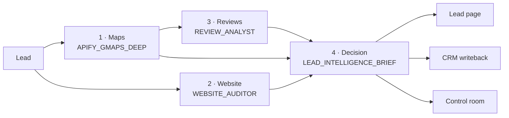
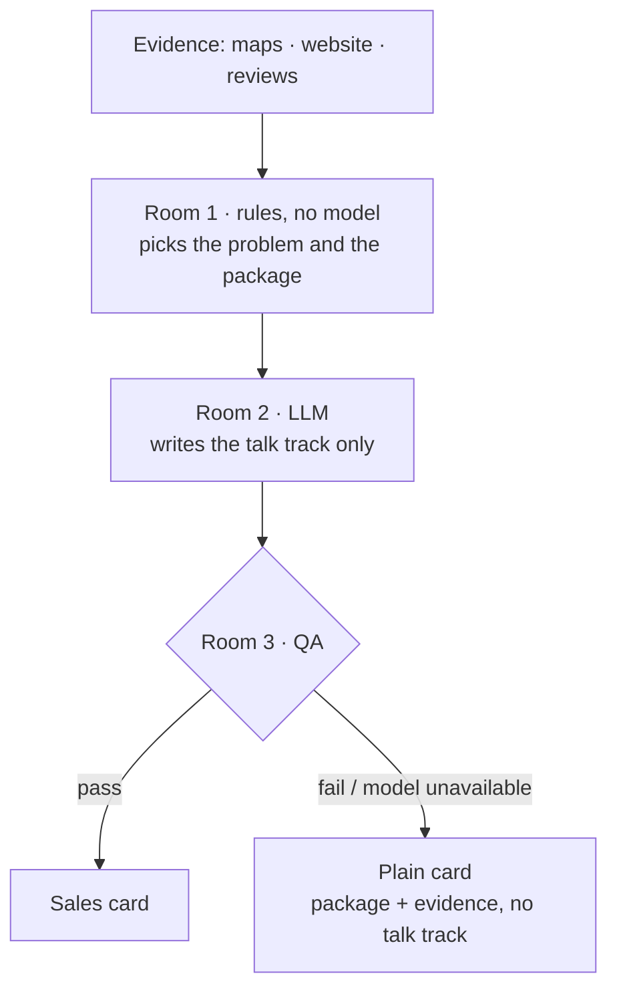

# Revint

**Sales intelligence for teams that sell to local businesses.**

Revint researches every lead (maps listing, website, customer reviews) and answers one question for the sales rep:

> *Why, how, and with which package should I call this business today?*

The answer is a single sales card: the recommended package, the one problem to lead with, an opening talk track, and the evidence behind every line. The card appears on the lead page in the app and is written back to the CRM. Revint sits on top of the CRM instead of replacing it.

---

## Contents

- [How it works](#how-it-works)
- [Quality control room](#quality-control-room)
- [Architecture](#architecture)
- [Repository layout](#repository-layout)
- [Getting started](#getting-started)
- [Commands](#commands)
- [Deployment](#deployment)
- [Engineering rules](#engineering-rules)
- [Glossary](#glossary)

---

## How it works

Four workers per lead. The first three gather evidence; the fourth makes the decision.



| Step | What it does | Output |
|---|---|---|
| **Maps** | Deep scrape of the business listing (max 2 concurrent calls) | Review corpus, rating, contact details, social links |
| **Website** | Headless-browser audit | Booking / menu / ordering signals as `true`, `false`, or `null` (not observed) |
| **Reviews** | LLM extraction only, writes no prose | Strengths, weaknesses, quotes, each pain flagged `sellable` or not. Skipped below 30 reviews |
| **Decision** | Head agent | One sales card |

### The head agent



- **Room 1** is deterministic. It picks one problem by fixed priority, then the **smallest** package that solves it. No evidence means no pitch.
- **Room 2** cannot invent packages or features; every sentence must cite a Room 1 evidence line.
- **Room 3** checks package, focus, and banned claims. A failure produces a plain card; there is no second model attempt.

The decision is also projected into a `SalesOpportunity` row, which CRM writeback, list ordering, and exports read.

---

## Quality control room

`/admin/control`. Analysis quality is measured by people, not by a model.

Three reviewer **lenses** (technical, domain, sales) review each brief **independently**: nobody sees another verdict before writing their own. Every verdict records the rubric version and time spent.

| Screen | Route | Purpose |
|---|---|---|
| Overview | `/admin/control` | What needs attention today, plus release gates |
| Review | `/admin/control/reviews` | Evidence shelf: each claim next to its source |
| Agreement | `/admin/control/uyum` | Inter-rater agreement (Fleiss' kappa), disagreements, adjudication |
| Trace | `/admin/control/trace` | Per-step runs, duration, cost, errors, raw output |
| Reference cases | `/admin/control/golden` | Regression set, baseline vs. candidate comparison |
| Publishing | `/admin/control/calibration` | ICP, package, and playbook publishing |
| Audit | `/admin/control/audit` | Who did what, and why |

**Honest numbers:** a rate is never shown on its own. It always comes with `n` and a 95% Wilson interval, and below 50 samples the screen says the result is not yet decidable.

```
60% (12/20) · 39–78% · not enough data to decide
```

Sales reps give feedback from the lead page ("used this brief" / "didn't use it", with a fixed reason). Rejected briefs jump to the front of the review queue.

---

## Architecture

| Layer | Technology |
|---|---|
| Web | Next.js 16 (App Router, Webpack), React 19, Tailwind CSS v4, Radix UI, Framer Motion |
| Background jobs | BullMQ + Redis, run by a separate worker process (`npm run workers`) |
| Database & auth | PostgreSQL with pgvector, Prisma 6, Supabase Auth |
| AI | Google Gemini (extraction, embeddings), Anthropic Claude (head agent) |
| Data sources | Google Places, Apify, Playwright |
| Integrations | HubSpot (OAuth + UI extension in `hubspot-app/`), Stripe, Resend |
| Hosting | Vercel (web), Railway (workers), Supabase (database) |

All AI work runs on a single `agent-runs` queue. Queue layout: [`docs/runbooks/workers-topology.md`](docs/runbooks/workers-topology.md).

---

## Repository layout

```
src/
  app/
    (site)/ (public)/         marketing site
    app/                      product: leads, discovery, campaigns, settings
    admin/control/            quality control room
    api/                      route handlers
  lib/
    ai-core/                  orchestrator, chains, memory, head agent
    agent-workers/            worker modules (the only place that calls Gemini)
    control/                  control room services (reviews, agreement, scoring, gates)
    integrations/hubspot/     OAuth, writeback, property provisioning
    playbook/vertical-pack/   vertical packs
  workers/                    BullMQ supervisor and workers
  generated/prisma/           generated Prisma client
prisma/
  schema.prisma               schema
  migrations/*.sql            idempotent SQL migrations, applied manually
hubspot-app/                  HubSpot UI extension project
scripts/                      maintenance scripts
docs/                         design notes and runbooks
```

---

## Getting started

**Requirements:** Node.js 22+, PostgreSQL with pgvector, Redis, and API keys for the services you use.

```bash
npm install                     # also runs prisma generate and installs Playwright Chromium
cp .env.example .env.local      # fill in values
npm run db:push                 # dev schema
npm run dev                     # web → http://localhost:3000
npm run workers                 # workers, in a second terminal
```

`.env.example` tags every variable as `[web]`, `[worker]`, or `[both]`. In production the worker refuses to start with missing required variables (`src/lib/env-check.ts`).

The head agent is enabled per workspace:

```bash
CLAUDE_HEAD_AGENT_WORKSPACES=<workspace-id>          # live
CLAUDE_HEAD_AGENT_SHADOW_WORKSPACES=<workspace-id>   # shadow: plain card shown, model draft stored separately
ANTHROPIC_API_KEY=...
```

> For restaurant workspaces there is no legacy fallback: with the head agent off, no brief is produced.

---

## Commands

| Command | Description |
|---|---|
| `npm run dev` | Development server |
| `npm run workers` | BullMQ worker supervisor |
| `npm run build` | `prisma generate` + `next build` |
| `npm run test` | Vitest unit and component tests |
| `npm run test:integration` | Integration tests |
| `npm run lint` | ESLint |
| `npx tsc --noEmit -p .` | Type check |
| `npm run db:generate` | Regenerate the Prisma client after schema edits |
| `npx tsx prisma/migrations/apply.ts <file>.sql` | Apply a SQL migration |
| `npx tsx scripts/control-assign-reviewer.ts` | Grant a control room role and lens |
| `npx tsx scripts/hubspot-verify.ts --portal <id>` | Check that CRM properties exist and are filled |
| `npx tsx scripts/hubspot-backfill.ts <workspace>` | Write existing briefs to the CRM (dry run by default) |

---

## Deployment

| Target | How |
|---|---|
| Web | Vercel, deployed from `main`. Daily cron for CRM writeback reconciliation (`vercel.json`) |
| Workers | Railway (`railway.json`: `npm run workers`, single replica) |
| Schema | Apply `prisma/migrations/*.sql` in order, **before** deploying code that needs them |
| Health | `GET /api/health` checks the database and Redis |

Step-by-step release, smoke test, and rollback: [`docs/runbooks/`](docs/runbooks/).

---

## Engineering rules

Every change follows these. Details in [`AGENTS.md`](AGENTS.md) and `.cursor/rules/*.mdc`.

1. Every Prisma query on workspace data is scoped by `workspaceId` (`requireUser()`).
2. Prisma types come from `@/generated/prisma/client`, never `@prisma/client`.
3. Semantic memory is read and written only through `src/lib/ai-core/memory.ts`.
4. No new BullMQ queue for AI work; extend `agent-runs`.
5. No new Gemini-calling endpoint; wrap the call as a worker under `src/lib/agent-workers/`.
6. The Stripe webhook verifies the signature, dedupes on `StripeEventLog`, and uses `runtime = "nodejs"`. No `apiVersion`.
7. Next.js 16: `params`, `cookies()`, `headers()`, and `searchParams` are Promises and are always awaited.
8. Admin mutations append an `AdminAuditEvent`; there are no update or delete routes.

---

## Glossary

| Term | Meaning |
|---|---|
| **Brief** | The single sales card per lead, produced by the `LEAD_INTELLIGENCE_BRIEF` run |
| **Head agent** | The three-room decision layer that produces the brief |
| **Room 1** | The head agent's rule layer: no model, picks the focus and the package |
| **Wedge** | The one problem the pitch leads with |
| **Package** | The product tier being recommended; the unit of sale, not individual modules |
| **Lens** | A reviewer perspective: technical, domain, or sales. Not a permission |
| **Role** | Control room permission: viewer, reviewer, or admin |
| **Evidence shelf** | The review card layout, with each claim shown next to its source |
| **Reference case** | A regression case (`EvalCase`, called `golden` in code) |
| **Baseline / candidate** | Rule-scored stored output vs. a fresh decision from frozen inputs |
| **Shadow mode** | Decisions are produced but not shown to sales reps |

---

© Revint. All rights reserved. This is proprietary software; no license is granted to use, copy, or distribute it.
