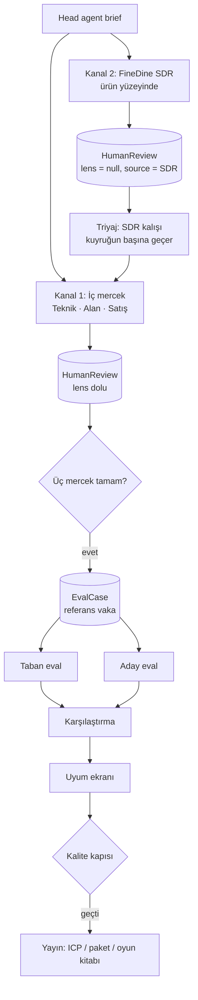

# Admin paneli — son karar kağıdı

29 Eylül 2026. Bu kağıt tartışmayı kapatır.

Beş ayrı kağıtta yazılmış admin paneli / kontrol odası muhabbetinin tamamını, bugünkü kodun ölçülmüş halini, dışarıdan yapılan araştırmayı ve Notion'daki milestone taahhütlerini tek yere koyar. Çelişkileri sayar ve her birine tek bir hüküm verir. Uygulama planı ayrı dosyadadır: `docs/superpowers/plans/2026-09-29-admin-paneli-son-implementasyon.md`.

Takımın "her şey karışık geliyor" demesinin sebebi belirsizlik değil. Beş kağıt art arda yazıldı, her biri bir öncekinin bir kısmını sessizce iptal etti, hiçbiri "şu kağıt artık geçersiz" demedi. Aşağıdaki bölüm 2 bunu bitirir.

---

## 1. Tek cümle

Kontrol odası yazıldı ve çalışıyor; ama beslediği boru hattı ona hiç karar üretmiyor, ve FineDine tarafından geri bildirim toplayacak ikinci kanal hiç yok. Bu iki eksik kapanmadan "analiz kalitesi" ölçülemez, dolayısıyla FineDine'a teslim edilemez.

---

## 2. Kağıt sırası ve hangisi hangisini yener

| # | Kağıt | Tarih | Durumu bugün |
|---|---|---|---|
| 1 | `plans/2026-09-26-finedine-control-plane.md` | 26 Eyl | **Uygulandı.** Şema, roller, denetim, iz, kalibrasyon, denetim ekranı. Kuyruk tanımı (§Task 7) 2 numara tarafından iptal edildi. |
| 2 | `specs/2026-09-27-finedine-decision-loop-design.md` | 27 Eyl | **Uygulandı.** Üç mercek, üçlü kapı, taban/aday eval, 14 günlük brief kuyruğu. Karar kartı alan listesi 5 numara tarafından değiştirilecek. |
| 3 | `plans/2026-09-28-lead-pipeline-simplify.md` | 28 Eyl | **Uygulanmadı.** Tek bir task işaretlenmemiş. 5 numara bu planı "daha geniş, hedef dar olmalı" diyerek yerinden etti. Ama içindeki veritabanı bulgusu (§1) hâlâ tek gerçek kaynaktır. |
| 4 | `specs/2026-09-28-inceleme-kanit-rafi-design.md` | 28 Eyl | **Uygulanmadı.** İnceleme kartının dört çekmecesi. Bu kağıdın en değerli parçası ve hâlâ geçerli — sadece çekmece isimleri 5 numaraya göre düzeltilir. |
| 5 | `analiz-ve-playbook.md` | 28 Eyl (en geç) | **Uygulanmadı.** Kendi içinde "uygulama planı bu kağıda göre yazılır" der. Boru hattı ve satış kuralları için üst otoritedir. |

**Hüküm:** Çelişki çıkarsa sıra şudur — 5 > 4 > 3 > 2 > 1. Bu kağıt (6) hepsinin üstündedir ve yalnızca aşağıdaki altı çelişkiyi karara bağlar; geri kalan her şey ilgili kağıtta durduğu gibi geçerlidir.

---

## 3. Bugün kodda gerçekten ne var (29 Eylül, ölçülmüş)

Tahmin değil. Komut çıktısı.

| Ölçüm | Değer |
|---|---|
| `src/lib/control/*.ts` | 24 dosya, 2.310 satır |
| Kontrol ekranları + bileşenler | 9 sayfa + 12 bileşen, ~1.707 satır |
| `src/app/api/admin/control/**` | 9 mutasyon rotası |
| Test | `npx vitest run src/__tests__/control` → **22 dosya, 73 test geçiyor** |
| Çalışmayan test | `review-ui.test.tsx` **boot edemiyor** (jsdom `ERR_REQUIRE_ESM`). Yani inceleme ekranının tek UI testi hiç koşmuyor. |
| Typecheck | `tsc --noEmit` → **7 hata, hepsi `src/lib/audit-checklist.ts` içinde.** Kontrol odasında sıfır hata. |

Yazılmış ve ayakta olanlar:

- **Şema:** `PlatformRoleAssignment` (+`lens`), `AdminAuditEvent`, `WorkspaceCalibrationVersion`, `EvalDataset/Case/Run/CaseResult`, `HumanReview` (+`lens`), `ReviewLens` enum, `ChainTelemetry` yazımı.
- **Servisler:** roller + mercek çözümü, append-only denetim yazıcısı, lead izi, genel bakış, brief→karar kartı (`decision.ts`), mercek başına kart satırları (`lens-card.ts`), inceleme kuyruğu + üçlü kapı (`review.ts`), referans vaka promote (`golden.ts`), modelsiz skorlayıcı (`score.ts`), taban eval (`eval-run.ts`), aday replay (`eval-replay.ts` + `agent-run-worker` içinde `control_eval_replay`), kalibrasyon snapshot/taslak/yayın/geri alma, iddia kapısı.
- **Ekranlar:** Genel Bakış, İnceleme, Mercekler, Vaka izi (+ lead detayı), Referans vakalar (+ karşılaştırma), Calibration, Denetim, Rehber.
- **Pazarlama admini** `(marketing)` route grubuna taşındı, silinmedi.

Yazılmamış ve eksik olanlar:

- `src/lib/control/trace-groups.ts` — **yok.**
- `getDefaultChain` hâlâ uzun zincir: `score`, `icp_scorer`, `triggers`, `dossier`, `social`, `webcrawl` duruyor. 3 numaralı planın Task 1'i yapılmamış.
- `lens-card.ts` içindeki `WORKER_GROUPS` hâlâ eski dörtlü: Site / Yorum / **ICP (`SALES_OPPORTUNITY_SCORER`)** / Karar. 5 numaralı kağıt bu worker'ı zincirden çıkarıyor.
- `overview.ts` `completed24h` **her** başarılı koşuyu sayıyor; "brief'e ulaşan lead" saymıyor.
- Teknik mercek kaynak satırı hâlâ `status · süre · dolar` basıyor — 4 numaralı kağıdın ilk cümlesi tam olarak bunu yasaklıyor: *"İnceleme ekranı 'iş çalıştı' demeyi bırakır."*
- FineDine tarafından gelen **hiçbir** geri bildirim kanalı yok. Ürün yüzeyinde (`src/app/app/leads/[id]/page.tsx`) hüküm bırakacak bir kontrol bulunmuyor.

---

## 4. Asıl tıkanma: kontrol odasının girdisi yok

Üç mercek, üçlü kapı, referans vaka, taban/aday karşılaştırması — hepsi `LEAD_INTELLIGENCE_BRIEF` koşusunun `outputJson.headAgent` alanını okur. 28 Eylül veritabanı sayımı (3 numaralı plan §1, Supabase üzerinde gerçek sorgu):

| Sayım | Değer |
|---|---|
| Başarılı `LEAD_INTELLIGENCE_BRIEF` koşusu | 83 |
| Bunlardan `briefMode = "head-agent"` olan | **0** |
| `legacy` | 70 |
| Mod alanı hiç yok | 13 |
| FineDine Beta workspace'inde brief satırı | **0** |

Notion'daki risk kaydı aynı şeyi söylüyor (*Head Agent kodda var ama production'da kapalı*): flag OFF, açık olduğu yerde **gölge modda**, sadece F&B lead'lerinde. SDR'a giden brief hâlâ deterministik taraftan geliyor.

```mermaid
flowchart LR
  L[Lead] --> Z[Uzun zincir: 12 worker]
  Z --> B[LEAD_INTELLIGENCE_BRIEF]
  B --> G["briefMode = legacy<br/>headAgent = yok"]
  G -.->|kuyruk boş| K[İnceleme kuyruğu]
  K -.->|hüküm yok| R[Referans vaka]
  R -.->|vaka yok| E[Taban / aday eval]
  E -.->|oran yok| Q[Kalite kapısı]
  Q -.->|kanıt yok| F[FineDine teslimi]

  style G fill:#fee,stroke:#c00
  style K stroke-dasharray: 5 5
  style R stroke-dasharray: 5 5
  style E stroke-dasharray: 5 5
  style Q stroke-dasharray: 5 5
```



Kontrol odası bozuk değil. **Aç.** Sırayı tersten kurduk: ölçüm aletini ölçülecek şeyden önce bitirdik.

Bu, planın sırasını belirler: önce head agent canlı brief üretir, sonra üç mercek onu okur. Bunun tersi imkânsız.

---

## 5. Altı çelişki, altı hüküm

### Çelişki 1 — İz grupları / worker listesi

| Kağıt | Diyor ki |
|---|---|
| 1 ve 2 | Site, Yorum, **ICP (`SALES_OPPORTUNITY_SCORER`)**, Karar, CRM |
| 3 | Sekiz grup: Site, Sınıf, SERP, Sosyal, Yorum corpus, Yorum, İletişim, Karar |
| 5 | **Dört worker:** Harita, Site, Yorum çıkarımı, Head agent. Puan/niş/tetik/açılış ayrı worker değil, dördüncünün içinde |

**Hüküm: 5 kazanır. Dört grup.**

| Grup | Worker | İçerik |
|---|---|---|
| Harita | `APIFY_GMAPS_DEEP` | Yorum corpus'u, puan, e-posta, sosyal link |
| Site | `WEBSITE_AUDITOR` (+ sayfa metni, + kural nişi tek satırda) | Ne bozuk, kendileri ne diyor |
| Yorum | `REVIEW_ANALYST` | Zayıf/güçlü yön, alıntı. Cümle yazmaz |
| Karar | `LEAD_INTELLIGENCE_BRIEF` → head agent | Tek satış kartı |

`SALES_OPPORTUNITY_SCORER`, `LEAD_DOSSIER_GENERATOR`, `ICP_SCORER`, `WHY_NOW_SYNTHESIZER`, `TRIGGER_DETECTOR`, `APIFY_WEB_CRAWL_DEEP`, `GOOGLE_PLACES_REVIEWS`, `SOCIAL_SCRAPER`, `APIFY_SERP_RANK`, `EMAIL_VERIFIER`, `SUBVERTICAL_CLASSIFIER` otomatik zincirden çıkar. Enum'dan silinmez, tıklanınca çalışır. 3 numaralı planın sekiz grubu **iptal**; o plandaki veritabanı bulgusu ve Apify kilidi / yorum eşiği düzeltmeleri **geçerli kalır** (bkz. Çelişki 6).

### Çelişki 2 — Kanıt rafındaki dördüncü çekmece

4 numaralı kağıt çekmeceleri Site / Yorum / **Puan** / Brief diye sayıyor. "Puan" = `SALES_OPPORTUNITY_SCORER`, ki 5 numara onu siliyor. Çekmece kalmalı mı?

**Hüküm: Çekmece kalır, kaynağı değişir.** Dört çekmece şöyle olur:

| Çekmece | Sol sütun (iddia) | Sağ sütun (dayanak) |
|---|---|---|
| **Harita** | Yorum sayısı, puan, kaç yorum çekildi | Corpus boyutu, çekim tarihi, `skipped` sebebi |
| **Site** | "Rezervasyon var / QR var / sipariş var" | Gerçek adres, erişilebilir mi, `crawlError` (sosyal profil / süresi dolmuş / ulaşılamadı), denetim tarihi |
| **Yorum** | Acı cümlesi ve yüzde | Okunan yorum sayısı, analiz tarihi, alıntının dili. **Yüzde, sayının yanında durur.** |
| **Karar** | Paket, kaçak, konuşma, modül sırası | **Oda 1'in kural çıktısı**: seçilen kaçak, seçilen paket, `bans`, kullanılan kanıt satırları, `excludedModules` gerekçesi |

Dördüncü çekmecenin sağ sütunu artık ayrı bir Gemini puanı değil, head agent'ın içindeki **Oda 1**'in deterministik çıktısıdır. Bu, 4 numaralı kağıdın "Paket Premium, tier Starter ise satır bunu yan yana koyar" talebini karşılar — çünkü Oda 1 hem paketi hem de yasağı yazar, ekran ikisini yan yana basar.

Süre ve dolar bu ekranda **durmaz**. Onlar Vaka izi'ndedir. 4 numaralı kağıdın hükmü aynen geçerli.

### Çelişki 3 — Karar kartının birimi: modül mü, paket mi?

| Kağıt | Birim |
|---|---|
| 2 (`expectedJson`) | `allowedModules`, skor kodu `MODULE`, birincil modül listedeki ilk eleman |
| 5 | *"Bu yapı modül satar. FineDine modül satmıyor. Üç paket satıyor. Playbook'un birimi modül olmaktan çıkar, paket ve kaçak olur."* |

**Hüküm: 5 kazanır. Ölçülen birim paket + kaçak olur, modül ikincil kalır.**

`expectedJson` şu hale gelir:

```ts
{
  expectedPackage?: "starter" | "growth" | "premium" | "none";  // yeni, birincil
  expectedWedge?: "reservation" | "bill_wait" | "marketplace"
                | "menu_surface" | "multi_location" | "guest_repeat" | "none"; // yeni, birincil
  icpMin?: number;              // 0–100, durur
  icpMax?: number;
  allowedModules?: string[];    // durur, ama artık ikincil sinyal
  forbiddenClaims: string[];
  forbiddenAngles: string[];
}
```

Skor kodları: mevcut `ICP_BAND`, `MODULE`, `FORBIDDEN_CLAIM`, `FORBIDDEN_ANGLE` durur; **`PACKAGE` ve `WEDGE` eklenir.** Ekran adları: "Paket yanlış", "Kaçak yanlış".

Gerekçe: bir vaka "modülü doğru, paketi yanlış" olabilir — Starter'a ön ödeme satmak gibi. Bugünkü skorlayıcı bunu göremiyor ve geçiriyor. 5 numaralı kağıdın QA listesi (§8) tam olarak bu hatayı arıyor.

### Çelişki 4 — İnceleme kuyruğu tanımı

1 numara: `NEEDS_REVIEW` olanlar + 7 gündür düşmüş ve geçmemiş koşular.
2 numara: son 14 günün **başarılı** brief'leri, üç mercek tamamlanana kadar kuyrukta.

**Hüküm: 2 kazanır. Kod zaten öyle yazılmış, doğru olan bu.** Düşen worker Vaka izi'nin işidir; Çınar ve Onur embedding hatası okumaz.

Ama bir düzeltme şart: `overview.ts` içindeki `completed24h` **her** başarılı koşuyu sayıyor. Bu sayı "analiz tamamlandı" diyor, halbuki tamamlanan şey embedding adımı olabilir. Bu sayaç `LEAD_INTELLIGENCE_BRIEF` + `briefMode = "head-agent"` olacak şekilde daraltılır. `skipped` bir düşüş değildir, sayıma girmez.

### Çelişki 5 — "Calibration" kelimesi iki ayrı şeyi anlatıyor

Kodda `/admin/control/calibration` = ICP / paket / oyun kitabı / iddia yayınlama ekranı.
Değerlendirme literatüründe *calibration* = **inceleyenler arası uyum ölçümü**, rubrik sürümleme, anlaşmazlık uzlaştırma.

Bu, takımın kafa karışıklığının sessiz kaynaklarından biri. Araştırmanın saydığı dört zorunlu ekrandan biri tam olarak bu ikinci anlamdır ve bizde **yok**.

**Hüküm:** Mevcut ekranın rotası `calibration` kalır (kırılmasın), menü etiketi **"Yayın"** olur. Yeni bir ekran açılır: `/admin/control/uyum` — **"Uyum"**. Rubrik sürümü, mercek başına hüküm dağılımı, üç mercek anlaşmazlıkları, Fleiss kappa, ve "bu vakayı uzlaştır" akışı orada durur.

### Çelişki 6 — 3 numaralı plan tamamen iptal mi?

Hayır. 5 numaralı kağıt zincir tasarımını yeniden yazar, ama 3 numaralı plandaki veri hijyeni düzeltmeleri bağımsız ve hâlâ doğrudur:

**Geçerli kalanlar (yeni planın içine alınır):**
- `hasQrMenu` / `hasOnlineOrdering` üç durumlu (`true` / `false` / `null`). Dishoom dahil sekiz restoranda alan `false` yazıyor, doğrusu `null`. Bu tek satır, "QR menü yok, QR sat" diye yanlış açı üretiyor.
- Apify eşzamanlılık kilidi (2), kota 402/403 → `skipped`, `FAILED` değil. 15 koşu bu yüzden düşmüş.
- Yorum corpus eşiği 30. Bugün Dishoom 29.744 yorumla 5 yorumdan analiz ediliyor, çıktı kendi içinde *"Treat the bars as a sample, not a measure"* yazıyor ve sistem yine de puan basıyor.
- `painPhrases[].sellable` bayrağı. Lezzet ve zehirlenme satış açısı değildir.
- Çift kuyrukların boot'tan inmesi (`review-analysis`, `email-verification`).
- `bookingProvider` doluysa `reservation` `excludedModules` içindedir — testte kilitlenir.

**İptal olanlar:** sekiz adımlı zincir, sekiz iz grubu, SERP/sosyal/e-posta/sınıflandırıcının otomatik adım olarak kalması.

---

## 6. Araştırma ne dedi

Composio üzerinden Perplexity Sonar, 29 Eylül 2026. Üç sorgu: insan değerlendirme pratiği, iç eval konsolu tasarım kalıpları, design partner pilot kapıları.

### 6.1 Hata taksonomisi ve ilk iki hafta

- Taksonomi **açık kodlamadan** doğar: önce not al, sonra grupla. Hamel Husain: taksonomiyi dondurmadan önce **en az 30 iz** elle kodla, çalışma havuzu ~100 iz. ([hamel.dev/blog/posts/evals-faq](https://hamel.dev/blog/posts/evals-faq/))
- Sağlıklı sınıf sayısı **5–15**. 20'yi geçmek uyarı işaretidir. Ölçüt sayı değil, **eyleme dönüşebilirlik**: iki sınıf farklı bir düzeltmeye götürmüyorsa birleştirilir.
- Bizde 7 sınıf var (`IDENTITY_MISMATCH`, `STALE_SOURCE`, `UNSUPPORTED_CLAIM`, `PACKAGE_MISMATCH`, `SCORE_CALIBRATION`, `PLAYBOOK_VIOLATION`, `PIPELINE_OMISSION`). **Bant içinde. Değiştirmiyoruz.** Ama henüz 30 iz elle kodlanmadan donduruldu — plan bunu telafi eder.

### 6.2 İnceleyenler arası uyum

| Etiket yapısı | İstatistik |
|---|---|
| 3+ inceleyen, kategorik tek etiket | **Fleiss kappa** |
| 2 inceleyen, kategorik | Cohen kappa |
| Sıralı (P0/P1/P2) veya eksik veri | Krippendorff alpha / ağırlıklı kappa |

Eşikler: `<0.40` zayıf · `0.40–0.60` rubrik düzeltilmeli · `0.60–0.75` keşif için kullanılabilir · `0.75–0.90` iyi · `>0.90` güçlü.

Kappa nadir etiketlerde yanıltır. Bu yüzden ekranda **dört şey birlikte** durur: ham uyum yüzdesi, kappa, etiket sıklığı, karışıklık matrisi.

Üç mercek anlaşamazsa: önce **bağımsız** etiketle (kimse diğerini görmeden), anlaşmazlığı ve onu doğuran rubrik maddesini kaydet, referans vaka olacaksa **uzlaştır**, anlaşmazlığı silme. Çoğunluk oyu güvenlik/ciddi hata vakalarında yeterli değildir.

**Bizdeki durum:** Üç mercek sözleşmesi var, ama üçü de aynı ekranda birbirinin hükmünü görüyor (`reviews` sayfası önceki hükümleri kartın altında basıyor). Bu **anchoring** yaratır ve kappa'yı yapay olarak yükseltir. Düzeltme planda.

### 6.3 Örneklem büyüklüğü — bu, Genel Bakış ekranını değiştirir

p = 0.80 için %95 Wilson aralığı yarı genişliği:

| n | Yarı genişlik | Yorum |
|---:|---:|---|
| 30 | ±0.145 | %65–%95. Hiçbir şey söylemez. |
| 50 | ±0.113 | %69–%91. Yön verir. |
| 100 | ±0.078 | %72–%88. Rutin karşılaştırma için asgari. |
| 200 | ±0.055 | %75–%86. Orta büyüklükte değişimi görür. |

**Sonuç:** Genel Bakış bugün "12/20" basıyor. **Bu sayı yalandır** — 20 vakada %60 ile aralık ±%21'dir, yani gerçek oran %39 ile %79 arasında herhangi bir yerdedir. Ekran çıplak oran basmayı bırakır; oranı, n'i ve aralığı birlikte basar, ve n eşiğin altındaysa **"henüz karar verilemez"** der.

### 6.4 LLM-as-judge — henüz değil

Yargıç modeli ancak (a) rubrik sabitlendiğinde, (b) ana hata modları insan tarafından bulunduğunda, (c) **100 insan etiketi** (50 geçen + 50 kalan) toplandığında devreye girer. Doğrulama **TPR ve TNR ayrı ayrı** raporlanır; ikisi de ≥0.80 olmalı. Literatürde TPR %96, TNR %25 olan yargıçlar ölçüldü — yani her şeye "geçti" diyen bir yargıç yüksek uyum gösterebilir.

**Bizdeki durum:** `score.ts` model çağırmıyor, deterministik. **Bu doğru ve öyle kalır.** Yargıç modeli bu planın dışındadır. 100 insan etiketi toplandıktan sonra ayrı bir kağıt konusudur.

### 6.5 İç eval konsollarının terk edilme sebepleri

| Hata modu | Bizde var mı | Karşılık |
|---|---|---|
| İnceleyen yorgunluğu | **Risk yüksek.** Kart bugün uzun, tek ekranda çok boyut. | Tek birincil karar + az sayıda etiket. Deterministik sinyaller önceden doldurulur. Zorunlu serbest metin yalnızca P0 ve uzlaştırmada. |
| Kuyruk şişmesi | **Risk var.** 14 gün × her brief × 3 mercek. | Kuyruk bütçesi: haftada mercek başına en fazla 20 vaka. Kuyruk yaşı, giriş hızı, tamamlanma oranı ekranda. Yakın-aynı vakalar tekilleştirilir. |
| Rubrik kayması | **Var, kontrolsüz.** Rubrik sürümü yok. | Rubrik kod gibi sürümlenir. Aktif sürüm her kartın üstünde. Olumlu ve olumsuz çapa örnekleri. |
| "Her şey iyi görünüyor" yanılsaması | **Var.** Genel Bakış toplam başarı sayıyor. | Konsol **kalış odaklı** olur, oran odaklı değil. Örneklem anlaşmazlığa, düşük güvene, yeni prompt sürümüne göre katmanlanır. |
| İncelemeden düzeltmeye yol yok | **Kısmen var** (promote → referans vaka). | Her onaylı kalış bir regresyon vakası olur. Referans vaka listesi "hangi hatadan doğdu" alanını taşır. |
| Karar başına süre değerden büyük | **Bilinmiyor, ölçülmüyor.** | Hedef medyan **<2 dakika**. ADELE 2025: tek rubrikte örnek başına 36–72 saniye. Süre ölçülür ve Uyum ekranında durur. |

Asgari ekran seti dörttür: **Kuyruk/triyaj · İnceleme tezgâhı · Rubrik & uyum · Sonuç/veri kümesi/regresyon.** Bizde birinci, ikinci ve dördüncü var; üçüncüsü yok (Çelişki 5).

Kaynaklar: [Langfuse annotation queues](https://langfuse.com/docs/evaluation/evaluation-methods/scores-via-ui) · [Braintrust HITL karşılaştırması](https://www.braintrust.dev/articles/best-human-in-the-loop-llm-evaluation-platforms-2026) · [Arize eval platformları](https://arize.com/resources/llm-and-agent-evaluation-platforms/) · [ADELE, CMU 2025](https://www.cs.cmu.edu/~sherryw/assets/pubs/2025-adele.pdf) · [aievals: judge kalibrasyonu](https://www.aievals.co/learn/llm-as-judge/calibration-to-humans) · [Eugene Yan](https://eugeneyan.kit.com/posts/an-llm-as-judge-won-t-save-your-product-fixing-your-process-will) · [OpenAI eval best practices](https://developers.openai.com/api/docs/guides/evaluation-best-practices.md)

### 6.6 Design partner pilot kapıları

Rollout otonomiye göre kademelenir: **gölge → insan onaylı (HITL) → dar otonomi.** Her kademenin çıkış kriteri önceden yazılır.

Sektör pratiğinden çıkan tipik kapılar (bizim rakamlarımız değil, referans):

| Ölçüt | Eşik |
|---|---|
| Referans set büyüklüğü | 50–100 hesap, segment ve veri kalitesi çeşitliliğiyle |
| Dayanaklılık (iddia kanıta bağlı) | ≥%95 brief'te ciddi olgusal hata yok |
| ICP uyumu | ≥%85 önerilen hesap segment içinde |
| "Gönderilebilir" oranı | ≥%70 brief yalnızca küçük düzeltme ister |
| Kırmızı bayrak | Referans sette 0, gölge koşuda ≤%1 |
| Gölge süresi | 2–4 hafta, veya ≥50 hesapta ≥100 brief; eşikler **üst üste iki haftalık ölçümde** tutmalı |

Geri bildirim ritmi: haftada bir **30 dakika, tek konulu** görüşme. Genel durum toplantısı değil.

Pilotların batma sebepleri: kapsamın geniş tutulması, başarı tanımının iki tarafta farklı olması, geri bildirimin ürüne dönmemesi, ve ölçülen şeyin aktivite hacmi olması (kaç brief üretildi) — sonuç olmaması (kaç brief aksiyona dönüştü).

---

## 7. Notion ne taahhüt etmiş

Composio üzerinden okundu, 29 Eylül.

**M1 — FineDine MVP live** (restart 12 Eylül 2026):
- *"Beta öncesi golden-set kalite kapısı zorunlu (Camden Round 1–2 hallucination borçları)."* — Yani bu kapı zaten kabul edilmiş bir taahhüt, yeni bir fikir değil.
- İlişki modeli: **design partner MOU — tek workflow, tek KPI, 6–12 hafta, buy/extend/stop.** Ücretsiz belirsiz beta değil.
- P0 teknik borçlar: analiz→writeback yok, temperature persist zayıf, açı audit sinyallerine bağlı değil, reconcile cron boş, Angle Card UI yok.

**M2 — FineDine validation** (hedef 1 Kasım 2026). Definition of Done içinde bizi doğrudan bağlayan üç madde:
- *"En az üç tam geri bildirim döngüsü tamamlanmıştır: feedback → önceliklendirme → geliştirme → yeniden kullanım."*
- *"Kullanım, doğruluk, hız ve SDR verimliliği için temel metrikler tanımlanmış ve ölçülmektedir."*
- *"SDR'lar brief'leri düzenli görüntülüyor ve bunlara dayanarak aksiyon alıyor."*

**Risk kaydından öğrenilen ders** (*Faz 1'in toplantı-temelli öğrenme yöntemi işe yarayan çıktı üretmiyor*): FineDine ile toplantı yapıp Discovery Board'a not düşmek, worker kuralına çevrilebilir çıktı üretmedi. Çıkanlar tek kişinin tek oturumdaki izlenimiydi — hipotez, doğrulanmış kural değil.

**Bu, geri bildirim kanalının şeklini belirler.** Toplantı transkripti geri bildirim kanalı değildir. Kanal, SDR'ın gerçek bir brief üzerinde bıraktığı yapılandırılmış hükümdür. Serbest metin sayılmaz.

Aynı kayıttan ikinci ders: SDR bir lead'i araştırırken pratikte neredeyse **sadece website/menüye** bakıyor. M4 shadowing kaydındaki ilk-bakış kontrol listesi (verbatim): *QR menü kullanıyor mu → lokasyon → sosyal medya güçlü mü → website'e ne kadar önem veriyor → key account mı.* Kanıt rafındaki **Site çekmecesi** bu yüzden ilk sırada durur.

---

## 8. Karar: admin panelinin nihai şekli

Yedi ekran. Yeni görsel dil yok. Metin Türkçe, rota İngilizce.

| Menü | Rota | Kimin işi | Ne için |
|---|---|---|---|
| Genel Bakış | `/admin/control` | Hepsi | Bugün müdahale gerektiren şey + kalite kapısı sayıları (n ve aralıkla) |
| İnceleme | `/admin/control/reviews` | Mercek sahibi | Dört çekmeceli kanıt rafı, tek hüküm |
| **Uyum** *(yeni)* | `/admin/control/uyum` | Yönetici | Rubrik sürümü, üç mercek anlaşmazlıkları, Fleiss kappa, uzlaştırma, inceleme süresi |
| Vaka izi | `/admin/control/trace` | Teknik | Dört grup, süre, dolar, hata, CRM, ham JSON |
| Referans vakalar | `/admin/control/golden` | İnceleyen | Vaka listesi, taban/aday karşılaştırma |
| Yayın *(eski adı Calibration)* | `/admin/control/calibration` | Yönetici | ICP, paket, oyun kitabı, iddia yayını. Davranış değişmez |
| Denetim | `/admin/control/audit` | Hepsi | Kim ne yaptı, neden |
| Mercekler | `/admin/control/mercekler` | Yönetici | Mercek ataması |
| Rehber | `/admin/control/rehber` | Hepsi | Nasıl çalışır |

**Silinen / eklenen yok** dışında değişen tek yapı: Calibration → "Yayın" etiketi, ve yeni "Uyum" ekranı.

### Panelin "yardımcısız sürdürülebilir" olması ne demek

Bu, kullanıcının asıl talebi. Somut karşılığı şudur — panel bu dört soruyu insan yardımı olmadan cevaplamalı:

1. **"Bugün neye bakmalıyım?"** → Genel Bakış tek cümle basar, kuyruk sırası gelir.
2. **"Bu karar doğru mu?"** → Kanıt rafı, iddiayı dayanağın yanına koyar. İnceleyen ayrı sekme açmaz.
3. **"Ölçüm güvenilir mi?"** → Uyum ekranı kappa'yı ve n'i basar. "12/20 geçti" yerine "20 vakada %60, aralık %39–%79, karar için yetersiz".
4. **"Düzeltme işe yaradı mı?"** → Aday koşu, donmuş girdiden yeni karar üretir, "N bozuldu, N düzeldi, N aynı" der.

Hiçbir adımda "bunu bir agent'a sor" yoktur. Her sayının yanında onu üreten kural yazılıdır.

---

## 9. İki geri bildirim kanalı

Bu, beş kağıdın hiçbirinde yazmayan ve şu an eksik olan parçadır. Bütün kağıtlar müşteri yüzeyini bilinçli olarak dışarıda bıraktı ("Müşteri kartı bu spec'te yok"). Ama M2'nin DoD'si üç tam geri bildirim döngüsü istiyor. Kanal olmadan döngü olmaz.



### Kanal 1 — İç mercek (var, düzeltilecek)

Üç mercek, üçlü kapı, referans vaka. Kodda var. Eksikleri: kanıt rafı, bağımsız etiketleme (anchoring), rubrik sürümü, kappa, süre ölçümü.

### Kanal 2 — FineDine SDR (yok, yazılacak)

SDR kontrol panelini **görmez**. Kendi lead kartında (`/app/leads/[id]`) tek bir kontrol görür. Tasarım kuralları:

- **Tek birincil karar.** "Bu brief'i kullandım / kullanmadım." İki düğme.
- "Kullanmadım" seçilirse **sabit listeden tek sebep**: yanlış işletme · kaynak eski · iddia dayanaksız · paket uymuyor · zaten müşteri · hedef profil değil. Serbest metin **opsiyonel**, zorunlu değil.
- Notion dersi gereği serbest metin ana sinyal sayılmaz. Sabit liste sayılır.
- Kayıt `HumanReview` satırıdır: `lens = null`, `source = "SDR"`. Mercek kapısına **girmez** — üçlü kapı iç merceklerin işidir. Ama **triyaj sinyalidir**: SDR "kullanmadım" dediği brief, iç inceleme kuyruğunun başına geçer ve rozetle işaretlenir.
- İkinci alan, sonradan: **sonuç etiketi.** Kapanan işte beş alan (5 numaralı kağıt §7): kaçak · paket · reaksiyon · itiraz · sonuç. Bu, M3'ün OI girdisidir; bu planda sadece şema yeri açılır, ekran açılmaz.

SDR'a ağırlık sorulmaz, puan sorulmaz, rubrik gösterilmez. Tek kaçağı denedi mi, ne oldu — o kadar.

---

## 10. FineDine'a vermeden önce geçilecek kapı

Notion M1 bunu zaten zorunlu kılmış. Somut hali:

### Kapı A — Boru hattı kapısı (kalite ölçümünden önce)

| Ölçüt | Eşik | Nereden okunur |
|---|---|---|
| FineDine Beta'da `briefMode = "head-agent"` brief | ≥ 40 lead | Genel Bakış `completed24h` (düzeltilmiş sayaç) |
| Brief'e ulaşamayan lead oranı | ≤ %20 | Vaka izi, `filter=failed` |
| Rezervasyon sağlayıcısı dolu hesapta `reservation` hariç listede | %100 | Test, `lead-intelligence-brief-grounding.test.ts` |
| 30'un altında yorumla KPI barı yazılan lead | 0 | Test + Yorum çekmecesi |

Bu kapı geçilmeden inceleme başlamaz. Bugün ilk satır **0/40**.

### Kapı B — Ölçüm kapısı (inceleme başladıktan sonra)

| Ölçüt | Eşik | Gerekçe |
|---|---|---|
| Elle açık kodlanmış iz | ≥ 30 | Taksonomiyi dondurmadan önce (Hamel) |
| Üç mercek hükmü tamamlanmış brief | ≥ 50 | n=50'de aralık ±%11; altında sayı anlamsız |
| Fleiss kappa (verdict, 3 mercek) | ≥ 0.60 | Altındaysa rubrik düzeltilir, ölçüm tekrarlanır |
| Medyan inceleme süresi | ≤ 2 dk | Üstündeyse kart sadeleştirilir |
| Referans vaka (`EvalCase`) | ≥ 30 | Regresyon seti |

### Kapı C — Teslim kapısı

| Ölçüt | Eşik |
|---|---|
| Taban eval geçiş oranı | ≥ %80, **n ≥ 50 ve alt sınır ≥ %69** |
| Kırmızı bayrak (P0 kalış) | 0 |
| Üst üste iki haftalık ölçüm | İkisi de eşiğin üstünde |
| Aday koşu | En az bir kez çalışmış, "bozuldu" listesi boş |

Kapı C geçilirse FineDine **HITL** kademesine girer: brief üretilir, SDR görür, SDR onaylar. Otonom gönderim bu planda yok.

---

## 11. Bu kağıdın kapsamı dışında

Bilerek bırakılanlar. Bir sonraki kağıt konusu:

- LLM-as-judge. 100 insan etiketi (50 geçen + 50 kalan) toplanmadan açılmaz.
- OI öğrenme katmanı, sonuç → katsayı. Notion'da M4.
- HubSpot sonuç panosu (cevap, toplantı, kazanıldı/kaybedildi).
- Sentry, Langfuse, Braintrust entegrasyonu. Kendi izimiz yeterli.
- Altı platform rolü, klavye kısayolu, grafik.
- Enum'dan ölü worker silmek. Zincirden çıkarmak davranışı keser; enum silmek ayrı şema turu.
- `cancel-all-global` düğmesi. UI'ya hiç çıkmaz.
- `seo-ops` ve discovery.

---

## 12. Adlandırma düzeltmeleri

Aynı kelimenin iki şeyi anlatması, takımın dağılma sebeplerinden biri. Kilitlenen karşılıklar:

| Kelime | Bu kağıttan sonra ne demek |
|---|---|
| **Calibration / Yayın** | ICP, paket, oyun kitabı, iddia yayınlama ekranı. Rota `calibration`, etiket **Yayın** |
| **Uyum** | İnceleyenler arası anlaşma. Fleiss kappa, rubrik sürümü, uzlaştırma |
| **ICP uyumu** | Karar kartındaki `salesConfidence` sayısı (0–100). Yukarıdaki "Uyum" ile ilgisi yok |
| **Mercek** | `TECHNICAL` / `DOMAIN` / `SALES`. Bakış açısı. Yetki değil |
| **Rol** | `VIEWER` / `REVIEWER` / `ADMIN`. Yetki. Bakış açısı değil |
| **Kaçak** | Satışın tek konusu. Altı tane. `wedge` |
| **Paket** | Starter / Growth / Premium. Modül değil |
| **Oda 1** | Head agent içindeki kural katmanı. Model yok. Kaçağı ve paketi o seçer |
| **Taban** | Saklanan çıktıyı kuralla sayan eval. Model çağırmaz |
| **Aday** | Donmuş girdiden bugünkü head agent ile yeni karar üreten eval |
| **Referans vaka** | `EvalCase`. Kodda `golden`. Ekranda hiç "golden" yazmaz |
| **Kanıt rafı** | İnceleme kartındaki dört çekmece. Sol iddia, sağ dayanak |

---

## 13. Bu kağıt bitince doğru olan

Takım şunu bilir: hangi kağıt geçerli, hangisi değil; kontrol odasının neden boş olduğunu; hangi altı çelişkinin nasıl karara bağlandığını; FineDine'a vermeden önce hangi üç kapının geçilmesi gerektiğini ve her kapının sayısını; geri bildirimin iki ayrı kanaldan geleceğini ve ikisinin de aynı `HumanReview` tablosuna düştüğünü.

Sırada uygulama planı var: `docs/superpowers/plans/2026-09-29-admin-paneli-son-implementasyon.md`.
