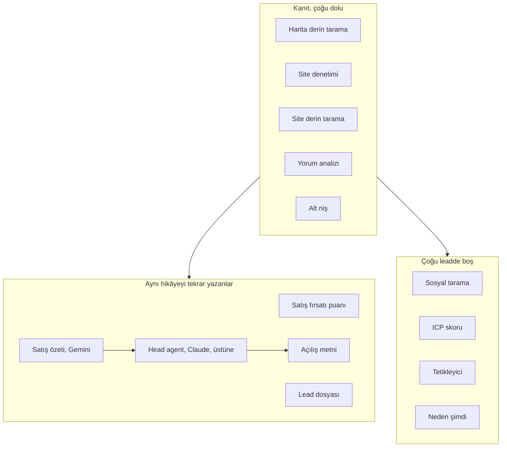
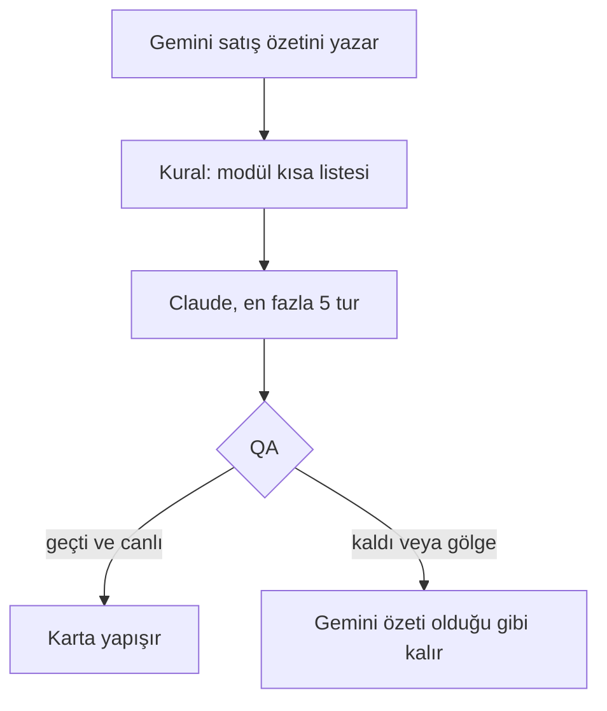
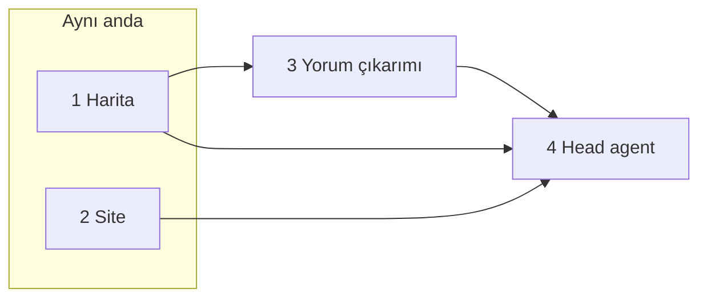
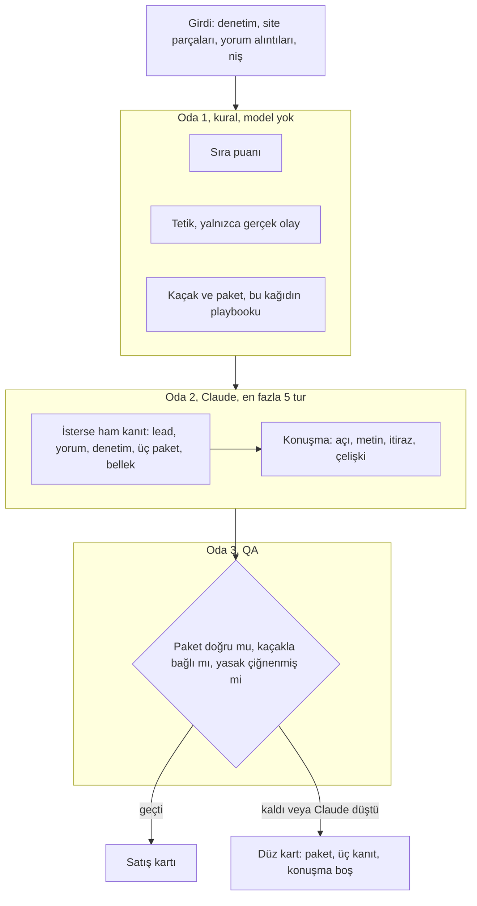
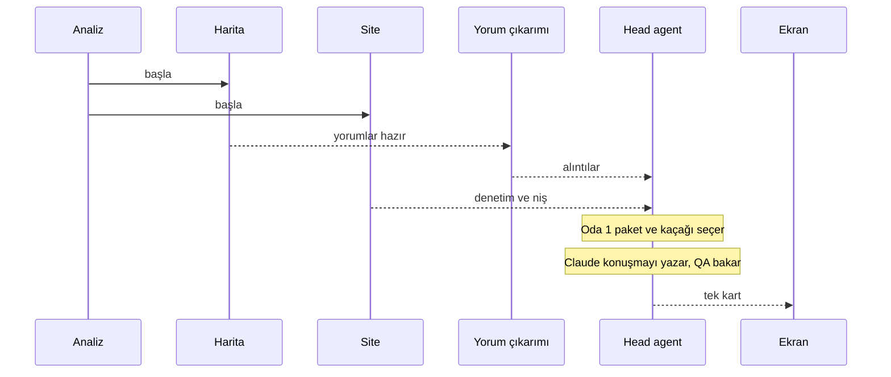
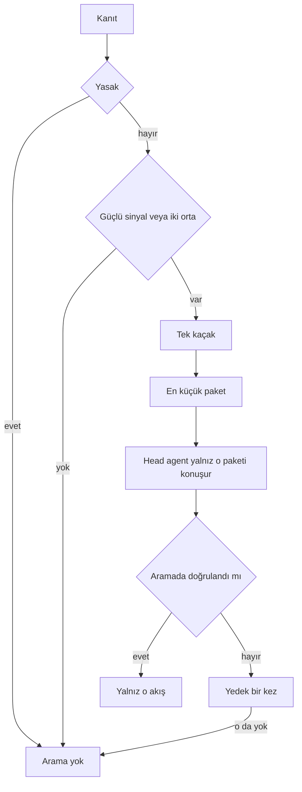
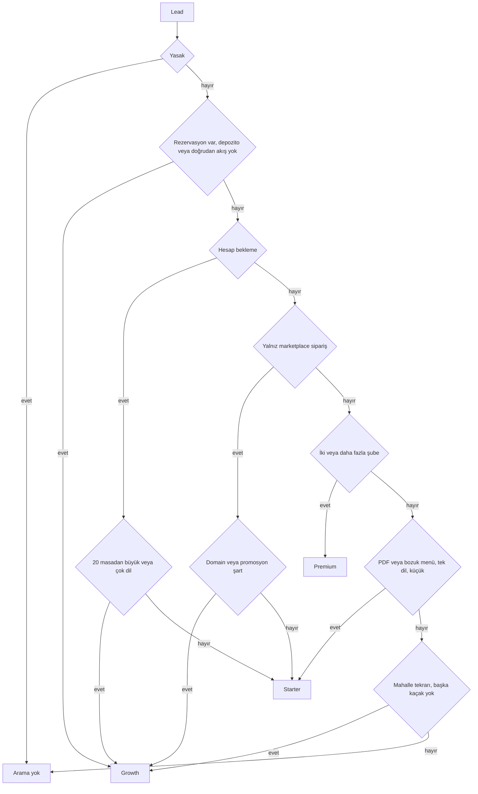

# Analiz ve playbook

28 Eylül 2026. Ekip kağıdı. Uygulama planı yazmadan önce okunur.

Bu kağıt üç şeyi yan yana koyar: bugün analiz çalışınca ne oluyor, olması gereken worker düzeni, bugünkü satış kuralları ve yerine geçecek kurallar. Kurallar [finedinemenu.com](https://finedinemenu.com) paketlerine ve 2025–2026 restoran teknolojisi piyasasına göre yazıldı. Kazanma oranımız henüz yok. Katsayı kilitlenmez.

İlgili kod:

- Worker listesi: `src/lib/agent-workers/registry.ts`
- Otomatik zincir: `src/lib/ai-core/chains.ts` içindeki `getDefaultChain`
- Satış kuralları: `src/lib/playbook/vertical-pack/packs/fnb.ts`
- İkinci açı motoru: `src/lib/playbook/angle.ts`
- Head agent: `src/lib/ai-core/agent/head-agent.ts`
- Paket sayfası: [finedinemenu.com/pricing](https://www.finedinemenu.com/pricing)

Aynı gün yazılmış bir uygulama taslağı var: `docs/superpowers/plans/2026-09-28-lead-pipeline-simplify.md`. O taslak zinciri kısaltır ama sosyal tarama, arama sırası, e-posta doğrulama ve alt nişi ayrı adım olarak bırakır. Bu kağıt daha dar bir hedef tarif eder. Uygulama planı bu kağıda göre yazılır.

---

## 1. Tek cümle

Kanıt toplayan üç iş, sonra tek karar. Kararı Head agent yazar. Satış, modül listesi değil. FineDine’ın üç paketinden birini, tek kaçağa bağlayarak söyler.

---

## 2. Bugün analiz ne yapıyor

Lead düşünce workspace’in preset’i bir zincir seçer. Yeni hesaplarda varsayılan dengeli (BALANCED) preset’tir.

Dengeli zincirin sırası kabaca şöyledir. Harita ve site aynı anda başlayabilir. Satış özeti en sonda, herkes bitsin diye bekler.

| Sırada | Kod adı                    | Ekrandaki ad          | Ne işe yarar                                                     |
| ------ | -------------------------- | --------------------- | ---------------------------------------------------------------- |
| 1      | `APIFY_GMAPS_DEEP`         | Harita derin tarama   | Google Haritalar’dan yorum, puan, e-posta, sosyal link, fotoğraf |
| 2      | `WEBSITE_AUDITOR`          | Site denetimi         | Playwright. Randevu, mobil, hız, schema, güvenlik                |
| 3      | `APIFY_WEB_CRAWL_DEEP`     | Site derin tarama     | Sayfa metni. Menü, hakkımızda, hizmet                            |
| 4      | `REVIEW_ANALYST`           | Yorum analizi         | Yorumları zayıf yön, güçlü yön, alıntıya çevirir                 |
| 5      | `SUBVERTICAL_CLASSIFIER`   | Alt niş sınıflandırma | Restoranı bar, fine dining gibi alt tipe koyar                   |
| 6      | `SALES_OPPORTUNITY_SCORER` | Satış fırsatı puanı   | 0–100 skor, paket, satış açısı                                   |
| 7      | `LEAD_DOSSIER_GENERATOR`   | Lead dosyası          | Uzun Markdown brief                                              |
| 8      | `ICP_SCORER`               | ICP skoru             | İdeal müşteriye uyum sayısı. Lead satırına yazılır               |
| 9      | `TRIGGER_DETECTOR`         | Tetikleyici tespiti   | Puan düşüşü, yeni şube, kötü servis arar                         |
| 10     | `WHY_NOW_SYNTHESIZER`      | Neden şimdi           | Tetik varsa bir aciliyet cümlesi. Yoksa “henüz tetik yok”        |
| 11     | `LEAD_INTELLIGENCE_BRIEF`  | Satış özeti           | Kısa kart. Sonunda, flag açıksa, Head agent                      |
| 12     | `SOCIAL_SCRAPER`           | Sosyal tarama         | Denetimin bulduğu linkleri kopyalar. Yeni tarama yapmaz          |

Agresif preset buna arama sırası (`APIFY_SERP_RANK`) ve açılış metnini (`OPENER_WRITER`) ekler. Açılış, satış özeti bittikten sonra da `sdr_brain_completed` ile bir kez daha çalışabilir.

Site denetimi ile site derin tarama aynı siteye bakar, aynı işi yapmaz. Biri neyin bozuk olduğunu ölçer. Diğeri işletmenin kendi metnini indirir. Harita yorumu indirir. Yorum analizi okur. Bu dördü duplicate değildir.

Duplicate olan anlatıdır. Satış fırsatı bir açı yazar. Dosya aynı hikâyenin uzun halini yazar. Satış özeti dosyanın ilk 6000 karakterini okuyup kısa kart ve bir açılış cümlesi daha yazar. Neden şimdi bir cümle daha yazar. Açılış metni gönderilecek metni bir daha yazar. Head agent, flag açıksa, Gemini kartının üstüne bir açı daha yapıştırır.

Üç sayı da aynı lead’e bakıyor:

| Sayı          | Kim yazar   | Soru                    |
| ------------- | ----------- | ----------------------- |
| Satış fırsatı | Gemini skor | Bunu satabilir miyiz    |
| ICP           | Kural       | Bizim müşterimiz mi     |
| Satış güveni  | Satış özeti | Diğerlerinin ortalaması |

Liste sırası `salesConfidence` alanındadır. Head agent bu sayıyı değiştirmez. Onun kendi `confidence` alanı “bu açıya ne kadar güveniyorum”dur. Ekranda iki rozet gibi dururlar.

İzde “Satış fırsatı puanı” iki kez görünebilir. İkincisi skor değildir. Skor satırını vektör belleğe gömen iç adımdır. Worker türü olarak aynı etiketi taşır.

### Boş kalanlar

| İş                                                  | Neden boş                                        |
| --------------------------------------------------- | ------------------------------------------------ |
| Sosyal tarama                                       | Yeni bilgi yok. Link yoksa `{ count: 0 }`        |
| ICP skoru                                           | Cümle yok. Sayı ve kod listesi                   |
| Tetikleyici                                         | Kural tutmazsa `detected: []`                    |
| Neden şimdi                                         | Tetik yoksa sabit cümle, aciliyet 10             |
| Arama sırası                                        | Kelime listesi yoksa `no_queries`                |
| Instagram, Facebook, Reddit, rakip reklam, LinkedIn | Varsayılan zincirde değiller. Link yoksa atlanır |
| E-posta doğrulama                                   | Zincirde yok. Adres yoksa atlanır                |
| MEDDPICC ve SPIN                                    | Ses notu yoksa boş. Analizin parçası değiller    |
| Resepsiyon, yorum yanıtı, mockup                    | Satış sonrası paket. Analiz değil                |

Daha önce hesap kademesi, BANT, satın alma komitesi, ticari içgörü ve itiraz tahmini zincirden çıkarıldı. Restoran satışında tek karar verici var. O worker’lar yüzde 90’dan fazla boş veya kopya metin üretiyordu. Etiketleri eski kayıtlar için duruyor.

### Head agent bugün nerede

Satış özeti worker’ının en sonunda, yalnızca restoran nişinde, flag açıksa çalışır.

Üç mod: kapalı, gölge, canlı.

- Gölge: karar üretilir, ekrana yapışmaz. Telemetri içindir.
- Canlı: QA geçerse karta yapışır. HubSpot’a giden açı ve konuşma metni budur.
- Claude düşerse veya QA kalırsa Gemini özeti durur.

Karar dardır: bir açı, iki üç cümle, önerilen ve yasak modüller, kataloğun gerçek paket adı, çelişkiler, 0–100 güven. Modül uyduramaz. Kısa liste `fnb.ts` kurallarından gelir. Araçları salt okunur: lead, yorumlar, denetim, dosya, skor, paketler, bellek. Dosya ve skor araçları başka bir modelin yazdığı metni tekrar okutur.

QA şunlarda düşer: açı yok, konuşma metni yirmi karakterden kısa, önerilen modül yok, kısa liste dışında modül.

28 Eylül veritabanı notu, ayrı plandan: restoran hesaplarında `briefMode = head-agent` satırı 0. Başarılı satış özetlerinin çoğu `legacy`. Yani canlıda Claude kararı henüz yapışmıyor. Ayrıntı `docs/superpowers/plans/2026-09-28-lead-pipeline-simplify.md` bölüm 1.

---

## 3. Olması gereken worker düzeni

Dört worker. İlk üçü kanıt. Dördüncüsü Head agent. Puan, niş, tetik ve açılış ayrı worker değildir. Dördüncünün içindedir.

| Worker           | Kim                                           | Ne bırakır                                                    |
| ---------------- | --------------------------------------------- | ------------------------------------------------------------- |
| 1 Harita         | Bugünkü harita derin tarama                   | Yorumlar, puan, e-posta, sosyal link, fotoğraf                |
| 2 Site           | Denetim + sayfa metni + kural nişi, tek satır | “Ne bozuk” ve “kendileri ne diyor”. Biri düşerse diğeri kalır |
| 3 Yorum çıkarımı | Gemini, yalnız çıkarım                        | Zayıf yön, güçlü yön, alıntı. Cümle yazmaz                    |
| 4 Head agent     | Claude                                        | Tek satış kartı                                               |

Yorum çıkarımı anlatı değildir. Ayrı durmasının sebebi, puanın model konuşmadan önce hesaplanmasıdır. Çıkarım ile satış metni aynı prompt’ta birleşirse acı cümleleri yumuşar.

Üç worker’a indirmek bu birleşmeyi zorlar. Her şeyi tek mega worker yapmak da kötüdür. Harita ve site dakikalar sürer. Biri düşünce yeniden yazmak için ikisini birden tekrar ödememek gerekir. Ayrı olan şey anlatının bölümleri değil, yapılan işin cinsidir.

Alt niş ayrı Gemini adımı değildir. İsim, Google tipi ve denetim sinyali yetiyorsa kural koyar. Yetmezse karta “niş belirsiz” diye gider.

Sosyal tarama kalkar. Linkler harita ve sitededir.

Uzun dosya ikinci bir model çağrısı değildir. Kartın açılmış halidir.

### Head agent’ın içi

Dışarıdan tek worker. İçinde üç oda. Yalnızca ortadaki oda modeldir.

Oda 1 bitmeden Claude başlamaz. Modül listesini kendisi uyduramaz. Bu kağıttaki kaçak ve paket kısa listesinden seçer.

Araçlardan `get_dossier` ve `get_sales_opportunity` kalkar. Ham kanıt kalır.

Claude yoksa, timeout olursa veya QA kalırsa ikinci bir Gemini denemesi açılmaz. Oda 1’in çıktısı düz kart olur. Temsilci uydurma açılış görmez.

Gölge mod canary içindir. Yanında uzun Gemini özeti yazılmaz. Karşılaştırma, kuralın seçtiği paket ile Claude’un seçtiği paket arasındadır.

### Bir lead baştan sona

İzde dört satır. Her biri dolu, ya da net bir atlama: site yok, haritada işletme yok, yorum beşten az. Boş `{ count: 0 }` ve “henüz tetik yok” satırı kalkar.

Temsilcinin gördüğü tek kart:

- Sıra puanı. Kural hesaplar. Liste buna göre sıralanır. Claude değiştirmez.
- Açı güveni. Claude’un “bu açı ne kadar sağlam”. Ayrı yeşil rozet değildir.
- Paket adı. Starter, Growth veya Premium. Başka isim yok.
- Kaçak. Aşağıdaki altıdan biri.
- Konuşma metni. Gönderilecek açılış budur.
- Neden şimdi. Yalnızca gerçek olay varsa: puan düşüşü, yeni şube, menü değişimi, yeni açılış. Yoksa satır basılmaz.

İki sayı:

|            | Kim    | Soru                   | Nerede     |
| ---------- | ------ | ---------------------- | ---------- |
| Sıra puanı | Kural  | Bu lead ne kadar iyi   | Liste      |
| Açı güveni | Claude | Bu açı ne kadar sağlam | Kartın içi |

ICP uymuyorsa sıra puanı 49’u geçemez. Yeşil rozet yanmaz. Claude “çok eminim” dese de liste sırası değişmez.

### Analizin dışında

İstek üzerine, girdi varsa çalışır. Bitince ilk üç worker tekrar etmez. Yalnızca Head agent kartı yeni kanıtla bir kez daha yazar.

- Instagram veya Facebook, link varsa
- Arama sırası, ajansın kelime listesi varsa
- E-posta doğrulama, siteden adres çıktıysa
- Mockup, resepsiyon, yorum yanıtı. Satış paketi, analiz değil
- Görüşme notu. Arama bittikten sonra tek çıkarıcı. MEDDPICC ile SPIN aynı transkripti ikiye bölmez. Not, karttaki acı ve sonraki adımı günceller

Maliyet: harita ve site taraması aynı kalır. Model çağrısı lead başına kabaca beşten ikiye iner. Yorum çıkarımı ve Head agent. Dosya, skor anlatısı, neden şimdi ve açılış o ikinci çağrının içindedir.

---

## 4. Bugünkü playbook

Tüm F&B bilgisi `src/lib/playbook/vertical-pack/packs/fnb.ts` içindedir. Motor (`engine.ts`) niş bilmez. Dosyanın kendi notu kaynağı şöyle yazar: FineDine araştırması ve 2026 sektör raporları. Kapalı iş, kayıp nedeni veya “müşteri bu cümlede öne eğildi” kaydı yok.

Puanlar birbirine eklenir. Bilinmeyen sinyal puan eklemez. Bir kaynağın bir modüle katkısı 50 ile sınırlıdır. Birincil modül eşiği 35, ikincil 25. Çok şube, CRM, AI menü ve Order & Pay puanını 1.2 ile çarpar.

| Sinyal                         | Modül        | Puan |
| ------------------------------ | ------------ | ---- |
| Yorumda yavaş servis           | Order & Pay  | 55   |
| Google fiyat seviyesi 0 veya 1 | Order & Pay  | 25   |
| Online sipariş yok             | Order & Pay  | 25   |
| PDF menü                       | QR menü      | 45   |
| Dijital menü yok               | QR menü      | 35   |
| PDF menü                       | AI menü      | 35   |
| Dijital menü yok               | AI menü      | 20   |
| Rezervasyon yok                | Rezervasyon  | 45   |
| Yorumda turist veya dil        | Çok dil      | 55   |
| Çok şube                       | Çok lokasyon | 60   |
| 100+ yorum ve 4.2+ puan        | CRM          | 50   |
| Site yok                       | Website      | 60   |
| Site bozuk                     | Website      | 45   |

Yasaklar, puandan ayrı:

- Dijital menü varsa QR satma. Yerine Order & Pay de.
- Rezervasyon aracı varsa booking satma.
- Site çalışıyorsa yeni site satma.

`dontPitch` cümleleri var ama motorda yasak değiller. Yüksek temaslı serviste Order & Pay, tek şubede çok lokasyon, turist mekânda CRM. Puan yine de birikir. CRM kuralı “100 yorum” deyince çoğu zaman tam da turist mekânını seçer. Yasak ile puan ters düşer.

İkinci motor `angle.ts`. Her tetiğin ağırlığı 3. Aynı lead’e iki kural seti farklı sıra basar. Head agent bunlardan birini gerçek sanıp konuşur.

PDF hem QR’a hem AI menüye puan basar. Bir zayıf sinyal iki modül açar.

Bu yapı modül satar. FineDine modül satmıyor. Üç paket satıyor. Playbook’un birimi modül olmaktan çıkar, paket ve kaçak olur.

---

## 5. Araştırma ne dedi

Perplexity ile 2025–2026 kaynakları tarandı. Toast, OpenTable, DoorDash, Sunday, me&u ve ticaret anketleri ağırlıkta. Birçoğu satıcı sponsorlu. Aşağıdaki hükümler yön içindir. FineDine kazanma oranı değildir.

Bağımsız sahip, misafir deneyimi yığınını değil, o haftaki kaçağı alır. Sınırlı servis, tam servisten daha hızlı teknoloji ekliyor. Ulusal restoran birliği taramasında kabaca yüzde 73’e karşı yüzde 60. Modül modül bağımsız sayım zayıf.

Pratik satın alma sırası:

1. Rezervasyon, no-show, telefona yetişememe veya Google’dan gelen talebi kaçırma varsa.
2. Doğrudan sipariş veya QR. QSR, fast casual, bar, kafe. Paket komisyonu veya zirve işçilik varsa.
3. Dönüşüm sayfası. Talep Instagram veya marketplace’te kalıyorsa.
4. Masada ödeme. Hesap bekleme ölçülebilirse.
5. CRM. Mahalle tekrarı ve işlem hacmi varsa. İlk alışveriş değil.
6. Çok lokasyon menü kontrolü. İkinci şubeden sonra.
7. Çok dil. Turist karışımı kanıtlanınca.
8. AI menü ve fotoğraf. En son.

Bizim paket bunun tersini yapıyor. PDF ve “menü yok” iki modül açıyor. Site yoksa en yüksek puanlardan biri website. CRM yorum sayısından erken açılıyor.

### Her kuralın hükmü

| Kural                                        | Hüküm               | Neden                                                                                                                                     |
| -------------------------------------------- | ------------------- | ----------------------------------------------------------------------------------------------------------------------------------------- |
| Yavaş servis, 55, Order & Pay                | Zayıf               | Bekleme mutfaktan, masadan veya hesaptan olabilir. Self-order mutfak darboğazını çözmez. Fine dining ve tadım menüsü için yanlış ürün     |
| Ucuz fiyat, 25, Order & Pay                  | Zayıf vekil         | Fiyat, servis modelinin yerine geçmez                                                                                                     |
| Online sipariş yok, 25, Order & Pay          | Yanlış ürün         | Bu, Deliveroo komisyonu ve doğrudan sipariştir. Masada ödeme değildir                                                                     |
| PDF, 45, QR                                  | Çelişiyor           | PDF, menünün kötü olduğu anlamına gelmez. Satış, fiyat, alerjen veya dil sık değişiyorsa açılır                                           |
| Dijital menü yok, 35, QR                     | Zayıf               | Menü Google’da, rezervasyon akışında veya kasten kâğıtta olabilir                                                                         |
| PDF veya menü yok, AI menü                   | İlk alışveriş değil | Optimizasyon. Sentetik fotoğraf fine dining’de sert yasak                                                                                 |
| Rezervasyon yok, 45                          | Zayıf               | Kafe, QSR, yürüyerek dolan bar rezervasyon istemez                                                                                        |
| OpenTable veya TheFork varsa booking satma   | Fazla sert          | İngiltere ve Avrupa’da asıl satış burada: komisyon, depozito, misafir verisi. “Bir sistem daha” değil, “doğrudan rezervasyon ve ön ödeme” |
| Turist yorumu, 55, çok dil                   | Zayıf               | Dil karışımı ve ciro kamudan ölçülmez. Dolaşan yüzde 8–23 artış iddialarının bağımsız kaynağı yok                                         |
| 100 yorum ve 4.2, CRM, 50                    | Çelişiyor           | Popülerlik. Sadakat değil. SumUp 2025’te küçük işletmelerin yüzde 73’ünde program yok. İlk engel “müşteri tabanı küçük”                   |
| Çok şube, 60                                 | Destekli            | Menü, fiyat ve alerjenin tek yerden yönetilmesi gerçek ihtiyaç                                                                            |
| Çok şube çarpanı 1.2                         | Çelişiyor           | Menü kontrolü, CRM veya self-order satın aldırtmaz                                                                                        |
| Site yok veya bozuk                          | Zayıf               | Sahip broşür değil, dönüşüm ister. Google’da sıralanan yere “site lazım” demek sık kayıp                                                  |
| Dijital menü varsa QR satma, Order & Pay sat | Zayıf               | Araç sadece vitrin de olabilir, ödeme çoktan içinde de olabilir                                                                           |
| Çalışan site varsa site satma                | Daraltarak doğru    | Broşür için doğru. Widget ölüyse satış konusu o kırık adımdır                                                                             |

Kayıp nedenleri, tekrar tekrar: POS’a inmeyen sipariş, mevcut sözleşmeyi bırakmadan ek abonelik, “PDF iş görüyor”, personelin QR’ı iş kaybı sanması, oturmalı serviste misafirin hesabı kendisi ödemek istememesi, acil bir kaçak olmaması.

Rakip kamaları:

| Satıcı     | İlk satış                                                                                 | Sonra                            |
| ---------- | ----------------------------------------------------------------------------------------- | -------------------------------- |
| Sunday     | Hesabı gör, böl, bahşiş, öde                                                              | Sipariş, elde terminal           |
| me&u       | Tam serviste personel sipariş alır, misafir hesabı kapatır. QR sipariş her yere zorlanmaz | CRM, sadakat                     |
| Mr Yum     | Mobil menü, sipariş, ödeme. Bar, pub, eğlence                                             | Sekmeler, CRM                    |
| Flipdish   | Marketplace yerine doğrudan sipariş                                                       | POS ancak mevcut kasa yetmiyorsa |
| OpenTable  | Rezervasyon ve talep                                                                      | CRM üst planda                   |
| SevenRooms | Rezervasyon ve misafir verisi, özellikle fine dining                                      | Pazarlama                        |
| Toast      | POS paketi                                                                                | Geri kalan her şey               |

FineDine POS değiştirmez. Kama, mevcut kasaya dokunmadan menü, sipariş, rezervasyon veya doğrudan kanal olur.

Kamudan bilinemez, puana girmez: işçilik payı, gerçek no-show oranı, masa devir dakikası, sadakat kârlılığı, dil başına ciro, o restoranın sözleşme komisyonu. Yorum bunları ima eder, ölçmez. Head agent biliyormuş gibi konuşursa uydurma olur.

DoorDash kendi sayfasında marketplace komisyonunu tipik yüzde 15–30 yazar. Deliveroo tarifesi kamuya sabit değildir. Sunday’nin “10 dakika, yüzde 15 daha fazla müşteri” iddiası satıcı iddiasıdır. OpenTable depozito iddiası platform raporudur. Toast’un “yüzde 81 kâğıt menü” anketi Toast sponsorludur. Yön aynıdır, oran kesin değildir.

---

## 6. FineDine’ın sattığı şey

Kaynak: [fiyat sayfası](https://www.finedinemenu.com/pricing), 28 Eylül 2026. Yıllık kampanya. Üstü çizili fiyat liste. Kampanya bitebilir. Uygulama planı fiyatı kodda sabitlemez. Katalog üç isimdir.

|                                              | Starter                     | Growth                 | Premium                     |
| -------------------------------------------- | --------------------------- | ---------------------- | --------------------------- |
| Kampanya, aylık, yıllık fatura               | 15 dolar                    | 35 dolar               | 68 dolar                    |
| Üstü çizili                                  | 29                          | 69                     | 135                         |
| Menü, QR, AI menü, AI fotoğraf, site, sosyal | Var                         | Var                    | Var                         |
| Dil                                          | 1                           | Birden fazla           | Birden fazla                |
| Sipariş ve ödeme                             | 20 masa, ayda 1.000 sipariş | 50 masa, 1.500 sipariş | Sınırsız                    |
| Rezervasyon                                  | Ayda 50, e-posta            | 250, ön ödeme          | Sınırsız, ön ödeme          |
| CRM                                          | Son 10 misafir              | Sınırsız, segment      | Sınırsız, segment           |
| Özel domain                                  | Yok                         | Var                    | Var                         |
| Çok lokasyon vitrini                         | Yok                         | Yok                    | Var                         |
| Ekip                                         | Yok                         | 3 kişi                 | Sınırsız, başarı yöneticisi |

Ön ödeme yalnızca Growth ve Premium’da. Çok dil Starter’da yok. Çok lokasyon vitrini yalnızca Premium’da. “Multi-venue management” satırı Starter’da da işaretli. Sitenin kendi cümlesi Premium’u çok lokasyon markaları için yazar. Çok şube hikâyesi Premium’dır. Starter’daki işaret, çok şube satışı değildir.

AI menü, site kurucu ve fotoğraf stüdyosu üç pakette de var. Açılış cümlesi olmazlar. Kaçak doğrulanınca, aynı mekân tipine referans gösterilir. Ana sayfadaki müşteri cümleleri (Cafe Sanuki, Pokemate, Imperio, otel oda QR’ı) puana girmez. Satıcı referansıdır.

---

## 7. Olması gereken kurallar

Oda 1 model değildir. İşı şudur: yasak varsa arama yok. Güçlü bir sinyal veya iki orta sinyal varsa tek kaçak seç. O kaçağı çözen en küçük paketi yaz. Claude yalnızca o paketin konuşmasını yazar.

Sinyal gücü, kazanma katsayısı değildir. “Bu olgu görünüyor mu” sorusudur. Otuz etiketli sonuçtan önce “şu kaçak daha çok toplantı getiriyor” denmez.

### Kaçaklar, öncelik sırası

Birden fazla güçlü sinyal varsa üstteki kazanır. Alttaki yedek olur. İkinci pitch olmaz.

1. **Rezervasyon.** Masa kabul ediyor. Sitede telefonla rezerve, ölü widget veya pazar yeri var. Depozito yok. Paket **Growth**. Ön ödeme Starter’da yok. Ayda 50 rezervasyon tavanı dolu odayı taşımaz. Fine dining’de açılış budur.
2. **Hesap bekleme.** Yorumlarda hesap, kart makinesi, bölünmüş hesap. Yemek gecikmesi bu kova değil. 20 masanın altı ve tek dil ise **Starter**. Üstü veya çok dil ise **Growth**. Tam serviste personel siparişi alır, misafir hesabı kapatır.
3. **Marketplace.** Sitede yalnızca Deliveroo, Uber Eats veya Just Eat. Doğrudan sipariş yok. Hacim Starter tavanına sığıyorsa **Starter**. Özel domain veya promosyon gerekiyorsa **Growth**. Masada ödeme hikâyesi değildir.
4. **Menü yüzeyi.** PDF, güncel olmayan menü, alerjen kâğıtta, tek dil, tek şube, masa sayısı küçük. **Starter**. Çok dil kanıtı varsa Growth. Starter’da dil birdir.
5. **Çok şube.** İki veya daha fazla mekân, menü veya fiyat ayrı. **Premium**. Tek şubeye Premium vitrini yok.
6. **Misafir tekrarı.** Mahalle kafesi, ilk parti veri yok. Birincil olamaz. 100 yorum bunu kanıtlamaz. Başka kaçak yoksa ve tekrar görünüyorsa **Growth**. Starter son 10 misafir tutar.

Yavaş servis yorumu tek başına kısa listeye girmez. Önce hesap mı, yemek mi, telefon mu ayrılır. Ayrılamıyorsa zayıf nottur. Açı açmaz.

### Sert yasak

- Tadım menüsü ve “servis bizden” diyen yerde misafir siparişinin ana hikâye olması.
- Sentetik yemek fotoğrafının tabak diye sunulması. Fine dining’de AI fotoğraf hiç söylenmez.
- Yürüyerek dolan kafe, QSR ve food hall’a rezervasyon.
- Tek şubeye Premium.
- Merkezden satın alan zincirin şube müdürüne paket.
- Paket servis yerine masa başı sipariş.
- Google’da sıralanan yere “yeni site”. Kırık adım söylenir: rezervasyon düğmesi, mobil menü, marketplace linki.
- Rakip kurulu diye eleme. Sunday, OpenTable, TheFork, Toast “neyi bırakacaksın?” sorusudur. Cevap hiçbiriyse ek abonelik kaybeder.
- OpenTable veya TheFork varken “bir rezervasyon sistemi daha”. Giriş, doğrudan rezervasyon ve ön ödemedir.
- AI, CRM, raporlama veya IQ ile açılış.

### Arama yok

Güçlü sinyal yok ve orta sinyal iki tane değil. Eldeki tek şey “restoran”, “site var” veya “yorumu çok”. Fine dining’de tek sinyal “QR yok”.

### Karar ağacı

Aynı lead’de rezervasyon kaçağı ile PDF birlikteyse Growth kazanır. PDF yedek nottur. Head agent ikisini birden satmaz.

### Örnek kart

Londra, 40 masa, brasserie. Sitede TheFork. Depozito yok. Yorumda “hesabı 20 dakika bekledik”.

- Paket: Growth. Ön ödeme ve 50 masa bu planda.
- Kaçak: Rezervasyon. Hesap bekleme yedek.
- Açılış: “Rezervasyonlar TheFork’tan geliyor, depozito görünmüyor. Doğrudan rezervasyon ve ön ödemenin no-show’u kesip kesmediğine 15 dakikada bakarız. Değilse bırakırız.”
- Söylenmez: AI menü, yeni site, sadakat, QR ile garsonu kaldırmak.
- İtiraz “TheFork müşteri getiriyor”: pazar yeri ile doğrudan rezervasyon ayrılır. Bırakmayacaklarsa anlaşma kapanır. Üçüncü ürün açılmaz.
- Sahip “no-show yok, hesap bekletiyoruz” derse: yedek kaçak, hâlâ Growth. Masa 20’nin üstünde.

### Arama, karttan sonra

SPICED aramada sorulur. Tek şubede sahip hem alıcı hem karar vericidir. Form şişirilmez.

| Adım        | Soru                                     | İlerlemezse                             |
| ----------- | ---------------------------------------- | --------------------------------------- |
| Durum       | Rezervasyon bugün nasıl işliyor          | Tanı sürer                              |
| Acı         | Depozito veya kaçan kapak var mı         | Yedek kaçak bir kez. O da yoksa kapanır |
| Etki        | Kaç kapak, hangi akşam                   | Sayı yoksa teklif yok                   |
| Neden şimdi | Yeni açılış, yaz sezonu, sözleşme bitişi | Tarih yoksa nurtur. Pipeline’a yazılmaz |
| Karar       | Kim öder, neye bakar                     | Teklif yok                              |

Çok şubede buna kağıt süreç eklenir. Sözleşme, kim imzalar, veri nerede durur.

### Temsilciden sonra gelecek etiket

Otuz etiketli sonuçtan önce pozitif katsayı kilitlenmez. Otuz, istatistik zaferi değil. Aynı itirazın üç kez, aynı kaçağın beş kez görünüp görünmediği eşik.

Her kapanan işte beş alan. Liste sabit kalır. Serbest yazı sayılmaz.

- Kaçak. Altıdan biri
- Paket. Starter, Growth, Premium
- Reaksiyon. Öne eğildi, nazik, reddetti
- İtiraz. Sabit liste
- Sonuç. Kazandı, kaybetti, karar yok

SDR’a ağırlık sorulmaz. SDR tek kaçağı dener ve reaksiyonu etiketler. Kaynak sırası: kurucunun kapattığı konuşmalar, bu form, sonra örneklem alıcı görüşmesi. Workshop, sayılar geldikten sonra doksan dakikadır. Önce yapılırsa odadan yeni bir `points: 55` çıkar.

SPICED, Oda 1’in formu değildir. Oda 1 aramadan önceki paket seçimidir. SPICED arama bitince not çıkarıcıya kalır.

---

## 8. Head agent sözleşmesi

Oda 1’in çıktısı:

- `plan`: `starter`, `growth`, `premium` veya `none`
- `wedge`: altı kaçaktan biri, veya boş
- `evidence`: URL veya yorum cümlesi
- `bans`: çiğnenmeyecek cümleler
- `backup`: bağımsız kanıt varsa, yoksa boş

Claude’un yazacağı JSON bugünkü karar şekline yakındır. Değişen şey modül kısa listesinin yerine paket ve kaçağın geçmesidir.

QA düşer, kart yapışmaz:

- Paket üç isimden biri değil
- Konuşma, kaçağın dışındaki bir özelliği satıyor. Örnek: Starter’a ön ödeme, Growth’a çok lokasyon vitrini
- Yasak çiğnenmiş. Fine dining’de self-order ana cümle, sentetik fotoğraf tabak diye sunulmuş
- Konuşma yirmi karakterden kısa veya kaçakla bağı yok

Düşerse düz kart: paket, üç kanıt, konuşma boş.

HubSpot’a giden alan, konuşma metni ve paket adıdır. Sıra puanı ayrı mülktür. Claude’un güven sayısı liste sırasını ezmez.

---

## 9. Uygulama planı yazılırken bakılacak yerler

Bu bölüm görev listesi değildir. Plan yazan kişi dosyayı buradan açar.

| Konu                                      | Dosya                                                                     |
| ----------------------------------------- | ------------------------------------------------------------------------- |
| Zinciri dört adıma indirmek               | `src/lib/ai-core/chains.ts` `getDefaultChain`                             |
| Panelde görünen worker’lar                | `src/lib/agent-workers/registry.ts` `hiddenFromPanel`, `listPanelWorkers` |
| Eski modül puanları                       | `src/lib/playbook/vertical-pack/packs/fnb.ts`                             |
| Eşikler 35 / 25 / 50 / 1.2                | `src/lib/playbook/vertical-pack/engine.ts`                                |
| İkinci açı motoru                         | `src/lib/playbook/angle.ts`                                               |
| Head agent prompt ve QA                   | `src/lib/ai-core/agent/head-agent.ts`                                     |
| Salt okunur araçlar                       | `src/lib/ai-core/agent/tools.ts`                                          |
| Gemini özetinin Claude’dan önce yazılması | `src/lib/agent-workers/lead-intelligence-brief.ts`                        |
| Üç puanın ortalaması                      | aynı dosyada `computeSalesConfidence`                                     |
| Paket kataloğu aracı                      | Head agent `get_packages`. Üç FineDine planı                              |
| İz etiketleri                             | `src/lib/control/labels.ts`                                               |

Plan yazılırken açık kalan kararlar:

- Gemini satış özeti, canlı Head agent’te tamamen kapanır. Düz kart yedeği kural çıktısıdır. İkinci model çağrısı yoktur.
- `angle.ts` ile `fnb.ts` tek kısa listeye iner. İkisi birden Head agent’a gitmez.
- Sosyal tarama, ICP, tetikleyici ve neden şimdi otomatik zincirden çıkar. Tetik, Oda 1 içinde fonksiyondur. Ayrı satır değildir.
- Site denetimi ile site derin tarama tek worker satırında birleşir. Biri düşünce diğeri kalır.
- Fiyat kampanyası kodda sabitlemez. Üç paket adı sabittir. Limitler (ön ödeme, dil, masa, çok lokasyon vitrini) QA’nın bildiği tablodur.
- Otuz etiket gelene kadar kaçak sırası bu kağıttaki sıradır.

Planın dışında, bilerek:

- Mockup, resepsiyon, yorum yanıtı
- Görüşme notu çıkarıcısı. Arama bitince, tek parça
- MEDDPICC ve SPIN’in ayrı worker olarak kalması
- Yeni BullMQ kuyruğu
- Kazanma katsayısı

---

## 10. Kısa sözlük

| Söz        | Anlamı                                                                      |
| ---------- | --------------------------------------------------------------------------- |
| Worker     | Zincirde bir adım. İzde bir satır                                           |
| Kaçak      | Satışın tek konusu. Rezervasyon, hesap, marketplace, menü, çok şube, tekrar |
| Paket      | Starter, Growth, Premium. Modül değil                                       |
| Oda 1      | Head agent’ın içindeki kurallar. Model yok                                  |
| Head agent | Claude. Yalnızca konuşmayı yazar                                            |
| Sıra puanı | Listenin sırası. Kural yazar                                                |
| Açı güveni | Claude’un kendi sayısıs. Listeyi ezmez                                      |
| QA         | Karar pakete ve yasağa uymazsa kart yapışmaz                                |
| Gölge      | Claude çalışır, ekrana yapışmaz                                             |
| Düz kart   | Konuşma boş. Paket ve üç kanıt durur                                        |

