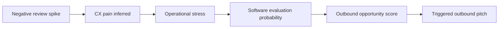
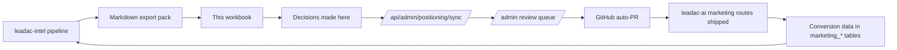

# Revint Positioning Workbook

> Notion-ready template for owning Revint's category language. Drop this `.md` into Notion via **Import → Markdown** and every heading becomes a page block, every table becomes a Notion table (convertible to a database with right-click → Turn into database).

**Purpose.** A founder's working document for owning Revint's category language. Every concept that came out of the Positioning Intelligence System maps to a section here. Fill it in, debate it, ship it.

**How to use.**

- This is a thinking workbook, not a wiki. Every entry should be dated and signed.
- Treat each section as a living artifact — version it weekly, not monthly.
- The Positioning Intelligence System (`leadac-intel`) auto-fills the data sections. The founder's job here is editing, not authoring from scratch.
- When in doubt about whether something belongs: if it's about the language, voice, narrative, or category we're claiming → it lives here. If it's data, metrics, or pipeline output → it lives in the intel dashboard.

---

## 0. Index

1. [Positioning Thesis](#1-positioning-thesis)
2. [ICP and Personas](#2-icp-and-personas)
3. [Pain Library](#3-pain-library)
4. [Competitor Map](#4-competitor-map)
5. [Saturation Map](#5-saturation-map)
6. [Whitespace Map](#6-whitespace-map)
7. [Intent Taxonomy](#7-intent-taxonomy)
8. [Signal Taxonomy](#8-signal-taxonomy)
9. [Messaging House](#9-messaging-house)
10. [Vertical Packs](#10-vertical-packs)
11. [Comparison Angles](#11-comparison-angles)
12. [Evidence Log](#12-evidence-log)
13. [Cycle Review](#13-cycle-review)
14. [Decision Log](#14-decision-log)
15. [Glossary](#15-glossary)
16. [Appendix A: Connection to the Intel System](#appendix-a--connection-to-the-intel-system)

---

## 1. Positioning Thesis

### The category we're claiming

> What category do we want to be the default answer for? Not "AI SDR." Not "lead gen." Something specific enough that we can win it.

- **Working answer:** _Intent Intelligence for Local Business Outbound_
- **Alt phrasing:** _Signal-Based Prospecting Infrastructure for SMB Sales Teams_
- **Why this category exists today:** the buying-readiness gap between identity data (Apollo, ZoomInfo) and actual purchase intent for local businesses.
- **Date claimed:**
- **Owner:**

### One-liner

> 15 words or less. Should pass the "if I overhear this at a dinner, do I get it" test.

| Version | Line | Date | Notes |
|---------|------|------|-------|
| v1 | We tell you when a local business is about to buy, before they tell you. |  |  |
| v2 |  |  |  |
| v3 |  |  |  |

### The manifesto

> A 200-300 word argument for why this category needs to exist. The internal version is meaner than the external version. Both go here.

**Internal manifesto (mean version, founder voice):**

```
Write here. Don't soften.
```

**External manifesto (homepage-safe):**

```
Write here. Customer-facing tone.
```

### We are NOT

- [ ] Another AI SDR tool
- [ ] A CRM
- [ ] An email sender
- [ ] A generic lead gen tool
- [ ] A list-buying service
- [ ] A data enrichment tool
- [ ] A meeting booker
- [ ] _add yours_

### We ARE

- [ ] An intent intelligence layer
- [ ] An operational signal interpreter
- [ ] A timing engine for outbound
- [ ] Trigger-based prospecting infrastructure
- [ ] _add yours_

### Tests for staying on-thesis

Run every new feature, every page, every campaign through these:

- Would Apollo build this? If yes → drop it.
- Would a generic AI SDR tool build this? If yes → drop it.
- Does this require operational data (reviews, hiring, menus, bookings) to work? If yes → keep it.
- Does this require local SMB context to work? If yes → keep it.
- Does it answer "_when_ should we reach out?" rather than "_who_ should we reach out to?" If yes → keep it.

---

## 2. ICP and Personas

### Primary ICP

> The one customer we'd build the entire product for if we could only have one.

| Field | Answer |
|-------|--------|
| Industry |  |
| Company size |  |
| Geography |  |
| Revenue band |  |
| Tech stack proxy |  |
| Buying trigger |  |
| Disqualifier signal |  |
| Annual contract value |  |
| Sales cycle length |  |
| Where we win them |  |
| Where we lose them |  |

### Secondary ICPs

| ICP name | Why secondary | When to deprioritize |
|----------|---------------|----------------------|
|  |  |  |

### Persona cards

> One per buying persona. Repeat the block.

#### Persona: [name]

- **Role / title:**
- **Reports to:**
- **What they say internally:**
- **What they say to vendors:**
- **What they fear:**
- **What they Google:**
- **What they read:**
- **Where they hang out (subreddits, communities, conferences):**
- **What gets them fired:**
- **What gets them promoted:**
- **A direct quote (with source):**
- **Buying authority:** champion / decision-maker / blocker / signer

#### Persona: [name]

[repeat block]

### Disqualifiers

- [ ] _signal that this is NOT our customer (e.g. "asks for SOC2 in first call" → enterprise, not us)_
- [ ]
- [ ]

---

## 3. Pain Library

### Pain inventory

> Every pain ships with a source quote and a permalink. No anonymous pains.

| ID | Pain (one sentence) | Frequency | Vertical | Intent class | Source | Quote / link | First seen |
|----|---------------------|-----------|----------|--------------|--------|--------------|------------|
| P-001 | Apollo gives us leads but not buyers | high | b2b-saas | Pain → Switching | r/sales | _link_ |  |
| P-002 | Restaurant owners rarely reply to cold email | high | restaurant | Pain | r/restaurantowners | _link_ |  |
| P-003 | Cold outreach feels random | high | generic | Pain → Solution Seeking | r/coldemail | _link_ |  |
| P-004 |  |  |  |  |  |  |  |

### Top 10 pains we own

1.
2.
3.
4.
5.
6.
7.
8.
9.
10.

### Pain stories

> Five customer (or prospect) stories where the pain was felt acutely. First-person voice. Include the moment they realized, what they tried, why it didn't work, what they wish existed.

#### Story 1: [name / role / vertical]

```
Write the story. Use their words wherever possible.
The "moment they realized" is the most important sentence — that's the headline material.
```

#### Story 2: [name]

```

```

#### Story 3 / 4 / 5

[repeat]

---

## 4. Competitor Map

> One card per competitor. Update on every cycle. Track positioning shifts, not just features. The intel system feeds you the diffs — you write the editorial interpretation here.

### Competitor: Apollo

- **One-liner they use (current):**
- **One-liner they used 90 days ago:**
- **Where they're saturated (which clusters):**
- **Where they're weak:**
- **Their stated ICP:**
- **Their real ICP (revealed by ad copy + landing pages):**
- **Their growth channel:** SEO / outbound / paid / community / PLG
- **Their hero headline (current):**
- **Their hero headline (90d ago):**
- **Recent messaging changes (last 90 days):**
- **Recent landing pages launched:**
- **What they ignore:**
- **Where we attack them:**
- **Where we don't compete:**
- **Last reviewed:**

### Competitor: ZoomInfo

[same fields]

### Competitor: Outreach

[same fields]

### Competitor: Lemlist

[same fields]

### Competitor: Smartlead

[same fields]

### Competitor: Instantly

[same fields]

### Competitor: Clay

[same fields]

### Competitor: 11x

[same fields]

### Competitor: [add as discovered]

---

## 5. Saturation Map

> Phrases everyone says. **Avoid these in our copy.** Use them only in comparison angles to position against. The intel system computes saturation per cluster; we add the editorial "what to do" column.

| Cluster | Example phrases | Competitors using | Saturation score | Our action |
|---------|-----------------|-------------------|------------------|------------|
| AI SDR | "AI SDR", "AI sales agent", "autonomous SDR" | Apollo, Outreach, 11x, Lemlist | 0.92 | AVOID |
| Sales automation | "automate your outreach", "10x your pipeline" | most | 0.88 | AVOID |
| Lead generation | "find leads on autopilot", "endless leads" | most | 0.95 | AVOID |
| Personalization | "hyper-personalized at scale" | most | 0.90 | AVOID |
| AI personalization | "AI-personalized emails" | growing fast | 0.85 | AVOID |
|  |  |  |  |  |

### Rule of thumb

If saturation > 0.6 → AVOID. If 0.3-0.6 → use only with a sharp differentiator. If < 0.3 → potential whitespace, see Section 6.

---

## 6. Whitespace Map

> Phrases nobody owns yet that match our positioning. **Use these aggressively.**

### Whitespace card template

#### Whitespace: [name]

- **Cluster label:**
- **Why it's underserved:**
- **Pain support (which P-IDs map to this):**
- **Buyer intent class:**
- **Estimated saturation (0-1):**
- **Estimated commercial volume:**
- **Why we can own it (our right to win):**
- **Risk of failure:**
- **Status:** Exploring / Claimed / Shipped / Killed
- **First headline ship date:**
- **Performance to date:**

#### Whitespace: Local SMB intent intelligence

- **Cluster label:** local-smb-intent
- **Why it's underserved:** every competitor optimizes for B2B SaaS ICPs; nobody serves agency-led local outbound at scale
- **Pain support:** P-002, P-003
- **Buyer intent class:** Solution Seeking + Operational Trigger
- **Status:** Claimed

#### Whitespace: Trigger-based prospecting

[fill]

#### Whitespace: Operational buying signals

[fill]

#### Whitespace: Review-triggered outbound

[fill]

#### Whitespace: Timing intelligence

[fill]

---

## 7. Intent Taxonomy (reference)

> The 10-class taxonomy used by the intel system's classifier. Use these labels consistently across every section in this workbook.

| Class | Meaning | Example phrase | Action template |
|-------|---------|----------------|-----------------|
| Pain | user frustration | "Apollo gives us leads but not buyers" | hook copy, social proof |
| Solution Seeking | active search | "best alternative to Apollo" | comparison page |
| Switching Intent | replacing a tool | "moving off Outreach" | switching content + migration guide |
| Buying Intent | purchase likelihood | "Apollo pricing 2026" | retargeting, pricing-page SEO |
| Awareness | educational | "what is intent data" | top-of-funnel SEO |
| Operational Trigger | operational shift | "restaurant just opened second location" | timed outbound |
| Reputation Signal | review issues | "negative reviews delivery" | trigger-based pitch |
| Growth Signal | expansion | "hiring sales rep" | growth-mode pitch |
| Urgency | immediate pain | "lost 30% bookings this month" | urgent outbound |
| Comparison | alt evaluation | "Apollo vs ZoomInfo" | comparison page |

---

## 8. Signal Taxonomy (reference)

> Signals are the moat. Keep this list updated as we discover more. The Signal Engine in `leadac-intel` Phase 3 detects these automatically.

| Signal | What it means | Detection source | Outbound timing |
|--------|---------------|------------------|-----------------|
| Negative review spike | operational stress | Google Maps reviews delta | within 7d |
| Hiring surge | expansion mode | LinkedIn jobs delta | within 14d |
| Menu redesign | repositioning | website diff | within 30d |
| Booking decline | revenue stress | review tone + frequency | within 7d |
| Website decay | operational neglect | uptime + crawl freshness | within 30d |
| Owner activity increase | growth mode | social posting frequency | within 14d |
| Tech stack change | strategic shift | BuiltWith delta | within 14d |
| Pricing page change | repositioning | Firecrawl diff | within 14d |
|  |  |  |  |

### Signal-to-pitch mapping



---

## 9. Messaging House

> Banks of approved copy. Each entry has provenance — which whitespace it came from, which evidence supports it, which test it won (or lost). Approved entries ship to Revint via the activation pipeline.

### Hero headlines

| ID | Text | Whitespace | Status | Performance | Lang | Date approved |
|----|------|------------|--------|-------------|------|---------------|
| H-001 | Most prospecting tools find businesses. We find the ones ready to buy. | local-smb-intent | Shipped | 2.4% CVR | EN |  |
| H-002 |  |  |  |  | EN |  |
| H-003 |  |  |  |  | TR |  |

### Subheads

| ID | Text | Pairs with | Status | Performance | Lang |
|----|------|-----------|--------|-------------|------|
| S-001 |  |  |  |  | EN |

### CTAs

| ID | Text | Context | Status | Performance | Lang |
|----|------|---------|--------|-------------|------|
| C-001 | See who's ready to buy this week | hero | Draft |  | EN |
| C-002 |  |  |  |  | TR |

### Google Ads (RSA pairs)

> 15 headlines + 4 descriptions per ad group. Mark winners in bold.

#### Ad group: brand

- Headlines:
- Descriptions:

#### Ad group: competitor / Apollo alternative

- Headlines:
- Descriptions:

#### Ad group: vertical / restaurant

- Headlines:
- Descriptions:

### Meta Ads (primary text)

| ID | Text (≤125 chars) | Persona | Status | Performance |
|----|-------------------|---------|--------|-------------|
| M-001 |  |  |  |  |

### Outbound: subject lines

| ID | Subject | Persona | Vertical | Status | Reply rate |
|----|---------|---------|----------|--------|------------|
| O-001 |  |  |  |  |  |

### Outbound: first lines

| ID | First line | Pairs with subject | Provenance (which P-ID) | Status |
|----|-----------|---------------------|-------------------------|--------|
| F-001 | I noticed your last 12 reviews mentioned slow delivery — running into anything operationally? | O-001 | P-X (review-triggered pain) | Draft |

### SEO clusters

| Cluster topic | Primary keyword | Supporting keywords (5) | Target URL pattern | KD | Volume | Status |
|---------------|-----------------|--------------------------|-------------------|-----|--------|--------|
| Restaurant intent signals |  |  | /resources/restaurant-intent-signals |  |  |  |
| Trigger-based outbound |  |  | /resources/trigger-based-outbound |  |  |  |

---

## 10. Vertical Packs

> One pack per vertical. Restaurant, dental, real-estate, b2b-saas, etc. Each pack lives or dies by whether it sounds native to that vertical.

### Vertical: Restaurant

- **Persona reading the page:** owner, head of marketing, GM
- **What they say to themselves:** _"I just want to fill seats midweek"_
- **What they Google:**
- **What they fear:**
- **The 3 pain stories (link to Section 3):**
- **The hero headline (vertical-specific):**
- **The 5 buyer questions (PAA-style):**
- **The competitor gap exploited:**
- **The page lives at:** `/for/restaurants`
- **Status:** Drafted / Shipped / A/B testing
- **Performance:**

### Vertical: Dental

[same fields]

### Vertical: Real estate

[same fields]

### Vertical: B2B SaaS (generic)

[same fields]

### Vertical: [next]

---

## 11. Comparison Angles

> One angle per competitor. The angle is the THING WE DO that they don't / can't / won't. Comparison pages live at `/compare/<competitor>` and `/alternatives/<competitor>`.

### Revint vs Apollo

- **Their strength:** identity data at scale
- **Our angle:** "Apollo finds. Revint times."
- **The proof:** [link to evidence]
- **The objection we'll get:** "But we already use Apollo"
- **Our objection handler:** "We're not replacing them. We're telling you which Apollo lead is ready to buy this week."
- **Headline draft:**
- **CTA draft:**
- **Status:** Drafted / Shipped

### Revint vs ZoomInfo

[same]

### Revint vs Outreach

[same]

### Revint vs Lemlist

[same]

### Revint vs Smartlead

[same]

### Revint vs Clay

[same]

---

## 12. Evidence Log

> Every quote we cite anywhere ships with a permalink. No quote without a source. Sourced from intel system's Reddit / G2 / Capterra / Firecrawl pipelines plus founder-led customer interviews.

### Reddit quotes

| Quote | Subreddit | Permalink | Upvotes | Date | Used in |
|-------|-----------|-----------|---------|------|---------|
|  |  |  |  |  |  |

### G2 / Capterra quotes

| Quote | Product reviewed | Reviewer role | Link | Date | Used in |
|-------|------------------|---------------|------|------|---------|
|  |  |  |  |  |  |

### Customer interview quotes

| Quote | Customer | Their role | Date | Used in |
|-------|----------|------------|------|---------|
|  |  |  |  |  |

### Sales call clips

| Clip | Customer / prospect | Timestamp | Date | Used in |
|------|---------------------|-----------|------|---------|
|  |  |  |  |  |

### Support ticket / NPS quotes

| Quote | Source | Date | Used in |
|-------|--------|------|---------|
|  |  |  |  |

---

## 13. Cycle Review

> Friday journal. 10 minutes. Reverse-chronological. The forcing function for not drifting.

### Cycle YYYY-WW (current week)

- **What changed in the market this week:**
- **What competitors moved:**
- **What new whitespace emerged:**
- **What we shipped:**
- **What performed:**
- **What underperformed:**
- **What we'll try next:**
- **Decisions made (links to Decision Log):**

### Cycle YYYY-WW (previous week)

[copy block, fill]

### Cycle YYYY-WW (n-2)

[copy block, fill]

> _Tip: archive cycles older than 90 days into a sub-page. Keep the last 12 weeks visible._

---

## 14. Decision Log

> Every positioning decision goes here. Including reversals. Especially reversals.

| Date | Decision | Why | Owner | Reverse if | Status |
|------|----------|-----|-------|-----------|--------|
| 2026-05-16 | Drop "AI SDR" from homepage hero | Saturation 0.92, no differentiation | Founder | New evidence shows we'd win it | Active |
|  |  |  |  |  |  |

### Reversal protocol

1. Cite the original decision row.
2. State what new evidence triggers the reversal.
3. Note who approved the reversal.
4. Add the reversal as a new row, mark the original "Reversed" in the status column.

---

## 15. Glossary

| Term | Definition |
|------|-----------|
| Whitespace | A semantic cluster with high pain support and low competitor coverage |
| Saturation | Fraction of relevant competitors using a given cluster's phrases |
| Intent class | The commercial meaning of a phrase (10 classes; see Section 7) |
| Signal | An observable operational change that predicts buying readiness (see Section 8) |
| Narrative pack | A set of generated copy variants per whitespace, all sharing provenance |
| Provenance | The audit trail behind every piece of copy: whitespace + evidence + competitor gap |
| Cycle | The weekly rhythm: ingest Mon → cluster Wed → narrative Thu → digest Fri |
| Vertical pack | A vertical-specific set of personas + pains + headlines + landing page scaffold |
| Saturation Map | The set of clusters competitors crowd; we avoid these |
| Whitespace Map | The set of clusters competitors miss; we own these |
| ICP | Ideal Customer Profile — the customer we'd build the product for if we could only have one |
| Pain story | A first-person customer narrative used as headline / outbound / landing source material |
| Comparison angle | The single thing we do that a specific competitor does not / cannot / will not |
| Trigger | An operational event that increases buying readiness within a known time window |
| Outbound opportunity score | The aggregate score that ranks signal events for sales outreach (Phase 3) |

---

## Appendix A — Connection to the Intel System

This workbook is the **human side** of the system. The intel pipeline (`leadac-intel`) generates evidence, clusters, and narrative drafts. This workbook is where the founder makes the editorial decisions — what we claim, what we drop, what we test, what we kill.

| Workbook section | Auto-populated by intel system | Founder's job |
|------------------|--------------------------------|---------------|
| Section 3 (Pain Library) | Reddit + G2 + Capterra ingestion → Phrase + Cluster | Promote 10 to "Top 10 we own" |
| Section 4 (Competitor Map) | CompetitorSnapshot diffs (Firecrawl + Ahrefs + SEMrush + BuiltWith) | Editorial interpretation per card |
| Section 5 (Saturation) | Saturation Detector → Whitespace Engine | Decide "Avoid / Sharpen / Use as comparison" |
| Section 6 (Whitespace) | Whitespace Ranker output | Status: Exploring / Claimed / Shipped / Killed |
| Section 9 (Messaging) | Narrative Engine generated drafts | Approve / kill / edit per ID |
| Section 12 (Evidence) | Reddit / G2 / Capterra / sales call ingestion | Tag what's used where |
| Section 13 (Cycle Review) | Friday digest auto-summary | The 10-minute editorial pass |
| Section 14 (Decision Log) | _Founder authored only_ | Feeds back into intel as `Narrative.outcomeScore` overrides |

### The activation loop



Every section that the system can pre-fill should be reviewed weekly, not authored from scratch. **The founder's job is editing, not writing.**

---

## Appendix B — Filling order for a brand-new copy of this workbook

If you're filling this in from scratch (e.g. a new niche or a major repositioning), the dependency order is:

1. Section 1 (Thesis) — set the category and one-liner first; everything below derives from this.
2. Section 2 (ICP) — narrow to one primary; secondary ICPs come later.
3. Section 3 (Pain Library) — start with 10, even if rough. The intel system will expand.
4. Section 4 (Competitor Map) — top 5 competitors, then expand.
5. Section 7 + 8 (taxonomies) — read-only references; just confirm you understand the labels.
6. Section 5 + 6 (Saturation + Whitespace) — these need data from the intel system. Skip on day 1.
7. Section 9 (Messaging) — derived from whitespace; don't write headlines until Section 6 is filled.
8. Section 10 (Vertical Packs) — pick the first vertical, ship it, then add the second.
9. Section 11 (Comparison Angles) — only after Sections 4 + 6 are stable.
10. Sections 12, 13, 14 — running logs. Start writing immediately.
11. Section 15 (Glossary) — read-only; keep open in a side tab.

---

_End of workbook. Last reviewed: YYYY-MM-DD by [name]._
