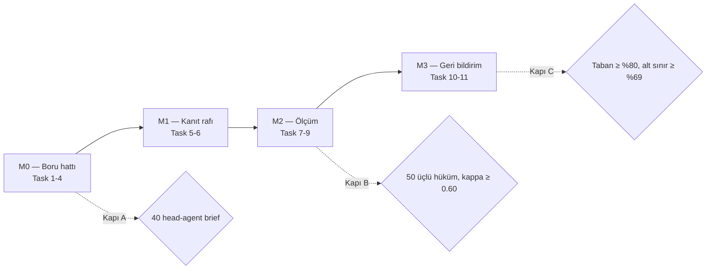

# Admin paneli — son uygulama planı

> **For agentic workers:** REQUIRED SUB-SKILL: Use superpowers:subagent-driven-development (recommended) or superpowers:executing-plans to implement this plan task-by-task. Steps use checkbox (`- [ ]`) syntax for tracking.

**Karar kağıdı:** `docs/admin-paneli-son-karar.md`. Çelişkilerin hükmü oradadır. Bu plan yalnızca icradır.

**Goal:** FineDine Beta'da head-agent kararı üreten kısa bir boru hattı kurmak, o kararı kanıtıyla yan yana gösteren bir inceleme kartı yazmak, üç merceğin bağımsız hükmünü ölçülebilir hale getirmek ve SDR geri bildirimini aynı tabloya bağlamak. Çıkış: FineDine teslim kapısının (Kapı C) sayıları ekranda okunabilir olur.

**Architecture:** Yeni kuyruk yok, yeni model ucu yok, yeni rol yok. Varsayılan zincir dört worker'a iner (`APIFY_GMAPS_DEEP`, `WEBSITE_AUDITOR`, `REVIEW_ANALYST`, `LEAD_INTELLIGENCE_BRIEF`). Karar yalnızca brief'in içindeki head agent'tedir; head agent'ın kural katmanı (Oda 1) paketi ve kaçağı seçer, Claude yalnızca konuşmayı yazar. Kontrol odası bu dört worker'ın ham çıktısını dört çekmeceli bir kanıt rafına açar. Mercek hükmü diğer hükümleri görmeden yazılır. Skorlayıcı model çağırmaz. SDR geri bildirimi `HumanReview` satırıdır, `lens = null`, üçlü kapıya girmez, kuyruk triyajını değiştirir.

**Tech Stack:** Next.js 16.2.3 App Router, React 19, TypeScript, Prisma 6 + Postgres, BullMQ `agent-runs`, Claude head agent, Gemini (yalnızca mevcut worker modüllerinde), Vitest.

---

## Global Constraints

- Workspace verisine dokunan her Prisma okuması ve yazması `where` veya `data` içinde `workspaceId` taşır. URL'deki kimlik, kontrol rolü geçmeden çocuk sorgularda kullanılmaz.
- Prisma tipleri `@/generated/prisma/client` üzerinden. `@prisma/client` yasak.
- Yeni BullMQ kuyruğu yok. AI işi `agent-runs` üzerinde kalır.
- Worker modülü dışında yeni Gemini çağrısı yok. `/api/admin/**` altında model çağrısı yok.
- `prisma.semanticMemory.*` doğrudan yazılmaz. Referans vaka hafıza yazmaz.
- `params`, `searchParams`, `cookies()`, `headers()` Promise'tir. `await` edilir.
- Admin mutasyonu `AdminAuditEvent` ekler. Güncelleme ve silme rotası yoktur.
- `typescript.ignoreBuildErrors` `false` kalır. Bu planın bitiminde kontrol odasında 0 tsc hatası olur (bugün de 0'dır, bozulmaz).
- Ekran metni Türkçe. Rota İngilizce. Enum değeri (`NEEDS_REVIEW`, `PACKAGE`, `TECHNICAL`) birincil etiket olarak basılmaz.
- Rolün kullanamayacağı kontrol görünür ve pasif durur, sebebi yanında yazar. Sunucu yine 403 döner.
- Mevcut görsel dil: kart, kenarlık, `--revint-*` token'ları. Yeni grafik, yeni kısayol, yeni renk yok.
- Ölü worker enum'dan **silinmez**. Yalnızca varsayılan zincirden çıkarılır.
- `POST /api/admin/pipeline/cancel-all-global` UI'ya çıkmaz.
- Çıplak geçiş oranı ekrana basılmaz. Oran, `n` ve %95 Wilson aralığı birlikte basılır.

---

## Dosya haritası

| Dosya | Sorumluluk | Durum |
|---|---|---|
| `src/lib/ai-core/chains.ts` | `getDefaultChain` dört adım. `LEAD_PIPELINE_ALLOWED_WORKERS` aynı liste | Değişir |
| `src/lib/control/trace-groups.ts` | Dört iz grubu, tek kaynak | **Yeni** |
| `src/lib/extractor.ts` | `hasQrMenu` / `hasOnlineOrdering` üç durumlu | Değişir |
| `src/lib/apify.ts` | `withApifySlot` (2), kota → `skipped` | Değişir |
| `src/lib/agent-workers/review-analyst.ts` | 30 yorum eşiği, `sellable` bayrağı | Değişir |
| `src/lib/agent-workers/lead-intelligence-brief.ts` | F&B'de legacy kapalı | Değişir |
| `src/lib/ai-core/agent/head-agent.ts` | Oda 1: kaçak + paket. Exclusion ve kanıt zorunluluğu | Değişir |
| `src/lib/control/evidence-shelf.ts` | Dört çekmece, sol iddia / sağ dayanak | **Yeni** |
| `src/lib/control/rubric.ts` | Rubrik sürümü, mercek soruları, çapa örnekleri | **Yeni** |
| `src/lib/control/agreement.ts` | Fleiss kappa, ham uyum, sıklık, karışıklık matrisi | **Yeni** |
| `src/lib/control/stats.ts` | Wilson aralığı, yeterlilik eşiği | **Yeni** |
| `src/lib/control/score.ts` | `PACKAGE` ve `WEDGE` kodları | Değişir |
| `src/lib/control/review.ts` | Bağımsız etiketleme, SDR triyajı, süre ölçümü | Değişir |
| `src/lib/control/overview.ts` | `completed24h` = head-agent brief. Kapı sayıları | Değişir |
| `src/lib/control/sdr-feedback.ts` | SDR hükmü yazımı | **Yeni** |
| `src/app/admin/control/uyum/page.tsx` | Uyum ekranı | **Yeni** |
| `src/app/api/leads/[id]/feedback/route.ts` | SDR geri bildirim rotası | **Yeni** |
| `src/components/admin/evidence-shelf.tsx` | Dört çekmece bileşeni | **Yeni** |
| `src/components/app/lead-feedback.tsx` | SDR'ın gördüğü iki düğme | **Yeni** |
| `src/components/admin/nav.tsx` | "Yayın" etiketi, "Uyum" satırı | Değişir |
| `prisma/schema.prisma` | `HumanReview.source`, `.rubricVersion`, `.reviewSeconds`; `ReviewSource` enum | Değişir |

---

## Milestone sırası



M0 bitmeden M1'in ekranında görülecek veri yoktur. Sıra atlanmaz.

> **29 Eylül, icra notu — Task 11 öne alındı.** Task 1'in testini koşarken çıktı: `jsdom` bu repoda tamamen kırık. `jsdom@29` → `html-encoding-sniffer@5` (CJS) → `@exodus/bytes@1.15` (yalnız ESM) zinciri Node 20'de `ERR_REQUIRE_ESM` atıyor ve vitest worker'ı boot ederken ölüyor. Hata deterministik değildi: worker'a hangi dosyanın düştüğüne göre bazı dosyalar sessizce atlanıyordu. Sonuç, **hiçbir bileşen testi hiç çalışmamıştı** ve tüm suite koşulduğunda 25 dosya boot edemiyordu. Bu yüzden Task 11 sıradan çıkarılıp M0'dan önce yapıldı (commit `86cb852`). Varsayılan ortam `node`, sekiz bileşen dosyası `// @vitest-environment happy-dom` ile opt-in ediyor. Suite artık uçtan uca kalkıyor: **1179 geçiyor, 28 kalıyor** — o 28'i ölçülmüş baseline ile karşılaştırdım, hepsi bu çalışmadan önce de kırıktı.

---

# M0 — Boru hattı: kontrol odasına girdi üret

### Task 1: Varsayılan zinciri dört worker'a indir

**Files:**
- Modify: `src/lib/ai-core/chains.ts` (`getDefaultChain`, `LEAD_PIPELINE_ALLOWED_WORKERS`, `REMOVED_V2_WORKERS`)
- Create: `src/lib/control/trace-groups.ts`
- Test: `src/__tests__/ai-core/lead-pipeline-presets.test.ts`
- Test: `src/__tests__/control/trace-groups.test.ts`

**Interfaces:**
- Consumes: `getDefaultChain(preset, plan)` imzası aynı kalır.
- Produces: BALANCED ve AGGRESSIVE için `["apify_gmaps", "audit", "review_refresh", "intelligence_brief"]`. `TRACE_GROUPS: { label: string; kinds: AgentWorkerKind[] }[]`.

- [x] **Step 1: Kırılacak testi yaz**

```ts
it("BALANCED is map, site, reviews, decision", () => {
  expect(stepIdsIn(getDefaultChainForUi("BALANCED", "AGENCY"))).toEqual([
    "apify_gmaps",
    "audit",
    "review_refresh",
    "intelligence_brief",
  ]);
});

it("AGGRESSIVE matches BALANCED", () => {
  expect(stepIdsIn(getDefaultChainForUi("AGGRESSIVE", "AGENCY"))).toEqual(
    stepIdsIn(getDefaultChainForUi("BALANCED", "AGENCY")),
  );
});

it("LITE on FREE keeps site and decision", () => {
  expect(stepIdsIn(getDefaultChainForUi("LITE", "FREE"))).toEqual([
    "audit",
    "intelligence_brief",
  ]);
});

it("the brief waits for every data step", () => {
  const brief = stepById(getDefaultChainForUi("BALANCED", "AGENCY"), "intelligence_brief");
  expect(brief?.dependsOn.sort()).toEqual(["apify_gmaps", "audit", "review_refresh"].sort());
});

it("keeps the retired workers out of the default chain", () => {
  const kinds = getDefaultChainForUi("BALANCED", "AGENCY").map((s) => s.workerKind);
  for (const retired of [
    "SALES_OPPORTUNITY_SCORER",
    "LEAD_DOSSIER_GENERATOR",
    "ICP_SCORER",
    "WHY_NOW_SYNTHESIZER",
    "TRIGGER_DETECTOR",
    "APIFY_WEB_CRAWL_DEEP",
    "GOOGLE_PLACES_REVIEWS",
    "SOCIAL_SCRAPER",
    "APIFY_SERP_RANK",
    "EMAIL_VERIFIER",
    "SUBVERTICAL_CLASSIFIER",
  ]) {
    expect(kinds).not.toContain(retired);
  }
});
```

`trace-groups.test.ts`:

```ts
import { TRACE_GROUPS } from "@/lib/control/trace-groups";

it("trace groups match the four-step chain in order", () => {
  expect(TRACE_GROUPS.map((g) => g.label)).toEqual(["Harita", "Site", "Yorum", "Karar"]);
  expect(TRACE_GROUPS.flatMap((g) => g.kinds)).toEqual([
    "APIFY_GMAPS_DEEP",
    "WEBSITE_AUDITOR",
    "REVIEW_ANALYST",
    "LEAD_INTELLIGENCE_BRIEF",
  ]);
});
```

- [x] **Step 2: Testleri çalıştır, kırmızı gör**

Run: `npx vitest run src/__tests__/ai-core/lead-pipeline-presets.test.ts src/__tests__/control/trace-groups.test.ts`

Expected: FAIL. Mevcut BALANCED `score`, `icp_scorer`, `triggers`, `dossier`, `social`, `webcrawl` içeriyor. `trace-groups` modülü yok.

- [x] **Step 3: `getDefaultChain` gövdesini değiştir**

```ts
const balanced: Chain = [
  { stepId: "apify_gmaps", workerKind: "APIFY_GMAPS_DEEP", dependsOn: [], optional: true },
  { stepId: "audit", workerKind: "WEBSITE_AUDITOR", dependsOn: [], optional: true },
  { stepId: "review_refresh", workerKind: "REVIEW_ANALYST", dependsOn: ["apify_gmaps"], optional: true },
  {
    stepId: "intelligence_brief",
    workerKind: "LEAD_INTELLIGENCE_BRIEF",
    dependsOn: ["apify_gmaps", "audit", "review_refresh"],
    optional: true,
  },
];
```

`LITE` = `audit` + `intelligence_brief`. `apify_gmaps` ve `review_refresh` `minPlan: PRO`; `filterByPlan` onları FREE'de zaten düşürür. `LEAD_PIPELINE_ALLOWED_WORKERS` bu dört kind ile sınırlanır. Çıkarılan worker'lar `REMOVED_V2_WORKERS` listesine eklenir; enum'dan **silinmez**, tıklama zincirlerinde (`user_one_click_pitch`, `user_deep_research`) durmaya devam eder.

`trace-groups.ts`:

```ts
import type { AgentWorkerKind } from "@/generated/prisma/client";

export const TRACE_GROUPS: Array<{ label: string; kinds: AgentWorkerKind[] }> = [
  { label: "Harita", kinds: ["APIFY_GMAPS_DEEP"] },
  { label: "Site", kinds: ["WEBSITE_AUDITOR"] },
  { label: "Yorum", kinds: ["REVIEW_ANALYST"] },
  { label: "Karar", kinds: ["LEAD_INTELLIGENCE_BRIEF"] },
];
```

- [x] **Step 4: Eski dörtlüyü tek kaynağa bağla**

`src/lib/control/lens-card.ts` içindeki dosya-yerel `WORKER_GROUPS` sabitini sil, `TRACE_GROUPS` import et. `SALES_OPPORTUNITY_SCORER` satırı kalkar, `APIFY_GMAPS_DEEP` satırı gelir. `src/app/admin/control/trace/[leadId]/page.tsx` düz `runs.map` yerine `TRACE_GROUPS` sırasında basar; gruptaki kind için koşu yoksa satır "çalışmadı" der.

- [x] **Step 5: Testler yeşil**

Run: `npx vitest run src/__tests__/ai-core src/__tests__/control`

Expected: PASS. `lens-card.test.ts` eski grup adlarını bekliyorsa onu da güncelle.

- [x] **Step 6: Commit**

```bash
git add src/lib/ai-core/chains.ts src/lib/control/trace-groups.ts src/lib/control/lens-card.ts src/app/admin/control/trace/[leadId]/page.tsx src/__tests__/ai-core/lead-pipeline-presets.test.ts src/__tests__/control/trace-groups.test.ts
git commit -m "fix: default lead chain is map, site, reviews, and one decision"
```

---

### Task 2: Veri hijyeni — üç durumlu menü sinyali, Apify kilidi, yorum eşiği

Bu, `plans/2026-09-28-lead-pipeline-simplify.md` Task 3 ve Task 4'ün geçerli kalan kısmıdır. Zincir tasarımı iptal, bu düzeltmeler değil.

**Files:**
- Modify: `src/lib/extractor.ts`
- Modify: `src/lib/apify.ts`
- Modify: `src/lib/agent-workers/review-analyst.ts`
- Modify: `src/workers/index.ts` (çift kuyruklar boot'tan iner)
- Test: `src/__tests__/lib/extractor-qr-menu-and-reservation.test.ts`
- Test: `src/__tests__/lib/apify-limiter.test.ts`
- Test: `src/__tests__/agent-workers/review-analyst-corpus.test.ts`
- Test: `src/__tests__/workers/supervisor-boot.test.ts`

**Interfaces:**
- Produces: `extractFeatures()` → `hasQrMenu: boolean | null`, `hasOnlineOrdering: boolean | null`. `withApifySlot(fn)` eşzamanlı en fazla 2. `shouldAnalyzeReviews(count): boolean` eşik 30. `painPhrases[].sellable: boolean`.

- [ ] **Step 1: Testleri yaz**

```ts
it("returns null QR when the page has no menu link", () => {
  const f = extractFeatures("<html><body><h1>Cafe</h1></body></html>", "https://cafe.example");
  expect(f.hasQrMenu).toBeNull();
  expect(f.hasOnlineOrdering).toBeNull();
});

it("returns false QR when a menu link exists and no vendor matches", () => {
  const html = `<a href="https://cafe.example/menu">Menu</a>`;
  expect(extractFeatures(html, "https://cafe.example").hasQrMenu).toBe(false);
});

it("does not treat a shop link as online ordering", () => {
  const html = `<a href="https://cafe.example/shop">Shop</a>`;
  expect(extractFeatures(html, "https://cafe.example").hasOnlineOrdering).toBeNull();
});

it("runs at most two apify calls at once", async () => {
  let active = 0, max = 0;
  await Promise.all(Array.from({ length: 5 }, () => withApifySlot(async () => {
    active += 1; max = Math.max(max, active);
    await new Promise((r) => setTimeout(r, 20));
    active -= 1;
  })));
  expect(max).toBeLessThanOrEqual(2);
});

it("does not write KPI bars below 30 reviews", () => {
  expect(shouldAnalyzeReviews(5)).toBe(false);
  expect(shouldAnalyzeReviews(30)).toBe(true);
});

it("does not boot the legacy review and email queues", () => {
  const src = readFileSync("src/workers/index.ts", "utf8");
  expect(src).not.toMatch(/startReviewAnalysisWorker\(/);
  expect(src).not.toMatch(/startEmailVerificationWorker\(/);
  expect(src).toMatch(/startAgentRunWorker\(/);
});
```

- [ ] **Step 2: Testler kırmızı**

Run: `npx vitest run src/__tests__/lib/extractor-qr-menu-and-reservation.test.ts src/__tests__/lib/apify-limiter.test.ts src/__tests__/agent-workers/review-analyst-corpus.test.ts src/__tests__/workers/supervisor-boot.test.ts`

- [ ] **Step 3: Uygula**

`extractor.ts`: `let hasQrMenu: boolean | null = null`. Menü linki bulunup sağlayıcı tutmazsa `false`, tutarsa `true`. Online sipariş için aynı üç durum. `has_ecommerce = true` bu alanı doldurmaz; sipariş/sepet/Deliveroo/UberEats/kendi checkout linki gerekir. `bookingProvider` doluysa `hasOnlineReservation: true`.

`apify.ts`: süreç içi sayaçla `withApifySlot`. HTTP 402, ve 403 `platform-feature-disabled` / `actor-memory-limit-exceeded` / `concurrent-runs-limit-exceeded` için throw yok — `{ skipped: "apify_quota", statusCode }` döner ve koşu `SUCCEEDED` biter. Gmaps actor `maxReviews` 80, tavan 200.

`review-analyst.ts`: `export const MIN_REVIEW_CORPUS = 30` ve `shouldAnalyzeReviews`. `false` ise Gemini çağrılmaz, `ReviewAnalysis` upsert edilmez, dönüş `{ skipped: "thin_corpus", count }`. `leadScore` alanına 0–100 fırsat puanı basılmaz — o puan brief'in işi. Pain phrase şemasına `sellable: boolean`; lezzet ve zehirlenme `false`, bekleme / rezervasyon / sipariş hatası / hesap `true`. Embed hatası (`EmbeddingError`) loglanır, koşuyu düşürmez.

`workers/index.ts`: `startReviewAnalysisWorker` ve `startEmailVerificationWorker` çağrıları, import'ları ve shutdown `close` satırları silinir. `crawl-worker` / `analyze-worker` yorumları kalır.

- [ ] **Step 4: Testler yeşil, commit**

```bash
git commit -am "fix: distinguish unseen menu signals from absent ones, cap Apify, skip thin review samples"
```

---

### Task 3: Brief tek karar — Oda 1 paketi ve kaçağı seçer

Bu görev `analiz-ve-playbook.md` §7 ve §8'in koda dökülmesidir. Karar kağıdı Çelişki 3'ün hükmü buradadır.

**Files:**
- Modify: `src/lib/ai-core/agent/head-agent.ts` (Oda 1, QA, `replayHeadAgentDecision` aynı sözleşmeyi kullanır)
- Modify: `src/lib/agent-workers/lead-intelligence-brief.ts`
- Modify: `src/lib/control/decision.ts` (kart `wedge` ve `recommendedPackage` okur)
- Test: `src/__tests__/agent-workers/lead-intelligence-brief-grounding.test.ts`
- Test: `src/__tests__/ai-core/head-agent-room-one.test.ts`

**Interfaces:**
- Consumes: audit üç durumlu sinyaller, yorum KPI (`sellable`), harita corpus sayısı, `computeFnbModuleFit` kısa listesi.
- Produces:

```ts
export type RoomOneOutput = {
  plan: "starter" | "growth" | "premium" | "none";
  wedge: "reservation" | "bill_wait" | "marketplace"
       | "menu_surface" | "multi_location" | "guest_repeat" | "none";
  evidence: string[];   // URL veya yorum cümlesi. Boşsa wedge "none" olur.
  bans: string[];       // çiğnenmeyecek cümleler
  backup: string | null;
};
```

Brief çıktısı: `briefMode: "head-agent"`, `headAgent.recommendedPackage`, `headAgent.wedge`, `headAgent.primaryAngle`, `headAgent.talkTrack`, `headAgent.recommendedModules`, `headAgent.excludedModules`, `headAgent.confidence`, `headAgent.evidenceRefs`, `headAgent.sourceConflicts`, `missingSources: string[]`, `headAgent.roomOne: RoomOneOutput`.

**Task 1'den devreden borç — bu görevde kapanır.** `SALES_OPPORTUNITY_SCORER` otomatik zincirden çıktı, yani **yeni lead'lerde `SalesOpportunity` satırı oluşmuyor.** O satırı okuyan yüzeyler var: `/api/leads`, `/api/leads/[id]`, `/api/leads/export`, `/api/integrations/hubspot/card-data`, `explain`, `lookalikes`, ve halka açık işletme sayfası. Brief zaten `Lead.salesConfidence` yazıyor, ama paket ve açı `SalesOpportunity` üzerinden okunuyor.

Yapılacak: brief, head agent kararını yazarken aynı transaction içinde `SalesOpportunity` satırını da **tek yazar olarak** upsert eder — `recommendedPackage`, `bestSalesAngle` (kaçak), `leadScore` (`salesConfidence`), `reasonCodes` (Oda 1 kanıtı). İkinci bir model çağrısı yoktur; satır kararın projeksiyonudur. Test: brief koşusundan sonra `salesOpportunity.upsert` bir kez çağrılır ve `bestSalesAngle` karttaki kaçakla aynıdır. Bu kapanana kadar FineDine'a yeni lead verilmez.

- [x] **Step 1: Oda 1 testleri (model çağırmaz)**

```ts
it("picks growth and the reservation wedge when a marketplace holds the bookings", () => {
  const out = roomOne({
    audit: { hasBookingSystem: true, bookingProvider: "TheFork", hasPrepayment: false, tableCount: 40 },
    reviews: { count: 420, painPhrases: [] },
    locationCount: 1,
  });
  expect(out.wedge).toBe("reservation");
  expect(out.plan).toBe("growth");
  expect(out.evidence.length).toBeGreaterThan(0);
});

it("returns none when there is no strong signal and no two medium signals", () => {
  const out = roomOne({ audit: { reachable: true }, reviews: { count: 0, painPhrases: [] }, locationCount: 1 });
  expect(out.wedge).toBe("none");
  expect(out.plan).toBe("none");
});

it("never sells premium to a single venue", () => {
  const out = roomOne({ audit: {}, reviews: { count: 0, painPhrases: [] }, locationCount: 1 });
  expect(out.plan).not.toBe("premium");
});

it("does not open a wedge from a taste complaint", () => {
  const out = roomOne({
    audit: {},
    reviews: { count: 120, painPhrases: [{ text: "food was bland", sellable: false }] },
    locationCount: 1,
  });
  expect(out.wedge).toBe("none");
});
```

- [x] **Step 2: Brief testleri**

```ts
it("excludes reservation when a booking provider is already present", async () => {
  const out = await buildBriefDecision({
    niche: "RESTAURANT_TECH",
    audit: { hasBookingSystem: true, bookingProvider: "Dishoom reservations", hasQrMenu: null, hasOnlineOrdering: null },
    reviewCount: 29744,
    reviewAnalysis: null,
  });
  expect(out.briefMode).toBe("head-agent");
  expect(out.headAgent.excludedModules.map((m) => m.module)).toContain("reservation");
  expect(out.headAgent.evidenceRefs.length).toBeGreaterThan(0);
});

it("does not pitch a website rebuild from a thin five-review sample", async () => {
  const out = await buildBriefDecision({
    niche: "RESTAURANT_TECH",
    audit: { hasQrMenu: null, websiteBroken: false },
    reviewCount: 5,
    reviewAnalysis: null,
  });
  expect(out.headAgent.recommendedModules).not.toContain("website");
  expect(out.missingSources).toContain("reviews");
});

it("writes a plain card when QA fails instead of falling back to the legacy brief", async () => {
  const out = await buildBriefDecision({ niche: "RESTAURANT_TECH", forceQaFailure: true });
  expect(out.briefMode).toBe("head-agent");
  expect(out.headAgent.talkTrack).toBe("");
  expect(out.headAgent.recommendedPackage).toBeTruthy();
});
```

- [x] **Step 3: Testler kırmızı**

Run: `npx vitest run src/__tests__/ai-core/head-agent-room-one.test.ts src/__tests__/agent-workers/lead-intelligence-brief-grounding.test.ts`

- [x] **Step 4: Uygula**

`head-agent.ts` — Oda 1 saf fonksiyon, model yok:

1. Yasak varsa arama yok (`analiz-ve-playbook.md` §7 "Sert yasak" listesi).
2. Bir güçlü sinyal veya iki orta sinyal yoksa `wedge: "none"`.
3. Kaçak sırası: rezervasyon → hesap bekleme → marketplace → menü yüzeyi → çok şube → misafir tekrarı. Üstteki kazanır, alttaki `backup` olur. İkinci pitch yoktur.
4. O kaçağı çözen **en küçük** paket yazılır. Starter'da ön ödeme ve çok dil yoktur; çok lokasyon vitrini yalnızca Premium'dadır. Bu tablo koda sabit gelir, fiyat gelmez.
5. `evidence` boşsa kaçak `none` olur. Kanıtsız kaçak üretilmez.

Claude yalnızca o paketin konuşmasını yazar. Modül uyduramaz; kısa liste `computeFnbModuleFit` çıktısıdır. `bookingProvider` doluysa `reservation` shortlist'e girmeden `excludedModules` listesine yazılır. `website` modülü yalnızca `websiteBroken === true` ise listeye girer.

QA düşerse (paket üç isimden biri değil · konuşma kaçak dışındaki bir özelliği satıyor · yasak çiğnenmiş · konuşma 20 karakterden kısa veya kaçakla bağı yok · kanıt referansı olmayan cümle) **ikinci bir Gemini denemesi açılmaz**. Oda 1'in çıktısı düz kart olur: paket, üç kanıt, konuşma boş.

`lead-intelligence-brief.ts`: workspace niche `RESTAURANT_TECH` ise legacy üreticiyi hiç çağırma. `getHeadAgentMode` `off` ise brief `{ skipped: "head_agent_off" }` döner, legacy'ye düşmez. `salesConfidence` pack uyum puanıdır; `reviewAnalysis.leadScore` okunmaz. Upstream'in hepsi `skipped` olsa bile brief yazılır: modüller boş, güven düşük, `missingSources` içinde eksik kaynaklar durur.

`decision.ts`: `toDecisionCard` `headAgent.wedge` ve `headAgent.roomOne` alanlarını okur, karta iki satır ekler.

- [x] **Step 5: Testler yeşil**

Run: `npx vitest run src/__tests__/ai-core src/__tests__/agent-workers src/__tests__/control`

- [ ] **Step 6: FineDine Beta'da flag'i canlıya al**

`CLAUDE_HEAD_AGENT_WORKSPACES` içine FineDine Beta workspace id'si eklenir, mod `live` olur. Bu bir kod değişikliği değil, ortam değişkenidir. Notion risk kaydı (*Head Agent kodda var ama production'da kapalı*) bu adımda kapanır.

- [ ] **Step 7: Commit**

```bash
git commit -am "fix: restaurant briefs come from the head agent, and room one picks the package and the wedge"
```

---

### Task 4: Genel Bakış "brief'e ulaşan lead" sayar

**Files:**
- Modify: `src/lib/control/overview.ts`
- Test: `src/__tests__/control/overview.test.ts`

- [ ] **Step 1: Test**

```ts
it("counts only head-agent briefs as completed work", async () => {
  await getControlOverview("ws_1", new Date("2026-09-29T12:00:00Z"));
  expect(agentRunCount).toHaveBeenCalledWith({
    where: expect.objectContaining({
      workspaceId: "ws_1",
      workerKind: "LEAD_INTELLIGENCE_BRIEF",
      outputJson: { path: ["briefMode"], equals: "head-agent" },
      status: { in: ["SUCCEEDED", "SUCCEEDED_NO_MEMORY"] },
      finishedAt: { gte: new Date("2026-09-28T12:00:00Z") },
    }),
  });
});
```

- [ ] **Step 2: Kırmızı, sonra uygula**

Mevcut `status` ve `finishedAt` filtreleri durur; üstüne `workerKind` ve `outputJson` path filtresi eklenir. `skipped` brief'ler `briefMode` taşımaz, sayıma girmez.

- [ ] **Step 3: Yeşil, commit**

```bash
git commit -am "fix: the overview counts leads that reached a head-agent brief"
```

---

## ✅ Kapı A — M0 çıkış kontrolü

Bu kapı geçilmeden Task 5'e başlanmaz. Yeni bir FineDine lead'i şu izi bırakır:

| Kontrol | Beklenen |
|---|---|
| İz grupları | Harita · Site · Yorum · Karar. Beş satır yok |
| `hasQrMenu` | Anasayfada menü linki yoksa `null`, menü sayfası açılıp sağlayıcı yoksa `false` |
| Gmaps | 80 yoruma kadar yazar ya da `skipped: apify_quota`. `FAILED` değil |
| Yorum analizi | Corpus 30'un altındaysa bar yazmaz, `skipped: thin_corpus` |
| Brief | `briefMode = "head-agent"`. `bookingProvider` doluysa `reservation` hariç listede |
| `SALES_OPPORTUNITY_SCORER` / `LEAD_DOSSIER_GENERATOR` | Aynı lead için yeni `agent_runs` satırı açmaz |
| Supervisor log'u | `review-analysis` ve `email-verification` worker started satırı yok |
| **FineDine Beta'da `briefMode = head-agent` brief** | **≥ 40 lead** |
| Brief'e ulaşamayan lead oranı | ≤ %20 |

Eski lead'ler yeniden koşmaz. Kabul yeni lead'lerle yapılır.

---

# M1 — Kanıt rafı ve bağımsız hüküm

### Task 5: Kanıt rafı — dört çekmece, sol iddia, sağ dayanak

Bu görev `specs/2026-09-28-inceleme-kanit-rafi-design.md` dosyasının icrasıdır. Karar kağıdı Çelişki 2 çekmece adlarını düzeltir.

**Files:**
- Create: `src/lib/control/evidence-shelf.ts`
- Create: `src/components/admin/evidence-shelf.tsx`
- Modify: `src/components/admin/control-review-panel.tsx`
- Modify: `src/app/admin/control/reviews/page.tsx` (çekmeceler için worker çıktılarını taşır)
- Modify: `src/lib/control/lens-card.ts` (`technicalSourceLines` kalkar)
- Test: `src/__tests__/control/evidence-shelf.test.ts`

**Interfaces:**

```ts
export type ShelfCell = { text: string; muted?: boolean };
export type ShelfRow = { claim: ShelfCell; support: ShelfCell; conflict: string | null };
export type Drawer = { key: "map" | "site" | "reviews" | "decision"; label: string; rows: ShelfRow[]; empty: boolean };

export function buildShelf(input: {
  runs: Array<{ workerKind: string; status: string; finishedAt: string | null; output: unknown; errorMsg: string | null }>;
  card: DecisionCard;
  lead: { websiteUrl: string | null; googleMapsUri: string | null; address: string | null; rating: number | null; reviewCount: number | null };
  locationCount: number;
}): Drawer[];

export function drawerOrder(lens: ReviewLens): Drawer["key"][];
```

Çekmece içerikleri (karar kağıdı §5, Çelişki 2 tablosu):

| Çekmece | Sol (iddia) | Sağ (dayanak) |
|---|---|---|
| Harita | Yorum sayısı, puan | Çekilen corpus boyutu, çekim tarihi, `skipped` sebebi |
| Site | "Rezervasyon var / QR var / sipariş var" | Gerçek adres, `reachable`, `crawlError`, denetim tarihi |
| Yorum | Acı cümlesi ve yüzde | Okunan yorum sayısı, analiz tarihi, alıntının dili |
| Karar | Paket, kaçak, konuşma, modül sırası | Oda 1: seçilen kaçak, paket, `bans`, kanıt satırları, `excludedModules` gerekçesi |

Mercek sırası: `TECHNICAL` → `map, site, reviews, decision`. `DOMAIN` → `site, decision, reviews, map`. `SALES` → `decision, reviews, site, map`. Çekmeceler kaybolmaz, yalnızca sıra ve açık/katlı hali değişir.

**Çelişki satırı** her çekmecenin üstünde durur ve şu dört kuralı uygular:

- **Kutup:** bir yorum "yavaş servis" diyorsa brief "sık şikayet" diyemez.
- **Sayı:** beş yorum küresel bir yüzde taşıyamaz.
- **Kimlik:** alıntı bu işletmenin yorumudur.
- **Tür:** konuşma öneridir, site bulgusu gözlemdir. İkisi aynı cümlede erimez.

- [ ] **Step 1: Testler**

```ts
it("puts the percentage next to the sample size", () => {
  const shelf = buildShelf({ runs: [reviewRunWith({ count: 5, bars: [{ label: "bekleme", pct: 100 }] })], ... });
  const reviews = shelf.find((d) => d.key === "reviews")!;
  expect(reviews.rows[0].claim.text).toContain("%100");
  expect(reviews.rows[0].support.text).toContain("5 yorum");
  expect(reviews.rows[0].conflict).toBe("Beş yorum, yüzde yüz küresel sorun olamaz.");
});

it("marks an instagram address as not a website", () => {
  const shelf = buildShelf({ runs: [auditRunWith({ url: "https://instagram.com/x", crawlError: "social_profile" })], ... });
  const site = shelf.find((d) => d.key === "site")!;
  expect(site.rows.some((r) => r.support.text.includes("Sosyal profil"))).toBe(true);
});

it("flags a talk track pain that is not in the review drawer", () => {
  const shelf = buildShelf({ card: cardWithTalkTrack("müşteriler park sorunundan şikayetçi"), runs: [reviewRunWith({ bars: [{ label: "bekleme", pct: 40 }] })], ... });
  const decision = shelf.find((d) => d.key === "decision")!;
  expect(decision.rows.some((r) => r.conflict === "Brief'te var, yorumda yok.")).toBe(true);
});

it("says kayıt yok for a worker that never ran", () => {
  const shelf = buildShelf({ runs: [], ... });
  expect(shelf.every((d) => d.empty)).toBe(true);
});

it("never puts duration or dollars on the shelf", () => {
  const text = JSON.stringify(buildShelf({ runs: [anyRun()], ... }));
  expect(text).not.toMatch(/\$|saniye|\bdk\b/);
});

it("orders drawers by lens", () => {
  expect(drawerOrder("SALES")[0]).toBe("decision");
  expect(drawerOrder("TECHNICAL")[0]).toBe("map");
});
```

- [ ] **Step 2: Kırmızı**

Run: `npx vitest run src/__tests__/control/evidence-shelf.test.ts`

- [ ] **Step 3: Uygula**

`evidence-shelf.ts` saf fonksiyondur, Prisma görmez. Sayfa worker `outputJson` değerlerini ona verir. `reviews/page.tsx` bugün yalnızca brief koşusunu taşıyor; dört kind'in en yeni başarılı koşusunu taşıyacak hale gelir (`workspaceId` scope korunur).

Üst şerit her rolde aynıdır: işletme adı, adres, puan, yorum sayısı, ve iki link — `websiteUrl` ve `googleMapsUri`. Sistem siteyi kendisi gezmez; insan oradan açar. Bu, M4 shadowing kaydındaki SDR davranışının ekrana taşınmasıdır.

`lens-card.ts` içindeki `technicalSourceLines` silinir. Süre ve dolar Vaka izi'nde kalır.

- [ ] **Step 4: Yeşil, commit**

```bash
git commit -am "feat(control): review card shows each worker claim next to its evidence"
```

---

### Task 6: Bağımsız hüküm, rubrik sürümü, süre ölçümü

Anchoring kaldırılır. Bugün inceleme kartı diğer iki merceğin hükmünü altta gösteriyor; bu, Fleiss kappa'yı yapay olarak yükseltir ve ölçümü değersizleştirir.

**Files:**
- Modify: `prisma/schema.prisma` (`HumanReview.rubricVersion String`, `HumanReview.reviewSeconds Int?`, `HumanReview.source ReviewSource @default(LENS)`, `enum ReviewSource { LENS SDR }`)
- Create: `src/lib/control/rubric.ts`
- Modify: `src/lib/control/review.ts`
- Modify: `src/components/admin/control-review-panel.tsx`
- Modify: `src/app/admin/control/reviews/page.tsx`
- Test: `src/__tests__/control/review.test.ts`
- Test: `src/__tests__/control/rubric.test.ts`

**Interfaces:**

```ts
export const RUBRIC_VERSION = "2026-09-29.1";
export type RubricEntry = { code: ErrorClass; label: string; include: string; exclude: string; goodExample: string; badExample: string };
export const RUBRIC: Record<ReviewLens, RubricEntry[]>;
```

- [ ] **Step 1: Testler**

```ts
it("hides other lens verdicts until this lens has written one", async () => {
  const view = await buildReviewView({ workspaceId: "ws_1", agentRunId: "run_1", lens: "SALES" });
  expect(view.priorReviews).toEqual([]);
  expect(view.missingLensNames).toEqual(["Teknik", "Alan"]);
});

it("reveals the other verdicts once this lens has written one", async () => {
  await recordReview({ ...salesInput });
  const view = await buildReviewView({ workspaceId: "ws_1", agentRunId: "run_1", lens: "SALES" });
  expect(view.priorReviews.length).toBeGreaterThan(0);
});

it("stamps the rubric version and the elapsed seconds", async () => {
  await recordReview({ ...input, reviewSeconds: 74 });
  expect(create).toHaveBeenCalledWith({
    data: expect.objectContaining({ rubricVersion: RUBRIC_VERSION, reviewSeconds: 74, source: "LENS" }),
  });
});

it("gives every error class an include rule, an exclude rule, and two examples", () => {
  for (const entries of Object.values(RUBRIC)) {
    for (const e of entries) {
      expect(e.include.length).toBeGreaterThan(10);
      expect(e.exclude.length).toBeGreaterThan(10);
      expect(e.goodExample).toBeTruthy();
      expect(e.badExample).toBeTruthy();
    }
  }
});
```

- [ ] **Step 2: Kırmızı, sonra uygula**

`buildReviewView` yeni bir okuma fonksiyonudur: oturum sahibinin merceği bu `agentRunId` için hüküm yazmadıysa `priorReviews` **boş** döner, yalnızca eksik mercek adları döner ("Teknik ve Alan bakmadı."). Hüküm yazıldıktan sonra diğer ikisi görünür. Bu, hem bağımsızlığı korur hem de uzlaştırma konuşmasını mümkün kılar.

`rubric.ts` aktif sürümü ve yedi hata sınıfının her biri için giriş kuralı, dışlama kuralı, olumlu ve olumsuz çapa örneğini taşır. Örnekler FineDine vakalarından gelir (Dishoom rezervasyonu, Bianco43 metin menüsü, Honest Burgers beş yorumluk örneklem). Rubrik sürümü her kartın üstünde yazar.

Süre: kart açıldığında istemci bir zaman damgası tutar, kaydederken `reviewSeconds` gönderir. Sunucu 1–1800 aralığında kabul eder, dışındaysa `null` yazar.

Şema değişikliği sonrası `npm run db:generate`. Mevcut satırlar için `rubricVersion` varsayılanı `"pre-2026-09-29"` olur; geriye dönük doldurma yoktur.

- [ ] **Step 3: Yeşil, commit**

```bash
git commit -am "feat(control): lens verdicts are written independently and carry a rubric version"
```

---

# M2 — Ölçüm

### Task 7: Skorlayıcı paket ve kaçağı sayar

**Files:**
- Modify: `src/lib/control/score.ts`
- Modify: `src/lib/control/labels.ts`
- Modify: `src/components/admin/control-review-panel.tsx` (promote formu)
- Test: `src/__tests__/control/score.test.ts`

**Interfaces:** Karar kağıdı Çelişki 3'teki `expectedJson`. Yeni kodlar `PACKAGE` ve `WEDGE`. Ekran adları "Paket yanlış" ve "Kaçak yanlış".

- [ ] **Step 1: Testler**

```ts
it("fails when the card sells premium to a single venue", () => {
  const r = scoreOutput(cardJson({ recommendedPackage: "premium", wedge: "menu_surface" }),
    parseExpected({ expectedPackage: "starter", forbiddenClaims: [], forbiddenAngles: [] }));
  expect(r.failures.map((f) => f.code)).toContain("PACKAGE");
});

it("fails when the wedge is not the one the reviewers agreed on", () => {
  const r = scoreOutput(cardJson({ wedge: "guest_repeat" }),
    parseExpected({ expectedWedge: "reservation", forbiddenClaims: [], forbiddenAngles: [] }));
  expect(r.failures.map((f) => f.code)).toContain("WEDGE");
});

it("passes a card that matches the package and the wedge", () => {
  const r = scoreOutput(cardJson({ recommendedPackage: "growth", wedge: "reservation", salesConfidence: 80 }),
    parseExpected({ expectedPackage: "growth", expectedWedge: "reservation", icpMin: 70, icpMax: 100, forbiddenClaims: [], forbiddenAngles: [] }));
  expect(r.passed).toBe(true);
});

it("rejects an unknown package or wedge in expected rules", () => {
  expect(() => parseExpected({ expectedPackage: "enterprise", forbiddenClaims: [], forbiddenAngles: [] })).toThrow("invalid expected");
});

it("still applies the module rule when allowedModules is set", () => { /* mevcut test durur */ });
```

- [ ] **Step 2: Kırmızı, uygula**

`parseExpected` iki yeni alanı kapalı kümeden doğrular. `scoreOutput` kartın `recommendedPackage` ve `wedge` alanlarını okur. `expectedPackage` dolu ve kart boşsa `PACKAGE` kalır. `allowedModules` kuralı olduğu gibi durur — ikincil sinyal.

Promote formu altı alana çıkar: beklenen paket, beklenen kaçak, puan alt sınırı, puan üst sınırı, izinli modüller, yasak iddialar, yasak açılar. Form kaydetmeden önce donmuş `outputSnapshot` üzerinde sayımı gösterir: "Bu kurallarla donmuş çıktı geçer" veya Türkçe kalış nedeni. Bu önizleme model çağırmaz. JSON textarea yoktur.

- [ ] **Step 3: Yeşil, commit**

```bash
git commit -am "feat(control): reference cases score the package and the wedge, not only the module"
```

---

### Task 8: Uyum ekranı

Karar kağıdı Çelişki 5'in icrası. Araştırmanın saydığı dört zorunlu ekranın bizde eksik olanı.

**Files:**
- Create: `src/lib/control/agreement.ts`
- Create: `src/app/admin/control/uyum/page.tsx`
- Create: `src/app/api/admin/control/uyum/adjudicate/route.ts`
- Modify: `src/components/admin/nav.tsx` (Calibration → "Yayın", yeni "Uyum" satırı)
- Test: `src/__tests__/control/agreement.test.ts`

**Interfaces:**

```ts
export type AgreementReport = {
  items: number;                 // üç merceği de tamamlanmış agentRunId sayısı
  rawAgreement: number;          // üç merceğin aynı verdict'i verdiği oran
  fleissKappa: number | null;    // items < 10 ise null
  prevalence: Record<"PASS" | "FAIL" | "NEEDS_REVIEW", number>;
  confusion: Array<{ a: ReviewLens; b: ReviewLens; agreed: number; total: number }>;
  medianSeconds: number | null;
  rubricVersions: string[];      // birden fazlaysa ölçüm karışıktır, ekran uyarır
};

export function fleissKappa(rows: Array<Record<string, number>>): number | null;
export async function getAgreementReport(workspaceId: string, rubricVersion?: string): Promise<AgreementReport>;

export type Disagreement = {
  agentRunId: string; leadId: string; businessName: string;
  verdicts: Array<{ lens: ReviewLens; verdict: string; errorClass: string | null; severity: string | null; note: string | null }>;
  adjudicatedVerdict: string | null;
};
export async function listDisagreements(workspaceId: string): Promise<Disagreement[]>;
```

Fleiss kappa, `n = 3` değerlendirici ve `k = 3` kategori için:

```
P_i  = (Σ_j n_ij² − n) / (n(n−1))
P̄    = (1/N) Σ_i P_i
p_j  = (1/(N·n)) Σ_i n_ij
P_e  = Σ_j p_j²
κ    = (P̄ − P_e) / (1 − P_e)
```

- [ ] **Step 1: Testler**

```ts
it("returns 1 when every lens agrees on every item", () => {
  expect(fleissKappa([{ PASS: 3 }, { PASS: 3 }, { FAIL: 3 }])).toBeCloseTo(1, 5);
});

it("returns null below ten items", () => {
  expect(fleissKappa([{ PASS: 3 }])).toBeNull();
});

it("returns a value near zero for random labelling", () => {
  const rows = Array.from({ length: 30 }, (_, i) => (i % 3 === 0 ? { PASS: 1, FAIL: 1, NEEDS_REVIEW: 1 } : { PASS: 2, FAIL: 1 }));
  expect(fleissKappa(rows)!).toBeLessThan(0.3);
});

it("scopes every read by workspace", async () => {
  await getAgreementReport("ws_1");
  expect(humanReviewFindMany).toHaveBeenCalledWith(expect.objectContaining({
    where: expect.objectContaining({ workspaceId: "ws_1", source: "LENS", lens: { not: null } }),
  }));
});

it("warns when more than one rubric version is mixed into the report", async () => {
  const report = await getAgreementReport("ws_1");
  expect(report.rubricVersions.length).toBeGreaterThan(1);
});
```

- [ ] **Step 2: Kırmızı, uygula**

Rapor yalnızca üç merceği de tamamlanmış koşular üzerinden hesaplanır. Mercek başına **en yeni** hüküm esas alınır. `source = "SDR"` satırları rapora girmez.

Ekran dört blok basar:

1. **Sayılar.** `items`, ham uyum yüzdesi, Fleiss kappa, etiket sıklığı. `items < 10` ise kappa yerine "Ölçüm için yeterli vaka yok" yazar. Kappa 0.60'ın altındaysa satır "Rubrik düzeltilmeli" der.
2. **Mercek çiftleri.** Teknik–Alan, Teknik–Satış, Alan–Satış ham uyumu. Hangi ikilinin ayrıştığı görünür.
3. **Anlaşmazlıklar.** Üç merceğin aynı fikirde olmadığı vakalar. Her satırda üç hüküm yan yana, üçünün notu, ve "Uzlaştır" kontrolü. Uzlaştırma **orijinal satırları silmez**; `AdminAuditEvent` ile `review.adjudicate` yazar ve vakaya uzlaştırılmış hüküm etiketi ekler. Yönetici işidir; inceleyen pasif kontrol görür, sebebi yanında yazar.
4. **Süre.** Medyan inceleme süresi, mercek başına. 2 dakikanın üstündeyse satır "Kart sadeleştirilmeli" der.

Üstte aktif rubrik sürümü durur. Rapor birden fazla sürüm karıştırıyorsa uyarı basar ve sürüm filtresi sunar.

Nav: `Calibration` etiketi **Yayın** olur (rota değişmez), `Uyum` satırı İnceleme'den hemen sonra gelir.

- [ ] **Step 3: Yeşil, commit**

```bash
git commit -am "feat(control): agreement screen with fleiss kappa, disagreements, and adjudication"
```

---

### Task 9: Genel Bakış = kalite kapısı

Çıplak oran basmak biter.

**Files:**
- Create: `src/lib/control/stats.ts`
- Modify: `src/lib/control/overview.ts`
- Modify: `src/app/admin/control/page.tsx`
- Test: `src/__tests__/control/stats.test.ts`
- Test: `src/__tests__/control/overview.test.ts`

**Interfaces:**

```ts
export type Interval = { p: number; low: number; high: number; n: number; decidable: boolean };
export function wilson(passed: number, total: number, z = 1.96): Interval;   // total 0 ise decidable false

export type GateStatus = { key: string; label: string; value: string; target: string; met: boolean | null };
export async function getGateStatuses(workspaceId: string, now?: Date): Promise<GateStatus[]>;
```

`decidable` kuralı: `total >= 50` **ve** aralık genişliği `<= 0.25`. Altındaysa ekran oranı basar ama yanına "karar için yetersiz" yazar ve kapı `met: null` olur.

- [ ] **Step 1: Testler**

```ts
it("matches the published wilson half widths at p=0.8", () => {
  expect(wilson(24, 30).high - wilson(24, 30).low).toBeCloseTo(0.29, 1);   // ±0.145
  expect(wilson(40, 50).high - wilson(40, 50).low).toBeCloseTo(0.226, 1);  // ±0.113
  expect(wilson(80, 100).high - wilson(80, 100).low).toBeCloseTo(0.156, 1);// ±0.078
  expect(wilson(160, 200).high - wilson(160, 200).low).toBeCloseTo(0.11, 1);// ±0.055
});

it("is not decidable at twenty items", () => {
  expect(wilson(12, 20).decidable).toBe(false);
});

it("is not decidable with no items", () => {
  expect(wilson(0, 0)).toMatchObject({ n: 0, decidable: false });
});

it("lists the three gates with their targets", async () => {
  const gates = await getGateStatuses("ws_1");
  expect(gates.map((g) => g.key)).toEqual([
    "head_agent_briefs", "brief_reach_rate",
    "coded_traces", "triple_lens_briefs", "fleiss_kappa", "median_review_seconds", "reference_cases",
    "baseline_pass_rate", "red_flags", "candidate_regressions",
  ]);
});
```

- [ ] **Step 2: Kırmızı, uygula**

Genel Bakış üç blok basar:

**Blok 1 — Bugün.** Tek cümle. `failed24h = 4` ve `stuckSessions = 2` ise: "Son 24 saatte 4 analiz düştü, 2 oturum 30 dakikadır ilerlemiyor." İkisi de 0 ise: "Bugün müdahale gerektiren bir şey yok." Aksiyon isteyen üç kart: düşen koşular, takılı oturumlar, inceleme kuyruğu. Takılı kartın linki `?filter=stuck`.

**Blok 2 — Kapılar.** Karar kağıdı §10'daki üç kapı, sıra ile, her satırda ölçülen değer ve hedef. Geçen satır sakin, geçmeyen satır işaretli, ölçülemeyen satır gri ve "yetersiz veri" yazar. Bu blok, "FineDine'a verebilir miyiz" sorusunun tek cevabıdır.

**Blok 3 — Son sayımlar.** Taban ve aday koşu. Format: `%60 (12/20) · %39–%79 · karar için yetersiz`. Çıplak oran yoktur. Hiç koşu yoksa "Henüz kontrol koşusu yok" ve tek link Referans vakalar'a gider.

Duraklat düğmesi, ayar formu, global iptal yoktur.

- [ ] **Step 3: Yeşil, commit**

```bash
git commit -am "feat(control): the overview prints the quality gates with confidence intervals"
```

---

## ✅ Kapı B — M2 çıkış kontrolü

| Ölçüt | Eşik | Nereden |
|---|---|---|
| Elle açık kodlanmış iz | ≥ 30 | Denetim, `review.record` sayımı |
| Üç mercek hükmü tamamlanmış brief | ≥ 50 | Uyum, `items` |
| Fleiss kappa (verdict) | ≥ 0.60 | Uyum |
| Medyan inceleme süresi | ≤ 120 sn | Uyum |
| Referans vaka | ≥ 30 | Referans vakalar |
| Tek rubrik sürümü | Rapor tek sürüm içeriyor | Uyum uyarısı yok |

Kappa 0.60'ın altında çıkarsa **ölçüme devam edilmez**. Rubrik (`rubric.ts`) düzeltilir, sürüm artırılır, 20 vaka yeniden etiketlenir, kappa yeniden ölçülür.

---

# M3 — Geri bildirim kanalı

### Task 10: SDR geri bildirimi

Karar kağıdı §9, Kanal 2. Notion M2 DoD'sinin "üç tam geri bildirim döngüsü" maddesinin altyapısı.

**Files:**
- Create: `src/lib/control/sdr-feedback.ts`
- Create: `src/app/api/leads/[id]/feedback/route.ts`
- Create: `src/components/app/lead-feedback.tsx`
- Modify: `src/app/app/leads/[id]/page.tsx`
- Modify: `src/lib/control/review.ts` (triyaj)
- Modify: `src/components/admin/control-review-panel.tsx` (SDR rozeti)
- Test: `src/__tests__/control/sdr-feedback.test.ts`
- Test: `src/__tests__/control/review-triage.test.ts`

**Interfaces:**

```ts
export const SDR_REASONS = [
  "IDENTITY_MISMATCH",   // yanlış işletme
  "STALE_SOURCE",        // kaynak eski
  "UNSUPPORTED_CLAIM",   // iddia dayanaksız
  "PACKAGE_MISMATCH",    // paket uymuyor
  "ALREADY_CUSTOMER",    // zaten müşteri
  "OUT_OF_PROFILE",      // hedef profil değil
] as const;

export async function recordSdrFeedback(input: {
  workspaceId: string;
  leadId: string;
  agentRunId: string;
  used: boolean;
  reason: (typeof SDR_REASONS)[number] | null;
  note: string | null;
  userId: string;
}): Promise<{ id: string }>;
```

Kurallar:

- `used === false` ise `reason` zorunludur. Boşsa 400, satır yazılmaz.
- `used === true` ise `reason` ve `note` `null` yazılır.
- Satır `HumanReview` üzerine düşer: `lens = null`, `source = "SDR"`, `verdict = used ? "PASS" : "FAIL"`, `errorClass = reason`, `severity = null`, `rubricVersion = "sdr"`.
- `ALREADY_CUSTOMER` ve `OUT_OF_PROFILE` `ErrorClass` kümesinde yok; `HumanReview.errorClass` zaten `String?`, bu iki değer yalnızca `source = "SDR"` satırlarında geçerlidir. Mercek formu bunları sunmaz.
- Üçlü kapıya **girmez**: `missingLenses` hesabı `lens != null` satırlarını okur, bu zaten öyle.
- `AdminAuditEvent` action `sdr.feedback`.
- Her yazım `workspaceId` ile scope'lanır; `requireUser()` üzerinden gelen kullanıcı o workspace'in üyesi değilse 403.

Triyaj: `listReviewQueue` sıralaması değişir. `source = "SDR"` ve `verdict = "FAIL"` satırı olan `agentRunId`'ler listenin başına geçer ve satırda rozet durur: **"SDR kullanmadı: iddia dayanaksız."** Kuyruk tanımı değişmez, yalnızca sıra ve rozet eklenir.

- [ ] **Step 1: Testler**

```ts
it("refuses an unused brief without a reason", async () => {
  await expect(recordSdrFeedback({ ...base, used: false, reason: null })).rejects.toThrow("reason required");
});

it("writes a lensless review row that the triple gate ignores", async () => {
  await recordSdrFeedback({ ...base, used: false, reason: "UNSUPPORTED_CLAIM" });
  expect(create).toHaveBeenCalledWith({
    data: expect.objectContaining({ lens: null, source: "SDR", verdict: "FAIL", errorClass: "UNSUPPORTED_CLAIM", workspaceId: "ws_1" }),
  });
  expect(missingLenses([{ lens: null }])).toEqual(["TECHNICAL", "DOMAIN", "SALES"]);
});

it("puts an SDR rejection at the front of the review queue", async () => {
  const queue = await listReviewQueue("ws_1");
  expect(queue[0].sdrFlag).toBe("UNSUPPORTED_CLAIM");
});

it("does not let a member of another workspace write feedback", async () => {
  await expect(recordSdrFeedback({ ...base, workspaceId: "ws_2" })).rejects.toThrow();
});

it("keeps SDR rows out of the agreement report", async () => {
  const report = await getAgreementReport("ws_1");
  expect(report.items).toBe(0);
});
```

- [ ] **Step 2: Kırmızı, uygula**

Ürün yüzeyi (`lead-feedback.tsx`): brief kartının altında tek satır. İki düğme — **"Bu brief'i kullandım"** ve **"Kullanmadım"**. İkincisi seçilince altı seçenekli tek bir liste açılır. Not alanı opsiyoneldir ve "istersen tek cümle" yazar. Puan yok, yıldız yok, rubrik yok, kontrol paneline link yok.

Kaydedilince satır "Teşekkürler, kaydedildi" der ve düğmeler pasifleşir. Aynı `agentRunId` için ikinci kayıt öncekinin üstüne yazmaz, yeni satır olur; en yeni satır esastır.

- [ ] **Step 3: Yeşil, commit**

```bash
git commit -am "feat: SDRs mark a brief used or unused, and rejections jump the review queue"
```

---

### Task 11: İnceleme ekranının UI testi gerçekten koşsun

`src/__tests__/control/review-ui.test.tsx` bugün boot edemiyor: `jsdom` içindeki `html-encoding-sniffer`, `@exodus/bytes/encoding-lite.js` ESM modülünü `require()` ile çağırıyor. Test "geçmiyor" değil, **hiç çalışmıyor**. Kanıt rafı bu testin arkasına saklanamaz.

**Files:**
- Modify: `vitest.config.ts` (veya ilgili workspace config)
- Modify: `package.json` (gerekirse `overrides`)
- Test: `src/__tests__/control/review-ui.test.tsx`

- [x] **Step 1: Hatayı yeniden üret**

Run: `npx vitest run src/__tests__/control/review-ui.test.tsx`

Expected: `Error: [vitest-pool]: Failed to start forks worker` · `ERR_REQUIRE_ESM`.

- [x] **Step 2: Ortamı düzelt**

İki seçenek, sırayla denenir:

1. `jsdom` yerine `happy-dom` (`environment: "happy-dom"`). Bu testin ihtiyacı dar: React bileşeni render etmek. `happy-dom` bu zinciri hiç kurmaz.
2. Olmazsa `package.json` `overrides` ile `html-encoding-sniffer` sürümünü ESM uyumlu olana sabitle.

Birinci seçenek tercih edilir; yeni bağımlılık ağırlığı daha azdır.

- [x] **Step 3: Testi kanıt rafı için genişlet**

```ts
it("renders four drawers in the sales order", () => { /* decision, reviews, site, map */ });
it("does not render prior verdicts before this lens has written one", () => { ... });
it("shows the rubric version on the card", () => { ... });
```

- [x] **Step 4: Tam koşu**

Run: `npx vitest run src/__tests__/control`

Sonuç: **25 dosya, 97 test, 0 hata.** Öncesi 22 dosya / 73 test + boot hatası.
Tüm suite: 149 dosya, 1179 geçen, 28 kalan (hepsi önceden kırık).

Step 3'teki kanıt rafı testleri Task 5 ile birlikte yazılır; ortam
düzeltmesi onları beklemez.

- [x] **Step 5: Commit**

```bash
git commit -am "fix(test): the review UI test actually boots"
```

---

## ✅ Kapı C — Teslim kontrolü

| Ölçüt | Eşik | Nereden |
|---|---|---|
| Taban eval geçiş oranı | ≥ %80, `n ≥ 50`, alt sınır ≥ %69 | Genel Bakış Blok 3 |
| P0 kalış (kırmızı bayrak) | 0 | Referans vakalar, şiddet filtresi |
| Üst üste iki haftalık ölçüm | İkisi de eşiğin üstünde | Genel Bakış Blok 2 |
| Aday koşu | En az bir kez tamamlanmış, "bozuldu" listesi boş | Karşılaştırma ekranı |
| SDR geri bildirim satırı | ≥ 20, en az bir tam döngü kapanmış | Denetim, `sdr.feedback` |

Kapı C geçilirse FineDine **HITL** kademesine girer: brief üretilir, SDR görür, SDR onaylar. Otonom gönderim bu planda yok.

---

## Bu planın dışında

- LLM-as-judge. 100 insan etiketi (50 geçen + 50 kalan) toplanmadan açılmaz. TPR ve TNR ayrı ayrı ≥0.80 istenir.
- OI öğrenme katmanı, sonuç → katsayı, `AnalysisEvidence` tier sistemi. Notion'da M3/M4.
- HubSpot sonuç panosu: cevap, toplantı, kazanıldı / kaybedildi.
- Sentry, Langfuse, Braintrust.
- Kalibrasyon (Yayın) formunun oyun kitabı ve paket sırası eksikleri.
- Taslağı yazanın yayınlayamaması kuralının değişmesi.
- Hükmün `SemanticMemory` veya sonraki brief'e yazılması.
- Enum'dan ölü worker silmek. Ayrı şema turu.
- Pazarlama admini (`/admin` oturum, huni, coğrafya).
- Talk track içinden lokasyon veya tarih çıkaran model.
- `seo-ops`, discovery, mockup / opener / resepsiyonist tıklama zincirleri.
- Yeni kuyruk, yeni Gemini ucu, `cancel-all-global` düğmesi.

---

## Self-review

- Kağıt kapsamı: Çelişki 1 → Task 1. Çelişki 2 → Task 5. Çelişki 3 → Task 3, Task 7. Çelişki 4 → Task 4. Çelişki 5 → Task 8. Çelişki 6 → Task 2.
- `plans/2026-09-28-lead-pipeline-simplify.md` içindeki geçerli düzeltmelerin hepsi Task 2'de: üç durumlu menü sinyali, Apify kilidi, yorum eşiği, `sellable`, çift kuyruklar, `bookingProvider` exclusion testi (Task 3'te).
- `specs/2026-09-28-inceleme-kanit-rafi-design.md` çekmeceleri Task 5'te; dördüncü çekmecenin kaynağı Oda 1'e taşındı, `SALES_OPPORTUNITY_SCORER` bağımlılığı kalktı.
- `specs/2026-09-27-finedine-decision-loop-design.md` üç mercek ve üçlü kapı sözleşmesi değişmedi; yalnızca bağımsızlık (Task 6) ve ölçüm (Task 8) eklendi.
- Araştırmadan gelen her sayı bir göreve bağlı: 30 iz → Kapı B. 5–15 sınıf → mevcut 7, değişmedi. Fleiss kappa ≥0.60 → Task 8, Kapı B. Wilson n≥50 → Task 9, Kapı C. 2 dakika medyan → Task 6 ölçer, Task 8 basar. Dört zorunlu ekran → Uyum ekranı eklendi.
- Notion M2 DoD'si: üç geri bildirim döngüsü → Task 10. Doğruluk/hız metrikleri → Task 9 Blok 2. SDR aksiyon alıyor → Task 10 `used` alanı.
- Her yeni servis imzası `workspaceId` taşıyor: `getAgreementReport`, `listDisagreements`, `getGateStatuses`, `recordSdrFeedback`.
- Yeni kuyruk yok. Yeni Gemini ucu yok. Yeni rol yok. Yeni görsel dil yok.
- Şema değişikliği tek turda: `HumanReview.source`, `.rubricVersion`, `.reviewSeconds` ve `ReviewSource` enum (Task 6). Geriye dönük doldurma yok.
- Sıra kilitli: M0 bitmeden M1'de gösterilecek veri yok. Bugün FineDine Beta'da 0 head-agent brief var.
