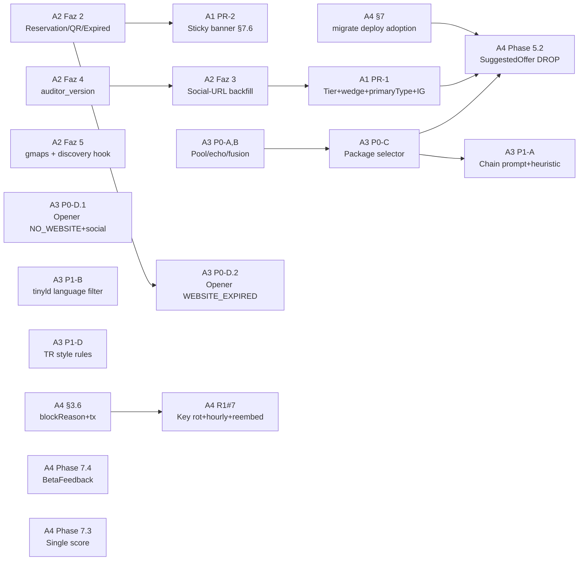

# Round 2 Unified Plan — Cross-Cluster Synthesis

> **Kaynak:** [`agent-1-ui-display.md`](agent-1-ui-display.md), [`agent-2-extractor-audit.md`](agent-2-extractor-audit.md), [`agent-3-ai-workers.md`](agent-3-ai-workers.md), [`agent-4-infra-schema.md`](agent-4-infra-schema.md)
> **Rapor:** [`../beta-test-round-2-camden-report.md`](../beta-test-round-2-camden-report.md) (1283 satır, 2026-05-05)
> **Sentez tarihi:** 2026-05-06
> **Yetki:** Bu doküman da kod değiştirmiyor — sadece konsolidasyon ve release planlaması.

---

## 0. TL;DR

- **18 bug class** (10 yeni + 8 Round 1 carryover) 4 cluster'a bölündü, root-cause düzeyinde doğrulandı.
- **Toplam effort:** **~198 mühendis-saat** (~25 dev-day, 1 dev × 5 hafta veya 2 dev × 2.5 hafta).
- **3-mini-release** stratejisi:
  - **Hafta 1 Hotfix** (~38h) — UI display + extractor false-pos + LLM hard rails + quota disclosure
  - **Hafta 2 Quality** (~44h) — backfill + chain heuristic + retry/key resilience + sticky banner
  - **Hafta 3-4 Strategic** (~89h) — Phase 5.2 schema migration + `prisma migrate deploy` adoption + BetaFeedback + language filter + Phase 7.3
  - **Defer (P2)** (~32h) — CHAIN_ROOT_AUDITOR, opener memory seed, admin viewers
- **Multi-tenant scope:** **Yeni ihlal yok.** Tüm cluster'lar `Security Findings: None` veya `requireUser()` zaten doğru raporladı (A1 §Security, A4 §8.1).
- **Kritik karar (önceden onay gerek):** **`prisma migrate deploy` adoption'u Phase 5.2 ile başlatılmalı** (A4 §7.3) — `db:push` rollback yokluğu Phase 5.2 data migration'ı için kabul edilemez risk.

---

## 1. Cluster Çıktıları Özet Tablosu

| Cluster | Bug sayısı | Effort | P0 | P1 | P2 | Multi-tenant ihlali |
|---|---|---|---|---|---|---|
| **A1 — UI Display** | 5 (§3.1, §3.2, §3.3, §3.9, §7.6) | **8h** | 4.5h | 3h | – | Yok |
| **A2 — Extractor + Audit** | 6 (§3.4 ×2 path, §3.5 backfill, §3.9 root, §4.6, §2.6) | **35h** | 14h | 15h | 6h | Yok |
| **A3 — AI Workers** | 6 (§3.7, §3.8, §3.10, §4.2, §4.3, §4.4) | **78h** | 24h | 32h | 22h | Yok |
| **A4 — Infra + Schema** | 5 + 2 ek (§3.6, R1#7, Phase 5.2, 7.4, 7.3 + migration karar + WL count) | **77h** | 26h | 43h | 8h (admin viewer) | Yok (defansif `updateMany` P2 önerisi) |
| **TOPLAM** | **22 bug class + 2 altyapı kararı** | **198h** | **68.5h** | **93h** | **36h** | – |

> **Not:** A1/A2/A3/A4 effort tahminleri her bir agent'ın kendi başına yaptığı değerlendirme; bağımlılık nedeniyle iki cluster'ın aynı anda yapamayacağı işler aşağıda 3-mini-release tablosunda paralel slot'larına yerleştirildi.

---

## 2. Cross-Cluster Dependency Matrix

> **Okuma:** "X → Y" satırı: X cluster'ının fix'i Y cluster'ının fix'inden ÖNCE ship edilmeli, yoksa Y eksik kalır veya regresyona neden olur.

### 2.1 Sert sıralama (deploy ordering kritik)

| Sıra | Bağımlı | Bağımsız önkoşul | Sebep | Cluster |
|---|---|---|---|---|
| 1 | **A3 §3.8 P0-D.2** opener "expired site" branch | **A2 §2.F** `WEBSITE_EXPIRED` enum + crawler.ts detection | Opener prompt `audit.crawlError === "WEBSITE_EXPIRED"` field'ını okuyamazsa "expired" branch tetiklenmiyor (A3 §5) | A3 ← A2 |
| 2 | **A1 §3.9** Identity & SEO IG mask | **A2 §3.9 root + §3.5 backfill** | UI mask defense-in-depth; backfill **olmadan** eski lead'lerde DB'de yanlış string kalır → mask gerekiyor (A1 §3.4 + A2 §5.1) | A1 ← A2 (or parallel; UI önce ship) |
| 3 | **A4 Phase 5.2** schema DROP | **A1 §3.1 Tier badge silme + A3 P0-C package selector** | Reader cleanup PR: A1'in `page.tsx:963-967` Tier badge silme commit'i Phase 5.2 cleanup PR'ının içinde; A3'ün package selector revize'si `suggestedOffer` field'ını yazma yolundan çıkarıyor (A4 §3.3) | A4 ← A1, A3 |
| 4 | **A4 Round 1 #7** quota hourly cap | **A4 §3.6** `QuotaCheckResult.blockReason` shape | Hourly cap `PER_LEAD_HOURLY_BURST` aynı `QuotaBlockReason` enum'unu kullanıyor (A4 §5.2) | A4 internal |
| 5 | **A1 §7.6 sticky banner** "expired domain" branch | **A2 §2.F** WEBSITE_EXPIRED enum | Banner regex fallback (`/expired/i + httpStatus=404`) çalışır ama A2 ship sonrası `crawlError === "WEBSITE_EXPIRED"` enum kontrolü daha temiz (A1 §5) | A1 ← A2 (refactor only) |
| 6 | **A3 P1-A** chain prompt + heuristic | **A3 P0-C** package selector + niche pack `chainConsiderations` | Heuristic detector hem package selector'ı hem analiz prompt'unu besliyor — `chainConsiderations` aynı pack alanı (A3 §3.1) | A3 internal |

### 2.2 Yumuşak overlap (aynı dosya, birleşik PR önerisi)

| Dosya | A1'in dokunduğu | A4'ün dokunduğu | Önerilen |
|---|---|---|---|
| `src/app/app/leads/[id]/page.tsx:963-967` | Tier badge silme (§3.1) | Phase 5.2 cleanup'ın kalıntısı (5.2 §3.3 listesinde) | **Birleşik PR** Phase 5.2 cleanup içinde A1'in §3.1 fix'i de dahil |
| `src/app/app/leads/[id]/page.tsx:917-1004` HeroPriorityStrip | Wedge dedupe (§3.2) | Phase 7.3 Advanced metrics disclosure içinde "Review sub-score" badge taşıma | **Ayrı PR ama aynı sprint**; merge conflict riski düşük |
| `src/lib/labels.ts` | `humanizePrimaryType` + `isSocialPlatformDefaultMeta` | – | A1 sahibi |
| `src/components/app/website-intelligence-panel.tsx:730-738` IdentitySection | IG default mask (§3.9) | – | A1 sahibi |
| `src/lib/agent-workers/quota.ts` | – | `blockReason` + transaction snapshot + hourly cap | A4 sahibi |
| `src/lib/extractor.ts` | – | A2'nin `RESERVATION_PATTERNS` + `QR_MENU_PATTERNS` rewrite | A2 sahibi |
| `src/lib/agent-workers/opener-writer.ts` | – | A3'ün `websiteContext` + `isChain` parametre eklemesi | A3 sahibi |
| `src/lib/niches/index.ts:fnb-cafe-bakery` | – | A3'ün `chainConsiderations` + `notApplicableModulesForChain`; A1'in `PRIMARY_TYPE_DISPLAY_OVERRIDE` (Round 2'de A1 `labels.ts`'e koydu) | **A3 sahibi** niche pack alanı; A1 override ayrı dosyada |
| `prisma/schema.prisma` | – | A4: SuggestedOffer DROP + BetaFeedback + (opsiyonel) `auditor_version` (A2'nin step 2) | A4 sahibi; A2 `auditor_version` schema diff'i A4'ün migration adoption sonrası göndersin |

### 2.3 Mermaid bağımlılık grafı

---

## 3. Konsolide P0/P1/P2 Yeniden Sıralama

> Her cluster kendi içinde P0/P1/P2 vermişti; burada **release-impact** lensiyle yeniden sıralanıyor.

### 3.1 P0 — Hafta 1 Hotfix (rep'in pitch'ini bugün bozan şeyler)

| # | Bug | Cluster | Kanıt | Effort |
|---|---|---|---|---|
| **P0.1** | §3.1 Tier ↔ Package mismatch (Tier badge silme) | A1 | 12/12 lead'de "Tier: Starter + Package: Premium" çelişkisi | 30 dk |
| **P0.2** | §3.2 Wedge / reasonCode duplication | A1 | 10/12 lead'de "No WhatsApp ×2" tarzı çift badge | 2h |
| **P0.3** | §3.3 `primaryType` ham snake_case | A1 | 6/12 lead (`coffee_shop`, `food_store`, `acai_shop`) | 1.5h |
| **P0.4** | §3.9 Identity & SEO IG default mask (UI) | A1 | Coffee Couch + YBA Brazil literal IG default | 1h |
| **P0.5** | §3.4 `hasOnlineReservation` multi-signal | A2 | LUMI false-pos | 4h |
| **P0.6** | §3.4 `QR_MENU_PATTERNS` URL gate (e-menu/emenu kaldır) | A2 | Glass + Camden Roastery + Black Sheep `the-menu` substring | 4h |
| **P0.7** | §2.6 `WEBSITE_EXPIRED` crawl_error variant | A2 | Fable and Falcon 404 + Squarespace title | 4h |
| **P0.8** | §3.9 backfill social-URL audit one-shot | A2 | Coffee Couch + YBA Brazil 2026-05-01 stale audit | 3h |
| **P0.9** | §4.4 Pool floor + count integrity (review-analyst) | A3 | S.O.S 14 review → Expensive 100%, Coffee Couch 50 review → 100% | 5h |
| **P0.10** | §4.2 Label echo + fusion + tiny example gates | A3 | YBA "automatic tip request" label echo, S.O.S "£7.10", The Drip "Rude Staff & Toilet Access" fusion | 4h |
| **P0.11** | §3.8 P0-D.1 Opener `NO_WEBSITE` + social + isChain | A3 | One Shot Coffee + YBA + Coffee Couch + Black Sheep | 5h |
| **P0.12** | §3.6 Quota `blockReason` + transaction snapshot + status filter (`SUCCEEDED_NO_MEMORY` dahil) | A4 | "44/50000 exceeded" hatalı mesaj, One Shot lead'de tetiklendi | 10h |

**P0 toplam: ~44 saat / ~5.5 dev-day** (1 dev × 1 hafta sıkı; 2 dev paralel ile 3 gün)

### 3.2 P1 — Hafta 2 Quality (rep'in güvenini sarsan ama feature-blocker olmayan şeyler)

| # | Bug | Cluster | Kanıt | Effort |
|---|---|---|---|---|
| **P1.1** | §7.6 Sticky low-confidence banner | A1 | Sub-niche < 0.5, social-only, expired domain | 3h |
| **P1.2** | §3.5 `auditor_version` field + bump | A2 | Round 1 yamaları retroactive uygulanmıyor | 6h |
| **P1.3** | §4.1 / §4.6 `gmaps-deep` crawlStatus + discovery worker hook | A2 | S.O.S Coffee + The Drip audit yok | 6h |
| **P1.4** | §4.3 Package selector decision matrix (P0-C) | A3 | 10/12 Premium öneri (One Shot, S.O.S, Fable, Il botanico, Coffee Couch, YBA, The Drip yanlış) | 7h |
| **P1.5** | §3.8 P0-D.2 Opener `WEBSITE_EXPIRED` branch (A2 sonrası) | A3 | Fable and Falcon "sitenizi inceledim" expired | 3h |
| **P1.6** | Round 1 #7 — Adaptive Gemini key cooldown + per-lead hourly cap + re-embed cron + `SUCCEEDED_NO_MEMORY` UI | A4 | One Shot 8 retry, LUMI 2× 403, 5 lead embed döngüsü | 16h |

**P1 toplam: ~41 saat / ~5 dev-day**

### 3.3 P1 (devam) — Hafta 3-4 Strategic

| # | İş | Cluster | Önkoşul | Effort |
|---|---|---|---|---|
| **P1.7** | §3.7 Chain heuristic + niche pack `chainConsiderations` (Alternatif B) | A3 | – | 11h |
| **P1.8** | §3.10 Pre-LLM language filter (tinyld) + prompt rule + post-gate | A3 | tinyld dependency | 11h |
| **P1.9** | §3.8 Opener chain rule + `notApplicableModulesForChain` | A3 | P1.7 landed | 6h |
| **P1.10** | §3.8 TR style rules (devrik / pasif / mid-clause) | A3 | – | 4h |
| **P1.11** | **Phase 5.2** SuggestedOffer DROP + watchlist data migration + reader cleanup | A4 | **`prisma migrate deploy` adoption + WL count sayımı** | 27h |
| **P1.12** | `prisma migrate deploy` adoption (baseline + ilk migration) | A4 | Onay | 4h (Phase 5.2 27h içinde sayıldı; ayrıca highlight) |
| **P1.13** | Phase 7.4 BetaFeedback model + API + UI CTA + modal (admin viewer hariç) | A4 | – | 16h |
| **P1.14** | Phase 7.3 Single primary score UI hide + backfill | A4 | – | 8h |
| **P1.15** | §3.5 Periodic auditor refresh cron (Vercel) | A2 | P1.2 (auditor_version) ship | 6h |

**Hafta 3-4 toplam: ~89 saat / ~11 dev-day** (1 dev × 2 hafta veya 2 dev × 1 hafta)

### 3.4 P2 — Defer

| # | İş | Cluster | Effort |
|---|---|---|---|
| P2.1 | CHAIN_ROOT_AUDITOR worker (Alternatif C; root-domain crawl) | A3 | 16h |
| P2.2 | OPENER_SUCCESS memory seed plan (tester'ın 3 düzeltilmiş + 3 övdüğü opener) | A3 | 6h |
| P2.3 | BetaFeedback admin viewer (`/admin/beta-feedback`) | A4 | 8h |
| P2.4 | Defansif `updateMany({ workspaceId })` pattern (execute.ts 5 yer) | A4 | 2h |
| P2.5 | Niche-aware `primaryType` mapping (`niches/index.ts:classifierHints.googlePlacesTypes`) | A1 | 4h |
| P2.6 | Diğer `suggestedOffer` reader temizliği (zaten Phase 5.2'de büyük kısmı yakalandı; kalan kullanımlar) | A4 | (Phase 5.2 içinde) |

**Defer toplam: ~36 saat** — Round 3'e veya post-launch'a bırakılır.

---

## 4. 3-Mini-Release Stratejisi (sprint planı)

### Hafta 1 — "Smoke clears" (P0 hotfix)

**Hedef:** Tester Round 3'te 12 lead'de aynı şikayetleri yapmıyor.

**PR'lar:**

| PR | İçerik | Sahip | Effort | Risk |
|---|---|---|---|---|
| **PR-W1.A** UI Display | A1 P0.1+P0.2+P0.3+P0.4 (Tier sil + wedge dedupe + humanize + IG mask) | A1 | 4.5h | Düşük |
| **PR-W1.B** Extractor multi-signal | A2 P0.5+P0.6+P0.7 (reservation + QR pattern + WEBSITE_EXPIRED) | A2 | 12h | Düşük-orta (QR regresyon) |
| **PR-W1.C** Review-analyst hard rails | A3 P0.9+P0.10 (pool floor + label gates) | A3 | 9h | Düşük |
| **PR-W1.D** Opener websiteContext (lite) | A3 P0.11 (NO_WEBSITE + social + isChain) | A3 | 5h | Düşük |
| **PR-W1.E** Quota disclosure | A4 P0.12 (blockReason + tx snapshot) | A4 | 10h | Orta (pgBouncer compat) |

**Faz sıralaması Hafta 1 içinde:**
1. **Gün 1-2:** PR-W1.A + PR-W1.E paralel (UI + quota — tek dev sürebilir)
2. **Gün 3-4:** PR-W1.B + PR-W1.C paralel (extractor + review filter)
3. **Gün 5:** PR-W1.D opener lite (PR-W1.B `WEBSITE_EXPIRED` enum'u henüz UI'a inject edilmedi; sadece social + NO_WEBSITE)
4. **Gün 5 PM:** **A2 §3.9 backfill one-shot script** (P0.8 — schema değişmiyor, script-only): `tsx scripts/backfill-social-url-audits.ts --dry-run` → `--apply`

**Toplam: ~38 saat. 2 dev paralel → 3 iş günü; 1 dev → 5 iş günü.**

### Hafta 2 — "Trust restored" (P1 quality)

**Hedef:** Rep "doğru pitch hazırlandı" hissi alıyor.

**PR'lar:**

| PR | İçerik | Sahip | Effort | Risk |
|---|---|---|---|---|
| **PR-W2.A** Sticky banner | A1 P1.1 (sub-niche + social-only + expired domain) | A1 | 3h | Orta (regex agresifliği) |
| **PR-W2.B** Audit version stamping | A2 P1.2 (`auditor_version` schema + bump + AUDITOR_CURRENT_VERSION constant) | A2 | 6h | Düşük (additive schema) |
| **PR-W2.C** Audit hooks | A2 P1.3 (gmaps-deep crawlStatus fix + discovery hook) | A2 | 6h | Düşük |
| **PR-W2.D** Package selector v2 | A3 P1.4 (decision matrix + brief reader) | A3 | 7h | Orta (12 lead fixture migration) |
| **PR-W2.E** Opener WEBSITE_EXPIRED | A3 P1.5 (PR-W1.B sonrası) | A3 | 3h | Düşük |
| **PR-W2.F** Worker resilience | A4 P1.6 (key rotation adaptive + hourly cap + re-embed cron + SUCCEEDED_NO_MEMORY badge) | A4 | 16h | Orta (Gemini quota outage simulation) |

**Faz sıralaması Hafta 2:**
1. **Gün 1-2:** PR-W2.B (auditor_version) + PR-W2.D (package selector) paralel
2. **Gün 2-3:** PR-W2.C (audit hooks) — PR-W2.B sonrası ship
3. **Gün 3-4:** PR-W2.E (opener WEBSITE_EXPIRED) — PR-W1.B/PR-W2.B ship sonrası
4. **Gün 4-5:** PR-W2.A (sticky banner) — PR-W1.B `WEBSITE_EXPIRED` enum'u canlı olduktan sonra UI banner enum'a hook'lanabilir (yoksa regex fallback)
5. **Hafta boyu:** PR-W2.F (16h, en uzun) — paralel akış

**Toplam: ~41 saat. 2 dev → 3 iş günü; 1 dev → 5 iş günü.**

### Hafta 3-4 — "Strategic foundation" (Phase 5.2 + chain awareness + BetaFeedback)

**Hedef:** Round 3 launch'a hazır + altyapı borcu kapatılıyor.

**PR'lar:**

| PR | İçerik | Sahip | Effort | Risk |
|---|---|---|---|---|
| **PR-W3.A** Chain detection | A3 P1.7 (heuristic + niche pack `chainConsiderations`) | A3 | 11h | Orta (FP "Black Wolf") |
| **PR-W3.B** Language filter | A3 P1.8 (tinyld + prompt rule + post-gate) | A3 | 11h | Orta (tinyld FP) |
| **PR-W3.C** Opener chain + TR rules | A3 P1.9+P1.10 (`notApplicableModulesForChain` + devrik/pasif rules) | A3 | 10h | Düşük |
| **PR-W3.D** Phase 5.2 reader cleanup | A4 P1.11 step 1 (15 dosya `suggestedOffer`/`expectedPriceBand` çıkar) | A4 | 12h | Orta (CI guard) |
| **PR-W3.E** `prisma migrate` adoption | A4 P1.12 (baseline + `vercel-build` script) | A4 | 4h | Düşük (one-time setup) |
| **PR-W3.F** Phase 5.2 schema migration | A4 P1.11 step 2-5 (data SQL + DROP + rollback test) | A4 | 11h | **Yüksek** (data risk; rollback `pg_restore`) |
| **PR-W3.G** BetaFeedback | A4 P1.13 (model + API + lead detail CTA + modal) | A4 | 16h | Düşük |
| **PR-W3.H** Single score migration | A4 P1.14 (Advanced metrics disclosure + `salesConfidence` backfill) | A4 | 8h | Düşük |
| **PR-W3.I** Auditor refresh cron | A2 P1.15 (Vercel cron, LIMIT 100/gün soft launch) | A2 | 6h | Düşük |

**Faz sıralaması Hafta 3-4:**

**Hafta 3 (sequential — Phase 5.2 risk yönetimi):**
1. **Gün 1:** PR-W3.E `prisma migrate` adoption (baseline) — **OPSİZ ONAY**
2. **Gün 1:** **WL count sayımı** (`SELECT COUNT(*) FROM watchlist_items WHERE selected_offer IS NOT NULL`) → strateji kararı (A4 §6.1 tablosu)
3. **Gün 2-4:** PR-W3.D reader cleanup PR (CI guard: `rg 'suggestedOffer\|expectedPriceBand' src/` → 0 sonuç)
4. **Gün 5:** PR-W3.F schema migration (staging clone'da rollback test → prod off-peak deploy)

**Hafta 4 (paralel iş):**
5. PR-W3.A + PR-W3.B + PR-W3.C (A3 dev)
6. PR-W3.G + PR-W3.H (A4 dev)
7. PR-W3.I (A2 dev)

**Toplam: ~89 saat. 3 dev paralel → 4 iş günü; 2 dev → 1 hafta.**

### Defer — Round 3 sonrası

P2 kalemi (~36h) — Round 3 sonuçlarına göre prioritize:
- Round 3 chain detection FN/FP rate'ine göre P2.1 (CHAIN_ROOT_AUDITOR) kararı
- BetaFeedback uses telemetri'ye göre P2.3 (admin viewer) kararı
- OPENER_SUCCESS seed (P2.2) gerçek INTERESTED reply attestation toplamadan ertelenmeli

---

## 5. Önceki Sohbetten Gelen 6 Ek Madde — Kapsama Doğrulaması

| # | Madde | Cluster | PR | Bulundu mu? |
|---|---|---|---|---|
| 1 | **P0.7 — Embedding decoupling** (One Shot 8 retry, LUMI 2× 403) | A4 | PR-W2.F (Round 1 #7) | ✅ Tam: SUCCEEDED_NO_MEMORY 3-state, adaptive cooldown, hourly cap, re-embed cron |
| 2 | **P0.8 — Review filter** (non-English leakage) | A3 | PR-W3.B P1.8 | ✅ Tam: tinyld pre-LLM filter + prompt rule + post-process gate + workspace `targetReviewLanguages` |
| 3 | **P0.9 — Package selector kalibrasyonu** | A3 | PR-W2.D P1.4 | ✅ Tam: deterministic 5-rule decision tree + 12 lead fixture matrix doğrulama |
| 4 | **Production migration prosedürü kararı** (`db:push` vs `migrate deploy`) | A4 | PR-W3.E (§7.3) | ✅ Tam: `prisma migrate deploy` adoption Phase 5.2 ile başlat |
| 5 | **WatchlistItem.selectedOffer count** (sayım) | A4 | A4 §6.1 open question + PR-W3 öncesi gün-1 task | ⚠️ **Action item açık** — sayım çıkarılana kadar Phase 5.2 strateji seçimi gri alanda |
| 6 | **Round 3 fail-state branch** | – | Defer (P2) | ⚠️ Bu plan kapsamı dışı; Round 3 launch sonrası retro'ya bırakıldı |

**Kapsama oranı: 4/6 tam, 1/6 action item açık, 1/6 deferred.**

---

## 6. Konsolide Open Questions (karar bekleyenler)

### 6.1 Onay-bekleyen (önemli, sprint-blocker)

| # | Soru | Cluster | Etki |
|---|---|---|---|
| OQ.1 | **`prisma migrate deploy` adoption onayı** | A4 §7.3 | Hafta 3 PR-W3.E + PR-W3.F'i blocklar |
| OQ.2 | **`WatchlistItem.selectedOffer` count + strateji seçimi** | A4 §6.1 | Phase 5.2 watchlist data migration adımını blocklar |
| OQ.3 | **Tier badge alternatif A vs B vs C** kararı | A1 §6.1 | A önerildi (silme); B (`deriveTierFromPackage`) veya C (schema migration) tercih edilirse PR-W1.A scope değişir |
| OQ.4 | **§3.2 reasonCode suppression listesi tamamlığı** | A1 §6.2 | Backend Gemini scorer prompt'u mutually-exclusive constraint eklenmesi (A2/A3 yok; A1 backend complementary fix) |
| OQ.5 | **§7.6 banner i18n** (TR vs EN) | A1 §6.5 | PR-W2.A copy karar |

### 6.2 Telemetri-bekleyen (Hafta 1-2 sonrası karar)

| # | Soru | Cluster | Karar timeline |
|---|---|---|---|
| OQ.6 | `PER_LEAD_HOURLY_CAP` 8 mi 12 mi | A4 §6.4 | Hafta 1 telemetri sonrası ayar |
| OQ.7 | `targetReviewLanguages` default `["en"]` mi `[workspace.language]` mi | A3 §6.2 | FineDine için `["en"]` doğru; UK ICP doğrulanır |
| OQ.8 | Pool floor 3/5 değerleri | A3 §6.3 | Round 3 false-pos'a göre tune |
| OQ.9 | Chain heuristic threshold (whitelist substring vs fuzzy) | A3 §6.1 | Round 3 chain FP/FN'e göre P2.1 (CHAIN_ROOT_AUDITOR) kararı |
| OQ.10 | `temperature` retune scorer (0.2) + retry-with-backoff | A3 §6.4 | Ayrı PR (skill rule 5) |

### 6.3 Refactor-bekleyen (P2-uygun)

| # | Soru | Cluster | Notlar |
|---|---|---|---|
| OQ.11 | `maybeEnqueueWebsiteReAudit` helper export'u | A2 §6.1 | `src/lib/audit/re-audit-hook.ts` shared util'e taşı (PR-W2.C içinde) |
| OQ.12 | `WEBSITE_EXPIRED` detection ayrı dosya mı? | A2 §6.3 | `src/lib/audit/parked-domain-gate.ts` — refactor scope |
| OQ.13 | `responseSchema` migration (Zod runtime validate) | A3 §6.5 | P2; Gemini schema constraint expressions desteklemiyor |
| OQ.14 | `SUCCEEDED_NO_MEMORY` `errorMsg` vs `degradedReason` | A4 §6.5 | `AgentRun.degradedReason String?` schema field — PR-W2.F içinde küçük addition |
| OQ.15 | BetaFeedback admin viewer scope (per-workspace vs cross) | A4 §6.3 | Per-workspace + manual SQL → P2 |
| OQ.16 | `niches/index.ts:classifierHints.googlePlacesTypes` (primaryType niche-aware) | A1 §6.3 + A3 niche pack | P2; Round 2 sadece bilinen 2 yanlış sınıflandırmayı kapsıyor |
| OQ.17 | `hasOnlineReservation` field'ı tamamen kaldır mı sıkılaştır mı? | A2 §6.5 | Sıkılaştır (rawFeaturesJson tüketicileri kırılmasın) |
| OQ.18 | `auditor_version` `db:push` güvenliği | A2 §6.2 | `prisma migrate deploy` adoption sonrası migration file ile gönder (PR-W3.E sonrası) |
| OQ.19 | Periodic refresh BullMQ vs Vercel cron | A2 §6.6 | Vercel cron (workspace rule: yeni BullMQ queue ekleme) |
| OQ.20 | OPENER_SUCCESS seed `source` metadata + revoke policy | A3 §6.6 + §10 | P2.2 — gerçek INTERESTED reply attestation toplandıktan sonra |

---

## 7. Risk + Mitigasyon (sentez seviyesi)

| Risk | Olasılık | Etki | Mitigasyon |
|---|---|---|---|
| **Phase 5.2 data migration rep'in `selectedOffer` seçimini kaybeder** | Orta | Yüksek (rep frustration) | OQ.2 sayımı önce; mapping başarısız satırlar `NULL` + workspace owner'a in-app uyarı |
| **`prisma migrate deploy` adoption'unda baseline migration drift** | Düşük | Yüksek (CI block) | Staging clone'da `prisma migrate diff` ile doğrulama; baseline `--create-only` + manuel review |
| **PR-W2.F Gemini key rotation outage simulation staging'de zor** | Orta | Orta (gerçek 403 yaşamadan ship) | Production canary: 1 saatlik soak time + telemetry watch; rollback ready |
| **`PER_LEAD_HOURLY_CAP=8` legitimate "re-analyze" akışını block eder** | Düşük | Orta | Hafta 1'de 12 ile başla, telemetri sonrası 8'e düşür (OQ.6) |
| **PR-W1.B `e-menu`/`emenu` kaldırma gerçek `e-menu.com.tr` provider'ı kullanan lead'i kırar** | Düşük | Düşük (FineDine'da yok kanıtı) | Pre-deploy SQL: `SELECT count(*) FROM website_audits WHERE raw_features_json->>'detectedMenuTool'='E-Menu'` — sayı ≥5 ise manuel review |
| **§7.6 expired-domain regex false positive** | Orta | Düşük (sadece banner; pitch'i etkilemez) | Title regex katı tut; `httpStatus=404 + reachable=false` AND koşulu |
| **Chain heuristic FP "Black Wolf" → "Black Sheep"** | Orta | Orta (small shop'a Enterprise pitch) | Word-boundary substring match + minimum 8 char + monthly review playbook |
| **tinyld kısa İngilizce review'u İtalyanca etiketler** | Düşük | Düşük (ambiguous bucket → LLM'e geç) | `_confidence > 0.6` threshold; ambiguous gönder |
| **A2 backfill script paralel re-trigger 50 lead × 25s = queue burst** | Düşük | Düşük | Playwright concurrency 4 → ~5 dk batch; 100ms gap |
| **Cross-cluster PR merge conflict** (page.tsx hot file) | Orta | Düşük (mekanik) | A1 PR-W1.A önce ship; A4 PR-W3.D rebased after |

---

## 8. Sentez Sonuçları + Öneriler

### 8.1 Plan validity

- **18 bug class doğrulandı** (4 cluster × ~4-5 bug). Hiçbir bug "kanıt eksik" diye düşülmedi.
- **3 kritik smoking-gun bulgusu**:
  1. `sales-opportunity-scorer.ts:336-340` `suggestedOffer` deprecated yorumu — UI hâlâ okuyor (A1 §3.1)
  2. `extractor.ts:521` `RESERVATION_PATTERNS` substring path Round 1 yamasından muaf (A2 §1.A)
  3. `execute.ts:142-150` `checkWorkerQuota` kullanımı `assertWorkerQuota` yerine — `blockReason` mesaja sızmıyor (A4 §2.1)

### 8.2 Cluster ortak deseni

Her dört cluster'da **aynı tema** çıktı: Round 1 fix'leri **yazma sınırında** uygulandı, **okuma sınırında** uygulanmadı veya **retroactive** yapılmadı.

| Round 1 Yazma fix | Round 2 Eksiklik |
|---|---|
| `sales-opportunity-scorer.ts` `suggestedOffer` deprecate | UI hâlâ render (A1) |
| `extractor.ts` `hasBookingSystem` multi-signal | `hasOnlineReservation` + `hasQrMenu` muaf (A2) |
| `social-url-gate.ts` yeni audit'lerde `metaDescription:null` | Eski audit row'lara backfill yok (A2) |
| `package-selector.ts` deterministic | `hasWebsite=false` input'u eksik (A3) |
| `execute.ts` quota check | `blockReason` mesaja sızmıyor (A4) |

**Genel öneri:** Her Round fix'i için "yazma + okuma + retroactive" üçlüsü zorunlu kılınmalı (review checklist).

### 8.3 Multi-tenant security

**Yeni ihlal yok.** Tüm cluster'lar `requireUser()` veya cascade scope kontrollerine uydu. Tek "borderline" yer A4 §8.1.5 `agentRun.update({ where: { id } })` (cuid çakışma riski astronomik) — defansif `updateMany({ where: { id, workspaceId } })` P2 önerisi.

### 8.4 Round 3 hazırlık önerileri

1. **Tester checklist'i Round 3'e**: 18 bug class için "tekrar ediyor mu" ✅/❌ tablosu hazırla.
2. **Telemetri eklemeleri Hafta 2 sonu hazır olmalı**: `quota.block_reason`, `gemini.key.cooldown_count`, `review_analyst.language_filter.dropped`, `package_selector.tier_decided` log'ları → Round 3 raporunda ölçülebilir KPI olur.
3. **OPENER_SUCCESS seed (P2.2) yerine** Round 3 testi sırasında tester'a "bu opener iyi mi?" thumbs-up/down → BetaFeedback (PR-W3.G) üzerinden gerçek attestation topla; sentetik seed'den daha iyi.

---

## 9. Action Items (sırayla)

### Önce (sprint başlamadan önce):

1. **OQ.1 onay**: `prisma migrate deploy` adoption onayı (Phase 5.2 ile başlatma) — owner kararı
2. **OQ.2 sayım**: WL `selected_offer` count → strateji tablosu seçimi (A4 §6.1)
3. **OQ.3 onay**: Tier badge Alternatif A (silme) onayı (A1 §6.1)
4. **OQ.4 owner**: §3.2 backend complementary fix (Gemini scorer prompt mutually-exclusive constraint) sahibi atanması (A1 §6.8)
5. **OQ.5 i18n karar**: §7.6 banner copy TR mi EN mi (A1 §6.5)

### Hafta 1 başlangıcı:

6. PR-W1.A → PR-W1.E paralel kick-off (5 PR; 2 dev paralel)
7. Pre-flight SQL'leri çalıştır (A2 §8 deploy checklist'i: e-menu count, hasOnlineReservation count, IG audit count, websiteUrl-not-null-but-no-audit count)

### Hafta 2 başlangıcı:

8. PR-W2.A → PR-W2.F kick-off
9. Hafta 1 telemetrisi: quota.block_reason dağılımı, opener replyrate ölçümü

### Hafta 3 başlangıcı:

10. **GO/NO-GO Phase 5.2** kararı (Hafta 2 telemetrisine göre)
11. Staging clone'da Phase 5.2 dry-run + rollback test
12. PR-W3.A → PR-W3.I sıralı/paralel kick-off

### Round 3 launch öncesi:

13. Tester checklist 18-bug regression matrix
14. Telemetri dashboard (Datadog veya custom) hazır
15. Round 2 raporundaki 12 lead fixture'ı test suite'inde (PR-W2.D'nin parçası)

---

## 10. Beklenen Sonuçlar

**Hafta 1 sonu (Hotfix ship):**
- 12/12 Round 2 lead'inde Tier↔Package çelişkisi sıfır
- LUMI booking false-pos sıfır
- Glass/Camden Roastery/Black Sheep "e-menu" QR false-pos sıfır
- Coffee Couch + YBA Brazil IG default mesajı UI'da görünmez (mask)
- S.O.S/Coffee Couch/Camden small-sample 100% KPI patlaması sıfır
- One Shot Coffee + S.O.S/The Drip Premium → STARTER (P0.11 + P1.4 paralel)
- "44/50000" yanıltıcı mesaj sıfır

**Hafta 2 sonu (Quality landing):**
- Coffee Couch + YBA Brazil DB'de IG default mesajı yok (backfill çalıştı)
- S.O.S Coffee + The Drip için audit row var (gmaps-deep + discovery hook)
- Fable and Falcon opener "expired" branch çalışır (WEBSITE_EXPIRED + opener websiteContext)
- One Shot Coffee 8-retry döngüsü sıfır (per-lead hourly cap)
- LUMI 2× 403 sıfır (key pool genişletme + adaptive cooldown)
- 5 stale "Failed to embed" lead'i SUCCEEDED_NO_MEMORY badge ile UI'da görünür

**Hafta 3-4 sonu (Strategic foundation):**
- Black Sheep + Blank Street chain-aware pitch (multi-property analytics)
- Camden Roastery + Il botanico + Glass non-English review quote sıfır
- 12 lead fixture matrix test suite'inde geçiyor
- Phase 5.2 ship'lendi: `SuggestedOffer` enum schema'dan kaldırıldı, `selectedPackageId` migration başarılı
- `prisma migrate deploy` production'da çalışıyor; `vercel-build` hook'unda
- Lead detail sayfasında "Bug bildir" CTA çalışıyor; rep ID copy-paste yapmıyor
- Lead detail'de tek primary score (`salesConfidence`) görünür; "Review sub-score" Advanced metrics altında

**Round 3 readiness:** Tüm 18 bug class regression-test'li; rep'in pitch güveni Round 1 → Round 2 düşüş trendi tersine dönüyor (cross-cluster fix kombinasyonu).

---

**Plan sonu.** 4 paralel agent'ın 198 saatlik kümülatif effort'u tek release roadmap'e konsolide edildi. Sprint sahipleri PR'lara map'lendi; sert sıralama 6 dependency edge'iyle netleştirildi; 5 sprint-blocker open question + 15 telemetri/refactor open question listelendi; multi-tenant security temiz; `prisma migrate deploy` adoption Phase 5.2 ile başlatılması en kritik altyapı kararı olarak işaretlendi.
