# LeadAC x FineDine master whitepaper

Tarih: 2026-06-06  
Versiyon: 1.0 TR  
Kitle: LeadAC kurucu ekibi, ürün, GTM, FineDine aktivasyon paydaşları  
Kapsam: FineDine ilk aktivasyon toplantısı, design-partner pilotu, restaurant-tech GTM intelligence tezi  
Durum: Araştırma destekli strateji dokümanı. Garanti ROI iddiası değildir.

---

## 0. Yönetici özeti

LeadAC, FineDine'e klasik anlamda bir CRM, lead list tool'u, enrichment database'i, sender ya da AI SDR olarak anlatılmamalı.

Daha güçlü tez şu:

> LeadAC, restaurant-tech ekipleri için operational GTM intelligence katmanıdır. Account sinyallerini, SDR kararlarını, kanal aksiyonlarını, CRM/sender outcome'larını ve sahadaki öğrenmeyi birbirine bağlar. Böylece sales ekibi şu sorulara cevap verebilir: hangi restorana gidilmeli, neden şimdi, hangi FineDine açısıyla, hangi motion ile ve sonuçtan ne öğrenilmeli?

Bu FineDine için özellikle önemli çünkü FineDine sadece bir QR menü ürünü değil. FineDine'in public positioning'i digital menu, restaurant website, ordering, payment, reservations, delivery/pickup, CRM/loyalty, campaigns, social media ve AI-powered menu optimization alanlarını kapsıyor. Bu yüzden GTM problemi yalnızca "QR menüsü olmayan restoranları bulalım" değildir. Asıl problem şudur:

> Hangi restoranın hangi operasyonel açığı var ve ilk temas hangi FineDine hikayesiyle yapılmalı?

Araştırma dört yüksek güvenli iddiayı destekliyor:

1. Restoran operatörleri maliyet, iş gücü, trafik ve dijital deneyim baskısı altında; buna rağmen verimlilik ve müşteri ilişkisi için teknoloji yatırımı yapıyorlar.
2. Restaurant-tech satışı lokal, danışmanlık temelli, çok kanallı ve çoğu zaman field-supported ilerliyor. Sadece email değildir.
3. Sales ekipleri research, admin, prospecting ve mesaj hazırlama yüzünden ciddi zaman kaybediyor.
4. Mevcut GTM stack data, enrichment, CRM ve sender katmanlarında kalabalık; fakat FineDine'e özel karar ve outcome-learning katmanı yeterince sahiplenilmiş değil.

Bu yüzden pilotun doğrulaması gereken temel soru:

> LeadAC, FineDine SDR/BD ekibinin karar bilgisini tekrar kullanılabilir bir ekip playbook'una çevirip account prioritization, mesaj relevansı, kanal seçimi ve outcome learning tarafında ölçülebilir değer yaratabilir mi?

---

## 1. Kategori problemi

Çoğu outbound aracı tek bir katmanı optimize eder:

- Database araçları account bulur.
- Enrichment araçları field doldurur.
- CRM kayıt tutar.
- Sender mesaj gönderir.
- Rep ve manager ne yapılacağına karar verir.

Eksik kalan yer çoğu zaman karar mantığıdır.

Restaurant-tech tarafında bu daha da kritiktir çünkü hesaplar birbirinin aynısı değildir. Bir cafe, QSR, bar, hotel F&B, fine dining venue, ghost kitchen, chain ya da multi-location group farklı ekonomi, farklı satın alma tetikleyicisi, farklı dijital ihtiyaç ve farklı aktivasyon kanalı taşır.

### Görsel: LeadAC stack içinde nerede duruyor?

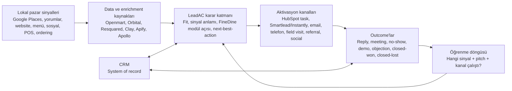

Ürün iddiası "stack'inizi değiştiriyoruz" değil.

Doğru iddia:

> "Mevcut stack'in neyin işe yaradığını öğrenmesini sağlıyoruz."

---

## 2. Pazar kanıtı: neden restaurant-tech güçlü bir beachhead?

### 2.1 Restoran operatörleri baskı altında

National Restaurant Association'ın 2026 State of the Restaurant Industry raporu ABD restaurant ve foodservice satışlarını 1.55 trilyon dolar olarak projekte ediyor. Fakat raporun ana tonu büyümeden çok kalıcı maliyet baskısı, dengesiz trafik, tüketici bütçe baskısı ve teknolojiyle verimlilik ihtiyacı etrafında kuruluyor.

NRA 2024 Restaurant Technology Landscape Report da operatörlerin teknolojiyi rekabet avantajı olarak gördüğünü ve digital/location-based marketing, loyalty/rewards, POS, contactless ordering/payment, inventory, labor management, cybersecurity ve self-order/self-pay gibi alanlarda yatırım düşündüğünü gösteriyor.

TouchBistro 2025 State of Restaurants raporu da bağımsız full-service restoranlarda gıda/iş gücü maliyet baskısı, online ordering, automation ve AI-positive tutumları destekliyor.

### 2.2 FineDine gerçek restoran pain'lerine oturuyor

| Restoran pain'i | FineDine açısı | Örnek account sinyali |
|---|---|---|
| İş gücü baskısı ve servis bottleneck'i | Table ordering, digital payment, self-service flow | Yorumlarda yavaş servis veya bekleme şikayeti |
| Menü güncelleme ve margin baskısı | Digital menu, AI upsell, menu analytics | PDF menü, fotoğrafsız menü, güncel olmayan fiyatlar |
| Guest data kaybı | CRM/loyalty, campaigns, direct ordering | Delivery marketplace var ama direct customer capture yok |
| Zayıf dijital conversion | Restaurant website, online ordering, reservations | Order/reserve CTA yok, mobil site zayıf |
| Multi-location tutarlılık | Merkezi menü ve içerik yönetimi | Birden fazla lokasyon, tutarsız sayfalar |
| Marketing ve repeat visit | Campaigns, social/ads, CRM | Aktif Instagram ama owned conversion path zayıf |

### 2.3 QR-only anlatım dar kalır

QR menü sadece giriş noktasıdır. Stratejik değer şunlardadır:

- dinamik menü merchandising
- ordering ve payment workflow'u
- guest data capture
- loyalty ve repeat visit activation
- menu analytics ve AI recommendations
- mevcut restoran altyapısıyla entegrasyon

Toplantıda güvenli cümle:

> "FineDine'ın değeri QR kodun kendisi değil. Değer, restoranın dijital revenue ve guest-data katmanında."

---

## 3. GTM gerçeği: restaurant-tech satış lokal ve çok kanallı

Toast en güçlü public benchmark'tır. Toast 2025 Form 10-K, food and beverage endüstrisinin lokal olduğunu ve Toast'un high-volume marketing engine ile localized, consultative sales force'u birleştirdiğini anlatır. Ayrıca müşteri kazanım ekiplerinin size, type ve geography bazında organize edildiğini ve in-market sales team'lerin kullanıldığını belirtir.

Bu FineDine için şu anlama gelir:

> Aktivasyon workflow'u pure email sequence engine gibi tasarlanmamalı.

### Görsel: restaurant-tech GTM motion

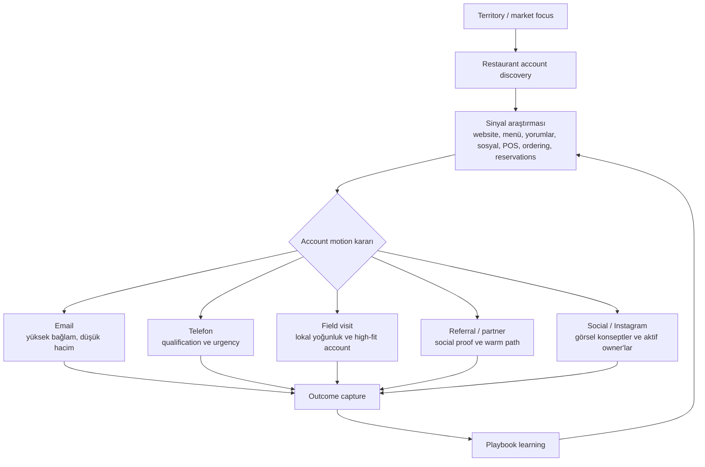

En önemli ürün sonucu:

> LeadAC yalnızca mesaj üretmemeli; motion önermeli.

---

## 4. Sales-team pain: research, admin ve kaybolan öğrenme

Salesforce State of Sales 2026'ya göre seller'lar zamanlarının %40'ını selling'e, %60'ını non-selling işlere ayırıyor. Salesforce ayrıca fully implemented AI agents ile prospect research time'da %34, email drafting time'da %36 azalma beklendiğini raporluyor.

McKinsey sales automation araştırmasına göre early adopter'lar %10-15 efficiency improvement ve up to %10 sales uplift potential görebiliyor. Aynı araştırma lead management automation'ın selling time'ı %15-20 artırabileceğini söylüyor.

Gartner, AI-driven sales enablement kullanan organizasyonların 2029'a kadar traditional enablement'e göre %40 daha hızlı sales-stage velocity elde edeceğini öngörüyor. Bu FineDine için bugün claim edilmemeli; ama yönü doğrular: static enablement yerini in-workflow, data-driven guidance'a bırakıyor.

### Görsel: SDR öğrenme kaybı

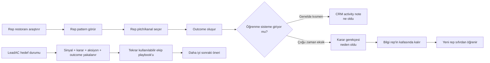

Toplantı cümlesi:

> "CRM activity'yi tutuyor. LeadAC'in yakalaması gereken şey activity'nin arkasındaki karar mantığı ve öğrenme."

---

## 5. Rekabetçi stack: kalabalık katmanlar ve açık alan

| Katman | Örnek araçlar | Ne sahipleniyorlar? | Açık kalan yer |
---|---|---|---|
| Local SMB data rail | Openmart, Resquared, Google Places, Apify | Restoran kayıtları, kategoriler, yorumlar, owner/contact, local search | FineDine-specific fit ve outcome learning |
| Enrichment/workflow | Clay | Waterfall enrichment, custom research, AI tables, webhooks | Opinionated restaurant-tech playbook |
| Broad B2B data/outbound | Apollo | B2B contacts, sequencing, enrichment | Derin lokal restoran context'i |
| CRM | HubSpot, Salesforce, Pipedrive | Companies, contacts, deals, stages, activities | Bir kararın neden çalıştığı |
| Sender | Smartlead, Instantly, Gmail/Outlook | Delivery, reply, bounce, unsubscribe | Hangi account'a hangi mesaj gitmeli |
| Revenue intelligence | Gong/Clari benzeri kategori | Enterprise pipeline/conversation intelligence | Local SMB restaurant-tech context |
| LeadAC wedge | LeadAC | Decision + action + outcome learning | FineDine pilot datasıyla kanıtlanmalı |

### Görsel: stack ownership map

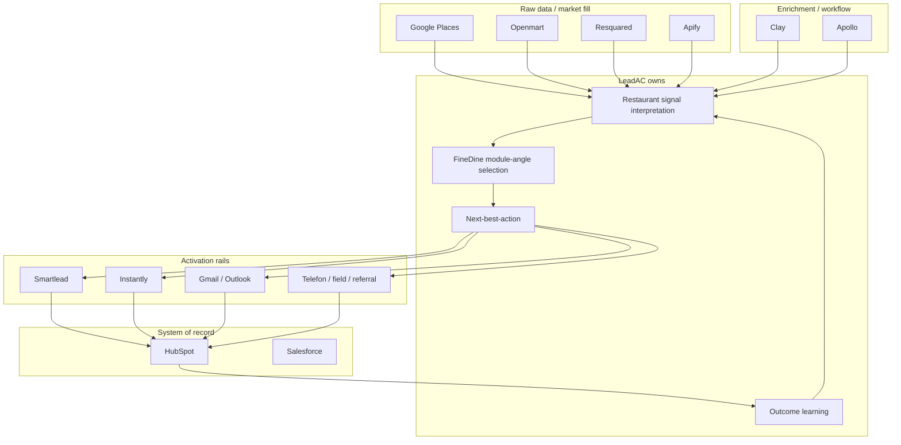

Objection cevabı:

> "Bu araçlar stack'in faydalı parçaları. Bizim amacımız onları replace etmek değil. Odaklandığımız yer FineDine-specific decision layer: hangi sinyal önemli, hangi account aksiyon hak ediyor, hangi motion doğru ve outcome bir sonraki rep'e ne öğretiyor?"

---

## 6. FineDine için LeadAC product thesis

FineDine için LeadAC şu hale gelmeli:

> BD/SDR ekibinin account önceliklendirmesine, doğru FineDine angle'ını seçmesine, doğru kanaldan aktive etmesine ve her outcome'dan öğrenmesine yardım eden restaurant account intelligence ve outcome-learning katmanı.

Her account brief şu sorulara cevap vermeli:

1. Bu restoran kim?
2. Segmenti ne: cafe, QSR, bar, hotel F&B, fine dining, ghost kitchen, group, chain?
3. Hangi dijital sinyaller önemli?
4. İlk credible FineDine angle'ı hangi modül?
5. İlk kanal ne olmalı?
6. Rep hangi kanıtı kullanmalı?
7. Muhtemel objection ne?
8. Aksiyon sonrası ne loglanmalı?

### Görsel: account decision card

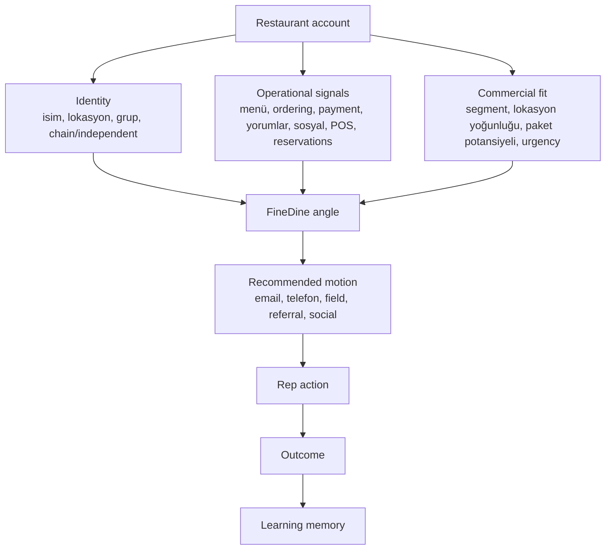

---

## 7. Değer modeli: gerçekçi yüzdesel etki

Bu doküman garanti ROI iddia etmez. Salesforce, McKinsey, Gartner ve outbound benchmark kaynaklarına dayanarak planlama aralığı kurar.

| Metrik | Conservative | Expected / kaynak destekli | Stretch | Kanıt sınırı |
---|---:|---:|---:|---|
| Prospect/account research time reduction | %15 | %20-30 | %34 | Salesforce AI agents ile prospect research -%34 beklentisi |
| Email/opener drafting time reduction | %15 | %20-30 | %36 | Salesforce email drafting time -%36 beklentisi |
| Selling/customer-facing time increase | +1.3 saat/rep/hafta | +2.4 ile +3.2 saat/rep/hafta | +4 saat/rep/hafta | McKinsey +%15-20 relative selling-time uplift; Salesforce %40 baseline |
| Sales process efficiency | %5 | %10-15 | %15+ | McKinsey early automation adopters |
| Pipeline/sales uplift | %2 | %5-10 | %10-15 | McKinsey data-driven decisions ve automation; pilotta kanıtlanmalı |
| Reply rate relative uplift | %10-25 | %25-50 | güçlü segmentlerde 2x | Outbound benchmark'lar değişken; A/B test gerekli |
| Stage velocity | %5 | %10-20 | %40 mature | Gartner %40 by 2029; ilk pilot claim'i değil |
| New SDR ramp speed | %10 | %20-30 | %30+ | Enablement araştırmaları yön veriyor; FineDine baseline gerekir |

### Görsel: impact confidence chart

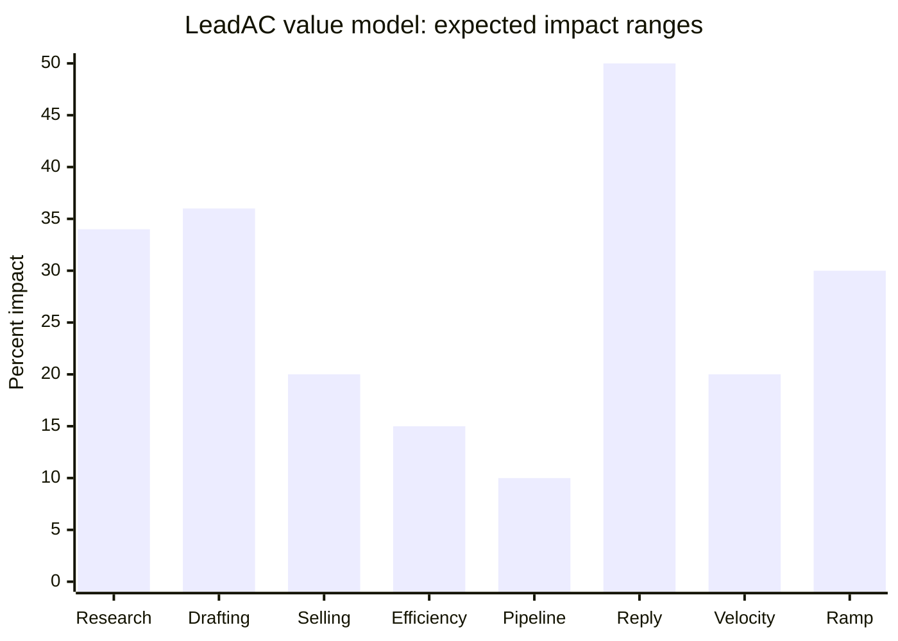

Yorum:

- Research ve drafting en yüksek güvenli metriklerdir çünkü kaynaklar bu task'ları doğrudan ölçer.
- Revenue, reply rate ve ramp daha düşük güvenlidir; FineDine pilot outcome datası gerekir.
- İlk pilotun en güvenli hedefi "revenue lift ispatlamak" değil, "daha iyi account kararı ve daha düşük hazırlık maliyeti ispatlamak" olmalı.

---

## 8. Pilot operating model

Pilot, PRINCE2, stage-gate, OKR, MoSCoW ve benefits-realization mantığından faydalanmalı. Amaç bürokrasi değil; erken pilotun flu kalmasını önlemek.

### 8.1 PRINCE2-inspired governance

| PRINCE2 fikri | LeadAC x FineDine uyarlaması |
|---|---|
| Continued business justification | Her stage pilotun neden hâlâ değerli olduğunu göstermeli. |
| Learn from experience | Her campaign ve outcome pilot learning'e dönüşmeli. |
| Defined roles | FineDine data, LeadAC product, SDR workflow, compliance ve metrics owner'ları net olmalı. |
| Manage by stages | Discovery -> model -> pilot -> benefits review. |
| Manage by exception | Data quality, zaman, compliance ve metric drift için toleranslar önceden tanımlanmalı. |
| Focus on products | Somut çıktılar: workflow map, signal library, brief template, pilot dashboard. |
| Tailor to project | Design-partner hızına uygun hafif governance. |

### 8.2 Stage plan

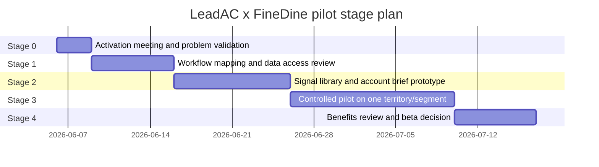

### 8.3 Stage gates

| Stage | Amaç | Exit criteria |
|---|---|---|
| 0. Problem validation | Pain gerçek mi ve çözmeye değer mi? | FineDine workflow, tools, channels ve beta outcome'u netleştirir. |
| 1. Workflow mapping | Lead source -> research -> decision -> outreach -> CRM outcome akışını anlamak. | End-to-end map FineDine sales stakeholder tarafından onaylanır. |
| 2. Prototype model | FineDine account decision model kurmak. | 20-50 sample account score edilir ve FineDine tarafından review edilir. |
| 3. Controlled pilot | Bir segment/territory üzerinde LeadAC test edilir. | Time saved, quality, reply/meeting, wasted touch için A/B veya matched-cohort sonucu alınır. |
| 4. Benefits review | Expand kararı vermek. | Evidence pack, ROI model update, product gap list, scale/no-scale decision. |

### 8.4 MoSCoW scope

| Must have | Should have | Could have | İlk pilotta won't have |
|---|---|---|---|
| Workflow map | HubSpot outcome sync | Openmart/Orbital enrichment | Fully automated AI SDR |
| Restaurant signal library | Sender event import | Field-visit route planning | US automated SMS/AI voice |
| FineDine module-angle logic | Objection pattern tagging | Nearby social proof map | CRM replacement |
| Account brief prototype | A/B test dashboard | Multi-city scaling | Revenue guarantee |
| Manual outcome capture | Source provenance | Clay webhook bridge | Broad horizontal SaaS ICP |

---

## 9. Measurement framework

### 9.1 North Star metric

Pilot için North Star:

> Rep başına haftalık qualified restaurant actions, her aksiyonun signal, recommended motion ve outcome ile loglanması.

Neden:

- Sadece lead volume ölçmez.
- Quality ve actionability zorunlu hale gelir.
- Learning loop'u kapsar.

### Görsel: metric tree

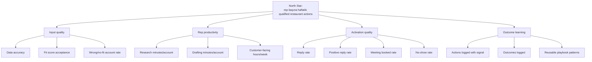

### 9.2 Pilot scorecard

| Metric | Baseline needed | Pilot target |
|---|---|---|
| Research minutes/account | 20 account manuel timer | -%15 ile -%34 |
| Drafting minutes/account | 20 opener manuel timer | -%15 ile -%36 |
| Manager-approved accounts | Current weekly count | +%10 ile +%30 |
| Customer-facing hours | Calendar/CRM activity | +2.4 ile +3.2 saat/rep/hafta |
| Wrong/no-fit account rate | Manager rejection reason | -%10 ile -%30 |
| Reply rate | Current campaigns | +%25 ile +%50 relative target, garanti değil |
| Meeting booked rate | Current campaigns | +%10 ile +%40 relative target |
| Outcome capture completeness | Current CRM completeness | Pilot aksiyonlarının %80+'i signal ve result ile loglanmalı |
| Playbook reuse | Current playbook usage | Approved signal/pitch pattern reuse +%20-40 |

---

## 10. Risk ve compliance modeli

### Görsel: pilot risk matrix

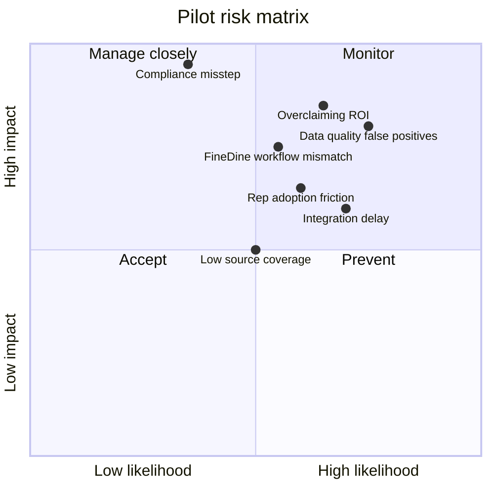

### 10.1 Compliance prensipleri

US-first activation için:

- CAN-SPAM B2B commercial email'e uygulanır. Sender identity, postal address, non-deceptive subject, ad identification, unsubscribe ve suppression kuralları takip edilirse outbound email lawful olabilir.
- TCPA automated SMS, AI voice, prerecorded calls ve robotext tarafında yüksek risk yaratır. Automated phone/SMS counsel-review item olmalı.
- Google Places verifier/freshness source olarak kullanılmalı; serbestçe store edilebilir ve resell edilebilir prospecting database gibi ele alınmamalı.
- Vendor data source provenance ve use-right flags taşımalı.

Pilot-safe cümle:

> "Email ve manual task'lar ilk activation rail olarak daha güvenli. Automated SMS veya AI voice consent ve counsel review olmadan açılmamalı."

---

## 11. FineDine pilotu için product outputs

### 11.1 Account Intelligence Brief

Her restoran için tek ekranlık brief:

- identity ve lokasyon
- segment/sub-niche
- chain vs independent
- relevant digital signals
- likely FineDine module angle
- recommended motion
- evidence snippet
- likely objection
- next action
- outcome capture fields

### 11.2 FineDine signal library

Başlangıç sinyalleri:

- no website / expired website
- PDF-only menu
- poor mobile menu UX
- no direct ordering
- third-party delivery dependence
- no reservation CTA where relevant
- active Instagram but weak owned conversion
- reviews mention slow service, waiting, menu confusion, value complaints
- high review volume but weak digital stack
- new opening / renovation / new menu launch
- multi-location inconsistency
- POS/reservation/ordering provider detected
- nearby FineDine/social-proof cluster

### 11.3 Outcome taxonomy

Minimum:

- sent / called / visited / referred / social touch
- reply: positive, neutral, negative
- meeting booked
- no-show
- demo completed
- objection type
- next step
- closed-won
- closed-lost
- lost reason
- bad-fit reason

### Görsel: outcome learning schema

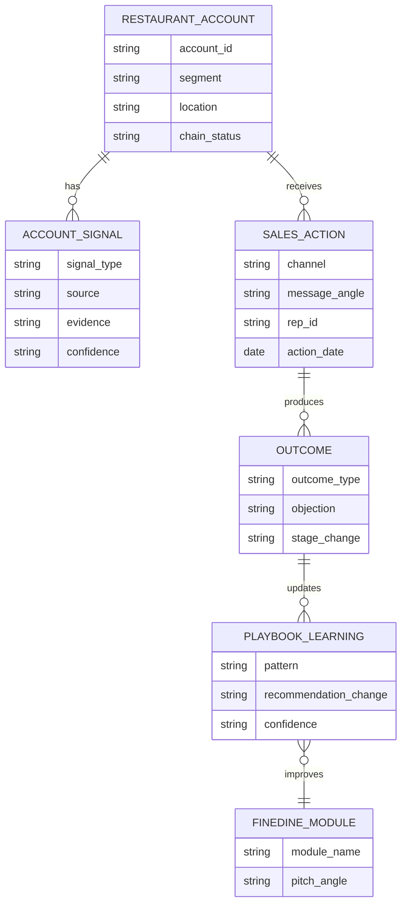

---

## 12. Toplantı talk-track

### Açılış

> "Bugün bunu klasik bir ürün demosu gibi yapmak istemiyoruz. LeadAC'i özellik özellik anlatmaktan önce, sizin outbound sürecinizi gerçekten anlamak istiyoruz."

### Problem frame

> "Bizim gördüğümüz problem sadece daha fazla lead bulmak değil. Özellikle restaurant-tech gibi local SMB pazarlarında asıl mesele şu: hangi restoran bugün çalışılmaya değer, hangi sinyal o hesabın hazır olduğunu gösteriyor, hangi mesaj o restoran tipi için daha mantıklı, hangi kanal daha doğru ve geçmişte benzer hesaplarda ne sonuç verdi?"

### Positioning

> "LeadAC'i CRM, lead list tool'u ya da AI SDR olarak konumlandırmıyoruz. HubSpot pipeline'ı tutar, sender mesajı gönderir, enrichment tool data'yı zenginleştirir. Bizim ilgilendiğimiz yer karar katmanı: bu hesaba neden şimdi gidilmeli, hangi FineDine angle'ı kullanılmalı, hangi motion seçilmeli ve sonuçtan ne öğrenilmeli?"

### FineDine context

> "FineDine sadece QR menü gibi anlatıldığında ürünün gerçek değeri eksik kalıyor. Pazar tarafında restoranlar maliyet, iş gücü, servis hızı, dijital ordering/payment, guest data, loyalty ve entegrasyon problemleriyle uğraşıyor. FineDine'ın asıl değeri, bu dijital katmanı restoranın gelir ve operasyon akışına bağlamak."

### Kapanış

> "Bugünkü görüşmeden sonra bizim için en net sonraki adım, sizin outbound sürecinizi daha detaylı map etmek. Bir sonraki görüşmede genel bir ürün demosu yerine, kendi workflow'unuz üzerinden kurulmuş daha somut bir model göstermek isteriz: hangi hesaplar önceliklenir, hangi sinyaller kullanılır, hangi play önerilir ve sonuçlar nasıl ekip hafızasına dönüşür."

---

## 13. Decision log

| Karar | Öneri | Gerekçe |
|---|---|---|
| Category framing | Restaurant-tech için operational GTM intelligence | CRM/data/sender/AI SDR karmaşasını önler. |
| İlk toplantı objective | Discovery ve workflow validation | Workflow map olmadan demo yanlış positioning yaratabilir. |
| İlk pilot scope | Tek segment veya territory | Ölçümü temiz tutar. |
| İlk value metric | Time saved + account decision quality | Immediate revenue'dan daha kontrol edilebilir. |
| Revenue claim | Sadece hipotez | FineDine outcome data gerekir. |
| Channel strategy | Multi-channel | Restaurant-tech GTM lokal ve consultative ilerler. |
| US SMS/AI voice | Counsel review olmadan ilk pilot dışı | TCPA riski. |
| Google Places role | Verifier, database değil | Terms/use-right riski. |

---

## 14. Benefits realization plan

### Stage 0: Baseline

Yakalanacaklar:

- mevcut lead sources
- mevcut channel mix
- research minutes/account
- drafting minutes/account
- weekly qualified actions/rep
- current reply/meeting rates
- current outcome capture completeness
- current no-fit/wasted-touch rate

### Stage 1: Prototype review

Ölçülecekler:

- FineDine account brief acceptance
- signal accuracy
- module-angle usefulness
- manager-approved account %

### Stage 2: Controlled pilot

Ölçülecekler:

- time saved
- account quality
- reply/positive reply/meeting
- objection patterns
- outcome capture completeness

### Stage 3: Benefits review

Karar:

- başka segmente expand
- HubSpot/sender integration ekle
- data provider ekle
- signal library sıkılaştır
- stop veya pivot

### Görsel: benefits review loop

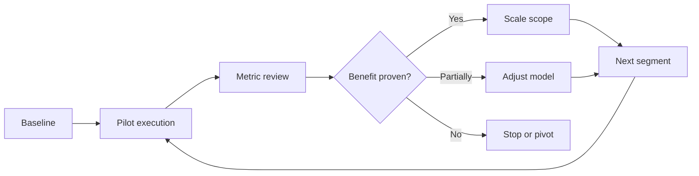

---

## 15. Evidence boundaries

### Güvenle söylenebilir

- Restoran operatörleri maliyet, iş gücü ve trafik baskısı altında; pratik teknoloji yatırımı yapıyorlar.
- FineDine QR menüden daha geniş bir ürün yüzeyine sahip.
- Restaurant-tech GTM lokal, consultative ve multi-channel.
- Sales ekipleri non-selling work, prospecting ve manual task'lar yüzünden zaman kaybediyor.
- AI/sales automation benchmark'ları research ve drafting tarafında zaman kazancını destekliyor.
- Data/enrichment/CRM/sender katmanları kalabalık.
- US activation için compliance ve data rights ürün mimarisine gömülmeli.

### Hipotez olarak söylenmeli

- FineDine rep'leri research'e fazla zaman harcıyor.
- FineDine top-rep knowledge sistematik yakalanmıyor.
- LeadAC FineDine reply/meeting rate'i iyileştirebilir.
- LeadAC ramp time'ı azaltabilir.
- LeadAC revenue artırabilir.

### Henüz söylenmemeli

- "LeadAC reply rate'i 2x yapar."
- "LeadAC FineDine revenue'yu %15 artırır."
- "LeadAC HubSpot, Clay, Apollo veya Smartlead'i replace eder."
- "LeadAC outbound'u tamamen otomatikleştirir."
- "Google Places kalıcı export edilebilir prospect database olarak kullanılabilir."
- "AI voice/SMS US'te consent review olmadan aktive edilebilir."

---

## 16. Kaynak tabanı

Primary ve high-confidence kaynaklar:

- National Restaurant Association, State of the Restaurant Industry 2026: https://restaurant.org/research-and-media/research/research-reports/state-of-the-industry/
- NRA 2026 press release: https://restaurant.org/research-and-media/media/press-releases/persistent-cost-increases-and-enduring-demand-will-shape-the-restaurant-industry-in-2026/
- NRA Restaurant Technology Landscape Report 2024 overview: https://restaurant.org/education-and-resources/resource-library/new-report-examines-the-technology-landscape-in-todays-restaurants/
- NRA Restaurant Technology Landscape Report PDF: https://go.restaurant.org/rs/078-ZLA-461/images/NatRestAssoc_TechLandscapeReport_2024.pdf
- Toast 2025 Form 10-K: https://www.sec.gov/Archives/edgar/data/1650164/000165016426000057/tost-20251231.htm
- Salesforce State of Sales 2026 PDF: https://www.salesforce.com/en-us/wp-content/uploads/sites/4/documents/reports/sales/salesforce-state-of-sales-report-2026.pdf
- Salesforce State of Sales 2026 announcement: https://www.salesforce.com/news/stories/state-of-sales-report-announcement-2026/
- Gartner B2B buyer outreach preference: https://www.gartner.com/en/newsroom/press-releases/2025-06-25-gartner-sales-survey-finds-61-percent-of-b2b-buyers-prefer-a-rep-free-buying-experience
- Gartner AI-driven sales enablement prediction: https://www.gartner.com/en/newsroom/press-releases/2026-04-01-gartner-predicts-ai-driven-sales-enablement-will-deliver-40-percent-faster-sales-stage-velocity-than-traditional-enablement-methods-by-20291
- McKinsey, Sales automation: https://www.mckinsey.com/capabilities/growth-marketing-and-sales/our-insights/sales-automation-the-key-to-boosting-revenue-and-reducing-costs
- McKinsey, AI-powered marketing and sales: https://www.mckinsey.com/capabilities/growth-marketing-and-sales/our-insights/ai-powered-marketing-and-sales-reach-new-heights-with-generative-ai
- McKinsey, Sales-growth outperformance: https://www.mckinsey.com/capabilities/growth-marketing-and-sales/our-insights/by-the-numbers-what-drives-sales-growth-outperformance
- FTC CAN-SPAM guide: https://www.ftc.gov/business-guidance/resources/can-spam-act-compliance-guide-business
- FCC TCPA guidance: https://www.fcc.gov/consumers/guides/stop-unwanted-robocalls-and-texts
- Google Places policies: https://developers.google.com/maps/documentation/places/web-service/policies
- Google Maps Platform terms: https://cloud.google.com/maps-platform/terms

Product/category kaynakları:

- FineDine official site: https://www.finedinemenu.com/en/
- FineDine AI home: https://www.finedinemenu.com/en/ai-home-/
- Openmart local business API: https://www.openmart.com/products/local-business-data-api
- Orbital: https://www.withorbital.com/
- Resquared: https://www.re2.ai/
- Clay waterfall enrichment: https://www.clay.com/waterfall-enrichment
- Mailshake State of Cold Email 2025 PDF: https://assets.mailshake.com/wp-content/uploads/2025/04/16091740/Cold-Email-Report-2025-Mailshake.pdf

Internal kaynaklar:

- LeadAC positioning: `C:\Users\meert\Desktop\hustle\POSITIONING.md`
- LeadAC buyer persona: `C:\Users\meert\Desktop\hustle\BUYER-PERSONA.md`
- FineDine beta round 2: `C:\Users\meert\Desktop\hustle\research\finedine\beta-test-round-2-camden-report.md`
- FineDine integration strategy: `C:\Users\meert\Desktop\hustle\docs\positioning\finedine-integration-strategy.md`
- FineDine US integration paper: `C:\Users\meert\Desktop\hustle\docs\positioning\finedine-final-us-integration-paper.md`

---

## 17. Final thesis

LeadAC'in FineDine ile fırsatı "daha fazla lead" değildir. Fırsat daha iyi GTM judgment'tır.

Ürünün en güçlü versiyonu şunları öğrenen bir katmandır:

- hangi restoran sinyalleri önemli
- hangi FineDine module angle'ı uygun
- hangi kanal kullanılmalı
- hangi objection'lar tekrar ediyor
- hangi outcome playbook'u doğruluyor
- hangi öğrenme bir sonraki rep tarafından tekrar kullanılmalı

Pilot reduced research time, daha iyi account prioritization, daha temiz message/channel selection ve outcome capture'ı kanıtlarsa, LeadAC revenue claim'lerine doğru genişleme hakkı kazanır.

O zamana kadar profesyonel vaat şu olmalı:

> "LeadAC, FineDine'ın restaurant account sinyallerini ve SDR judgment'ını her outcome ile gelişen, ölçülebilir ve tekrar kullanılabilir bir GTM playbook'una çevirmesine yardım eder."
