# LeadAC x FineDine master whitepaper

Date: 2026-06-06  
Version: 1.0  
Audience: LeadAC founders, product, GTM, FineDine activation stakeholders  
Scope: FineDine first activation meeting, design-partner pilot, restaurant-tech GTM intelligence thesis  
Status: Research-backed strategy paper. Not a guaranteed ROI claim.

---

## 0. Executive summary

LeadAC should not be positioned to FineDine as a CRM, lead list tool, enrichment database, sender, or AI SDR.

The stronger thesis is:

> LeadAC is the operational GTM intelligence layer for restaurant-tech teams. It connects account signals, rep decisions, channel actions, CRM/sender outcomes, and field learning so the sales team can answer: which restaurant should we pursue, why now, with which FineDine angle, through which motion, and what should we learn from the result?

This is especially relevant for FineDine because FineDine is not just a QR menu vendor. Public FineDine positioning spans digital menu, restaurant website, ordering, payment, reservations, delivery/pickup, CRM/loyalty, campaigns, social media, and AI-powered menu optimization. That means the GTM problem is not simply "find restaurants without QR menus." It is "understand which restaurant has which operational gap and which FineDine story should be used first."

The current research supports four high-confidence claims:

1. Restaurant operators are under cost, labor, traffic, and digital-experience pressure while continuing to invest in technology.
2. Restaurant-tech sales is local, consultative, multi-channel, and often field-supported. It is not email-only.
3. Sales teams lose meaningful time to research, admin, prospecting, and message preparation.
4. The existing GTM stack is crowded at the data/enrichment/CRM/sender layers, but the FineDine-specific decision and outcome-learning layer is under-owned.

The proposed pilot should therefore validate one core question:

> Can LeadAC turn FineDine's rep judgment into a reusable team playbook that improves account prioritization, message relevance, channel choice, and outcome learning?

---

## 1. The category problem

Most outbound tools optimize one layer:

- Databases find accounts.
- Enrichment tools add fields.
- CRMs store records.
- Senders send messages.
- Reps and managers decide what to do.

The gap is that the decision logic often remains informal.

In restaurant-tech, this is more painful because accounts are not interchangeable SaaS companies. A cafe, hotel restaurant, bar, fine-dining venue, ghost kitchen, QSR chain, and multi-location group have different economics, buying triggers, digital needs, and activation channels.

### Visual: where LeadAC sits

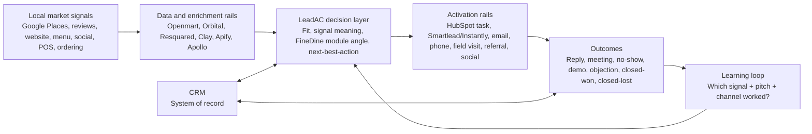

The product claim is not "we replace your stack." It is:

> "We make the stack learn what works."

---

## 2. Market proof: why restaurant-tech is a strong beachhead

### 2.1 Restaurant operators are under pressure

The National Restaurant Association's 2026 State of the Restaurant Industry report projects US restaurant and foodservice sales of $1.55T, but the report frames the operating environment around persistent cost pressures, uneven traffic, consumer budget pressure, and the need for technology-enabled efficiency.

The NRA 2024 Restaurant Technology Landscape Report also shows that operators see technology as a competitive advantage and are investing across digital marketing, loyalty, POS, contactless ordering/payment, inventory, labor, cybersecurity, and self-service ordering/payment.

TouchBistro's 2025 State of Restaurants report points to the same pressure in independent full-service restaurants: high food/labor cost pressure, operator interest in technology, online ordering, automation, and AI-positive attitudes.

### 2.2 FineDine maps to real restaurant pains

FineDine's product surface maps to current operator priorities:

| Restaurant pain | FineDine angle | Example account signal |
|---|---|---|
| Labor pressure and service bottlenecks | Table ordering, digital payment, self-service flow | Reviews mention slow service or waiting |
| Menu updates and margin pressure | Digital menu, AI upsell, menu analytics | PDF menu, no photos, outdated menu |
| Guest data loss | CRM/loyalty, campaigns, direct ordering | Delivery marketplace presence, no direct customer capture |
| Weak digital conversion | Restaurant website, online ordering, reservations | No order/reserve CTA, poor mobile site |
| Multi-location consistency | Central menu/content control | Multiple locations, inconsistent pages |
| Marketing and repeat visits | Campaigns, social/ads, CRM | Active Instagram but weak owned conversion path |

### 2.3 QR-only positioning is too narrow

QR menu is only the entry point. The strategic value is:

- dynamic menu merchandising
- ordering and payment workflow
- guest data capture
- loyalty and repeat visit activation
- menu analytics and AI recommendations
- integration with existing restaurant infrastructure

Meeting-safe line:

> "FineDine's value is not the QR code. The value is the restaurant's digital revenue and guest-data layer."

---

## 3. GTM reality: restaurant-tech sales is local and multi-channel

Toast is the clearest public benchmark. Its 2025 Form 10-K describes food and beverage as a local industry and says Toast combines a high-volume marketing engine with a localized and consultative sales force. Toast also describes customer acquisition teams by size, type, and geography, and mentions in-market sales teams.

This matters because a FineDine activation workflow should not be designed as a pure email sequence engine.

### Visual: restaurant-tech GTM motion

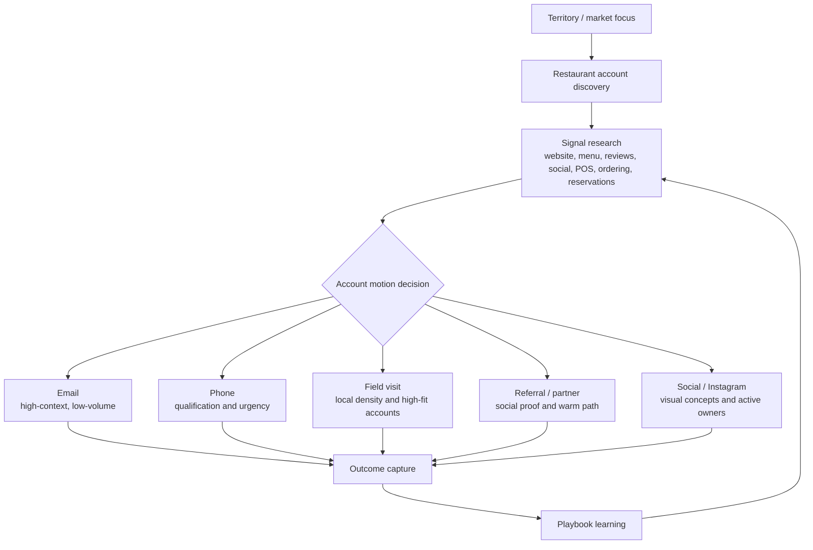

The most important product implication:

> LeadAC should recommend the motion, not only generate the message.

---

## 4. The sales-team pain: research, admin, and lost learning

Salesforce State of Sales 2026 reports that sellers spend 40% of their time selling and 60% not selling. Salesforce also reports that sellers expect fully implemented AI agents to reduce prospect research time by 34% and email drafting time by 36%.

McKinsey's sales automation research reports that early adopters saw 10-15% efficiency improvements and potential sales uplift of up to 10%. It also says lead management automation can increase selling time by 15-20%.

Gartner predicts that AI-driven sales enablement will deliver 40% faster sales-stage velocity than traditional enablement by 2029. This should not be claimed for FineDine today, but it validates the direction: static enablement is being replaced by in-workflow, data-driven guidance.

### Visual: SDR knowledge loss problem

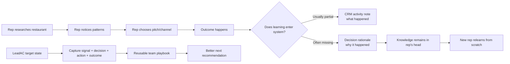

Meeting-safe line:

> "CRM records activity. LeadAC should capture the decision logic and the learning behind the activity."

---

## 5. Competitive stack: crowded layers and the open gap

### 5.1 Layer map

| Layer | Example tools | What they own | What remains open |
|---|---|---|---|
| Local SMB data rail | Openmart, Resquared, Google Places, Apify | Restaurant records, categories, reviews, owner/contact, local search | FineDine-specific fit and outcome learning |
| Enrichment/workflow | Clay | Waterfall enrichment, custom research, AI tables, webhooks | Opinionated restaurant-tech playbook |
| Broad B2B data/outbound | Apollo | B2B contacts, sequencing, enrichment | Deep local restaurant context |
| CRM | HubSpot, Salesforce, Pipedrive | Companies, contacts, deals, stages, activities | Why a decision worked |
| Sender | Smartlead, Instantly, Gmail/Outlook | Delivery, reply, bounce, unsubscribe | Which account and message should be sent |
| Revenue intelligence | Gong, Clari-like category | Enterprise pipeline/conversation intelligence | Local SMB restaurant-tech account context |
| LeadAC wedge | LeadAC | Decision + action + outcome learning | Must prove with FineDine pilot data |

### Visual: stack ownership map

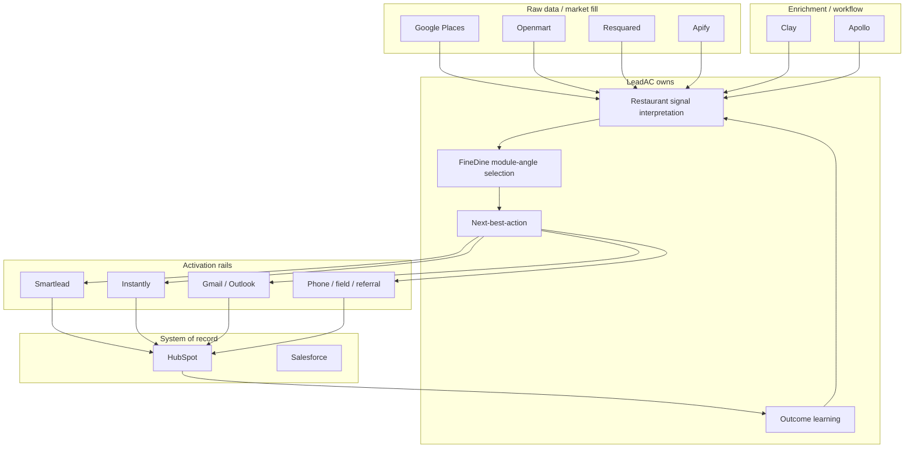

### 5.2 Objection framing

If FineDine asks "Isn't this Clay/Openmart/Apollo/HubSpot?", the answer is:

> "Those tools are useful parts of the stack. We do not need to replace them. Our focus is the FineDine-specific decision layer: which signals matter, which account deserves action, which motion fits, and what the outcome teaches the next rep."

---

## 6. LeadAC product thesis for FineDine

### 6.1 Core product promise

For FineDine, LeadAC should become:

> The restaurant account intelligence and outcome-learning layer that helps the BD/SDR team prioritize accounts, choose the right FineDine angle, activate through the right channel, and learn from every outcome.

### 6.2 Core questions per account

Each account brief should answer:

1. Who is this restaurant?
2. What segment is it: cafe, QSR, bar, hotel F&B, fine dining, ghost kitchen, group, chain?
3. Which digital signals matter?
4. Which FineDine module is the first credible angle?
5. Which channel should the rep use first?
6. What evidence should the rep cite?
7. What objection is likely?
8. What should be logged after the action?

### Visual: account decision card

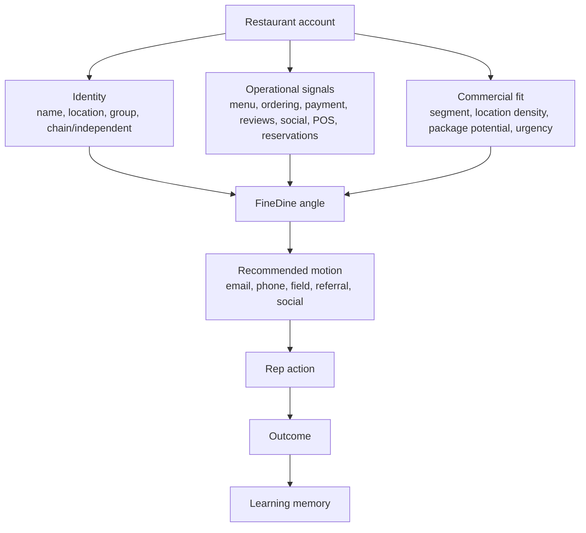

---

## 7. Value model: what percentage lift is realistic?

This paper does not claim guaranteed ROI. It uses Salesforce, McKinsey, Gartner, and outbound benchmark sources to create a planning range.

### 7.1 Source-backed value ranges

| Metric | Conservative | Expected / source-backed | Stretch | Evidence boundary |
|---|---:|---:|---:|---|
| Prospect/account research time reduction | 15% | 20-30% | 34% | Salesforce expects AI agents to reduce prospect research by 34%. |
| Email/opener drafting time reduction | 15% | 20-30% | 36% | Salesforce expects email drafting time to drop 36%. |
| Selling/customer-facing time increase | +1.3h/rep/week | +2.4 to +3.2h/rep/week | +4h/rep/week | McKinsey +15-20% relative selling-time uplift; Salesforce 40% baseline. |
| Sales process efficiency | 5% | 10-15% | 15%+ | McKinsey early automation adopters. |
| Pipeline/sales uplift | 2% | 5-10% | 10-15% | McKinsey data-driven decisions and automation; must be proven in pilot. |
| Reply rate relative uplift | 10-25% | 25-50% | 2x in strong segments | Outbound benchmarks vary; must A/B test. |
| Stage velocity | 5% | 10-20% | 40% mature | Gartner 40% by 2029 for mature AI-driven enablement, not first pilot. |
| New SDR ramp speed | 10% | 20-30% | 30%+ | Supported directionally by enablement research; FineDine baseline required. |

### Visual: impact confidence chart

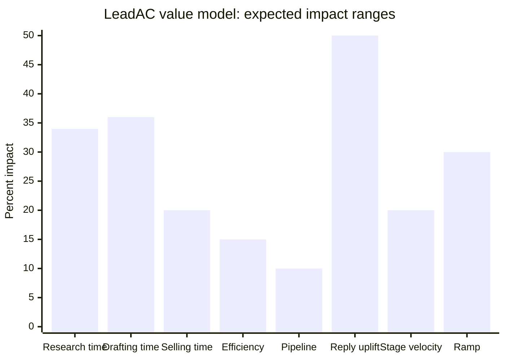

Important interpretation:

- Research and drafting are highest-confidence because sources directly measure those tasks.
- Revenue, reply rate, and ramp are lower-confidence until FineDine pilot outcomes exist.
- The safest first pilot goal is not "prove revenue lift." It is "prove better account decisions and lower prep cost."

---

## 8. Pilot operating model

The pilot should borrow from PRINCE2, stage-gate, OKR, MoSCoW, and benefits-realization thinking. The goal is not bureaucracy. The goal is to prevent an early pilot from becoming vague.

### 8.1 PRINCE2-inspired governance principles

| PRINCE2 idea | Adapted to LeadAC x FineDine |
|---|---|
| Continued business justification | Each stage must show why the pilot still matters. |
| Learn from experience | Every campaign and outcome becomes pilot learning. |
| Defined roles | Clear owner for FineDine data, LeadAC product, SDR workflow, compliance, and metrics. |
| Manage by stages | Discovery -> model -> pilot -> benefits review. |
| Manage by exception | Predefine tolerances for data quality, time, compliance, and metric drift. |
| Focus on products | Deliver tangible outputs: workflow map, signal library, brief template, pilot dashboard. |
| Tailor to project | Keep governance lightweight for design-partner speed. |

### 8.2 Stage plan

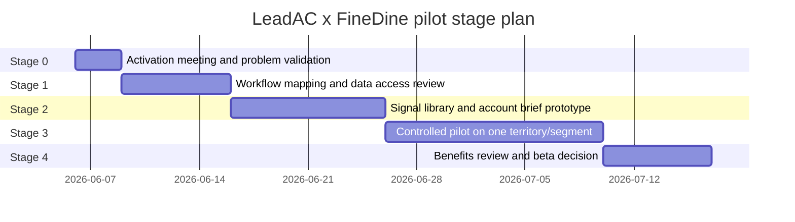

### 8.3 Stage gates

| Stage | Goal | Exit criteria |
|---|---|---|
| 0. Problem validation | Confirm the pain is real and worth solving. | FineDine confirms workflow, current tools, channels, and desired beta outcome. |
| 1. Workflow mapping | Understand lead source -> research -> decision -> outreach -> CRM outcome. | End-to-end map approved by FineDine sales stakeholder. |
| 2. Prototype model | Build FineDine account decision model. | 20-50 sample accounts scored and reviewed by FineDine. |
| 3. Controlled pilot | Test LeadAC against one segment/territory. | A/B or matched-cohort results for time saved, quality, reply/meeting, wasted touches. |
| 4. Benefits review | Decide whether to expand. | Evidence pack, ROI model update, product gap list, scale/no-scale decision. |

### 8.4 MoSCoW scope

| Must have | Should have | Could have | Won't have in first pilot |
|---|---|---|---|
| Workflow map | HubSpot outcome sync | Openmart/Orbital enrichment | Fully automated AI SDR |
| Restaurant signal library | Sender event import | Field-visit route planning | Automated SMS/AI voice in US |
| FineDine module-angle logic | Objection pattern tagging | Nearby social proof map | Full CRM replacement |
| Account brief prototype | A/B test dashboard | Multi-city scaling | Claimed revenue guarantee |
| Manual outcome capture | Source provenance | Clay webhook bridge | Broad horizontal SaaS ICP |

---

## 9. Measurement framework

### 9.1 North Star metric

For the pilot:

> Qualified restaurant actions per rep per week, with signal, recommended motion, and outcome logged.

Why this matters:

- It measures more than lead volume.
- It forces quality and actionability.
- It includes the learning loop.

### 9.2 Metric tree

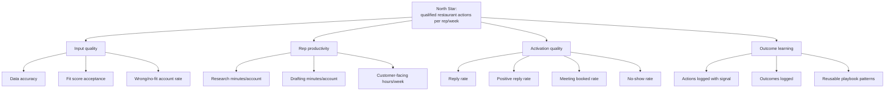

### 9.3 Pilot scorecard

| Metric | Baseline needed | Pilot target |
|---|---|---|
| Research minutes/account | Manual timer on 20 accounts | -15% to -34% |
| Drafting minutes/account | Manual timer on 20 openers | -15% to -36% |
| Manager-approved accounts | Current weekly count | +10% to +30% |
| Customer-facing hours | Calendar/CRM activity | +2.4 to +3.2h/rep/week if process adopted |
| Wrong/no-fit account rate | Manager rejection reason | -10% to -30% |
| Reply rate | Current campaigns | +25% to +50% relative target, not guaranteed |
| Meeting booked rate | Current campaigns | +10% to +40% relative target |
| Outcome capture completeness | Current CRM completeness | 80%+ pilot actions logged with signal and result |
| Playbook reuse | Current playbook usage | 20-40% more reuse of approved signal/pitch patterns |

---

## 10. Risk and compliance model

### 10.1 Risk map

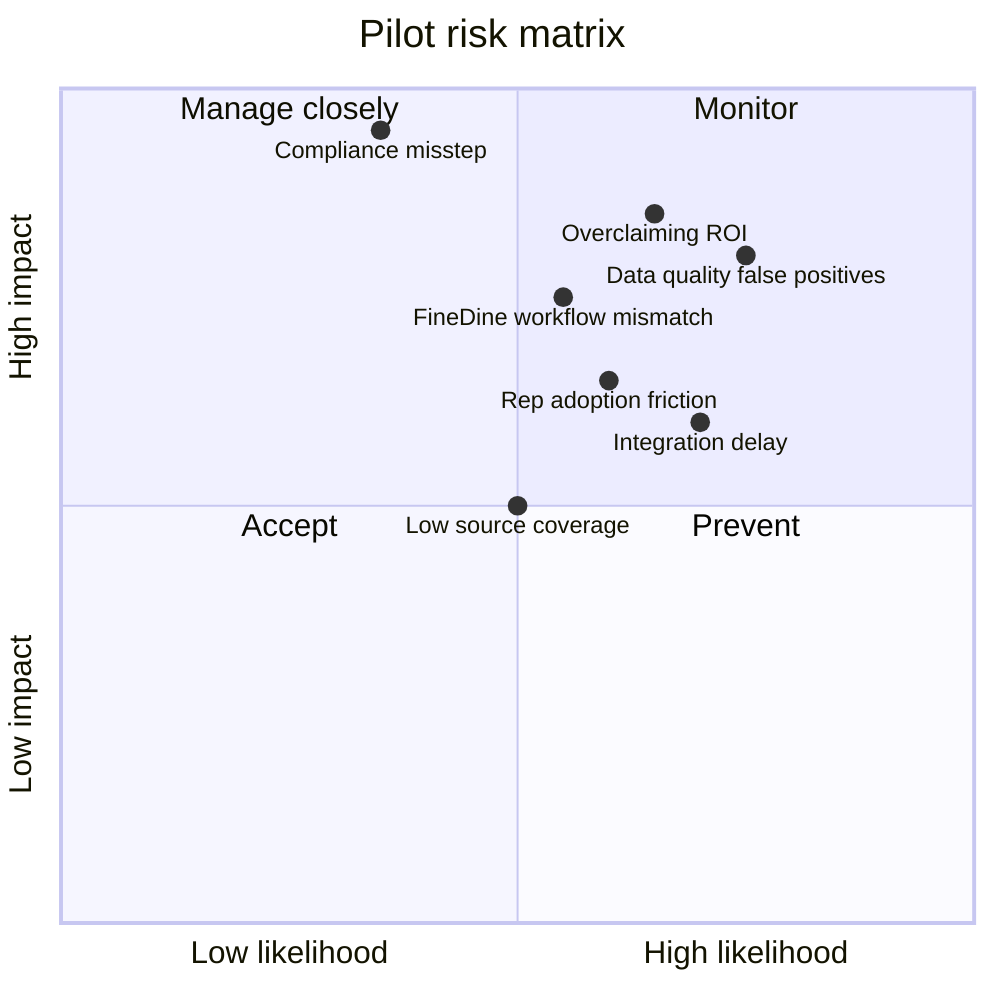

### 10.2 Compliance principles

For US-first activation:

- CAN-SPAM applies to B2B commercial email. Outbound can be lawful without prior opt-in only if sender identity, postal address, non-deceptive subject, ad identification, unsubscribe, and suppression rules are followed.
- TCPA creates high risk for automated SMS, AI voice, prerecorded calls, and robotexts. Treat automated phone/SMS as counsel-review items.
- Google Places should be used as a verifier/freshness source, not a freely storeable/resellable prospecting database.
- Vendor data must carry source provenance and use-right flags.

Pilot-safe line:

> "Email and manual tasks are safer first activation rails. Automated SMS or AI voice should wait for consent and counsel review."

---

## 11. Product outputs for the FineDine pilot

### 11.1 Account Intelligence Brief

Each restaurant should produce a one-screen brief:

- identity and location
- segment/sub-niche
- chain vs independent
- relevant digital signals
- likely FineDine module angle
- recommended motion
- evidence snippet
- likely objection
- next action
- outcome capture fields

### 11.2 FineDine signal library

Initial signals:

- no website / expired website
- PDF-only menu
- poor mobile menu UX
- no direct ordering
- third-party delivery dependence
- no reservation CTA where relevant
- active Instagram but weak owned conversion
- reviews mention slow service, waiting, menu confusion, value complaints
- high review volume but weak digital stack
- new opening / renovation / new menu launch
- multi-location inconsistency
- POS/reservation/ordering provider detected
- nearby FineDine/social-proof cluster

### 11.3 Outcome taxonomy

Minimum:

- sent / called / visited / referred / social touch
- reply: positive, neutral, negative
- meeting booked
- no-show
- demo completed
- objection type
- next step
- closed-won
- closed-lost
- lost reason
- bad-fit reason

### Visual: outcome learning schema

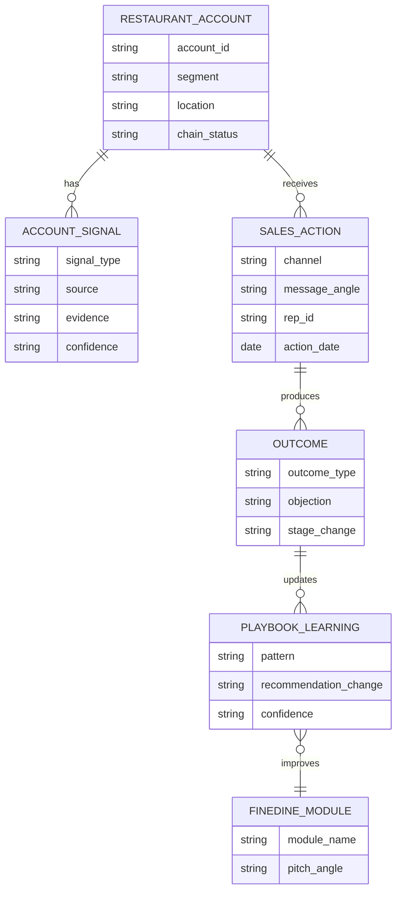

---

## 12. Meeting talk-track

### Opening

> "Bugün bunu klasik bir ürün demosu gibi yapmak istemiyoruz. LeadAC'i özellik özellik anlatmaktan önce, sizin outbound sürecinizi gerçekten anlamak istiyoruz."

### Problem frame

> "Bizim gördüğümüz problem sadece daha fazla lead bulmak değil. Özellikle restaurant-tech gibi local SMB pazarlarında asıl mesele şu: hangi restoran bugün çalışılmaya değer, hangi sinyal o hesabın hazır olduğunu gösteriyor, hangi mesaj o restoran tipi için daha mantıklı, hangi kanal daha doğru ve geçmişte benzer hesaplarda ne sonuç verdi?"

### Positioning

> "LeadAC'i CRM, lead list tool'u ya da AI SDR olarak konumlandırmıyoruz. HubSpot pipeline'ı tutar, sender mesajı gönderir, enrichment tool data'yı zenginleştirir. Bizim ilgilendiğimiz yer karar katmanı: bu hesaba neden şimdi gidilmeli, hangi FineDine angle'ı kullanılmalı, hangi motion seçilmeli ve sonuçtan ne öğrenilmeli?"

### FineDine context

> "FineDine sadece QR menu gibi anlatıldığında ürünün gerçek değeri eksik kalıyor. Pazar tarafında restoranlar maliyet, iş gücü, servis hızı, dijital ordering/payment, guest data, loyalty ve entegrasyon problemleriyle uğraşıyor. FineDine'ın asıl değeri, bu dijital katmanı restoranın gelir ve operasyon akışına bağlamak."

### Close

> "Bugünkü görüşmeden sonra bizim için en net sonraki adım, sizin outbound sürecinizi daha detaylı map etmek. Bir sonraki görüşmede genel bir ürün demosu yerine, kendi workflow'unuz üzerinden kurulmuş daha somut bir model göstermek isteriz: hangi hesaplar önceliklenir, hangi sinyaller kullanılır, hangi play önerilir ve sonuçlar nasıl ekip hafızasına dönüşür."

---

## 13. Decision log

| Decision | Current recommendation | Reason |
|---|---|---|
| Category framing | Operational GTM intelligence for restaurant-tech | Avoids CRM/data/sender/AI SDR confusion. |
| First meeting objective | Discovery and workflow validation | Product demo before workflow map risks mispositioning. |
| First pilot scope | One segment or territory | Keeps measurement clean. |
| First value metric | Time saved + account decision quality | More controllable than immediate revenue. |
| Revenue claim | Hypothesis only | FineDine outcome data required. |
| Channel strategy | Multi-channel | Restaurant-tech GTM is local and consultative. |
| US SMS/AI voice | Out of first pilot unless counsel-reviewed | TCPA risk. |
| Google Places role | Verifier, not resold database | Terms/use-right risk. |

---

## 14. Benefits realization plan

### Stage 0: Baseline

Capture:

- current lead sources
- current channel mix
- research minutes/account
- drafting minutes/account
- weekly qualified actions/rep
- current reply/meeting rates
- current outcome capture completeness
- current no-fit/wasted-touch rate

### Stage 1: Prototype review

Measure:

- FineDine acceptance of account brief
- signal accuracy
- module-angle usefulness
- manager-approved account %

### Stage 2: Controlled pilot

Measure:

- time saved
- account quality
- reply/positive reply/meeting
- objection patterns
- outcome capture completeness

### Stage 3: Benefits review

Decide:

- expand to another segment
- add HubSpot/sender integration
- add data provider
- tighten signal library
- stop or pivot

### Visual: benefits review loop

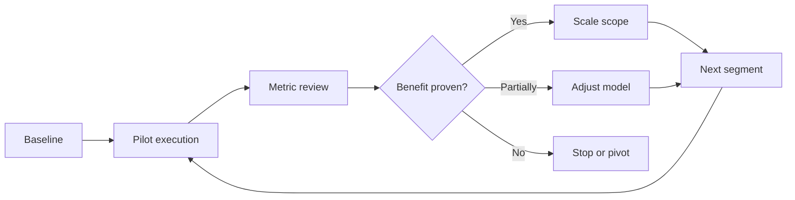

---

## 15. Evidence boundaries

### Can say confidently

- Restaurant operators are under cost/labor/traffic pressure and investing in practical technology.
- FineDine is broader than QR menu.
- Restaurant-tech GTM is local, consultative, and multi-channel.
- Sales teams lose time to non-selling work, including prospecting and manual tasks.
- AI/sales automation benchmarks support time savings in research and drafting.
- Data/enrichment/CRM/sender layers are crowded.
- Compliance and data rights must be designed into US activation.

### Should say as hypothesis

- FineDine reps spend too much time researching.
- FineDine's top-rep knowledge is not consistently captured.
- LeadAC can improve FineDine reply/meeting rate.
- LeadAC can reduce ramp time.
- LeadAC can increase revenue.

### Should not say yet

- "LeadAC will 2x reply rates."
- "LeadAC will increase FineDine revenue by 15%."
- "LeadAC replaces HubSpot, Clay, Apollo, or Smartlead."
- "LeadAC fully automates outbound."
- "Google Places can be used as a permanent exportable prospect database."
- "AI voice/SMS can be activated in the US without consent review."

---

## 16. Source base

Primary and high-confidence sources:

- National Restaurant Association, State of the Restaurant Industry 2026: https://restaurant.org/research-and-media/research/research-reports/state-of-the-industry/
- NRA 2026 press release: https://restaurant.org/research-and-media/media/press-releases/persistent-cost-increases-and-enduring-demand-will-shape-the-restaurant-industry-in-2026/
- NRA Restaurant Technology Landscape Report 2024 overview: https://restaurant.org/education-and-resources/resource-library/new-report-examines-the-technology-landscape-in-todays-restaurants/
- NRA Restaurant Technology Landscape Report PDF: https://go.restaurant.org/rs/078-ZLA-461/images/NatRestAssoc_TechLandscapeReport_2024.pdf
- Toast 2025 Form 10-K: https://www.sec.gov/Archives/edgar/data/1650164/000165016426000057/tost-20251231.htm
- Salesforce State of Sales 2026 PDF: https://www.salesforce.com/en-us/wp-content/uploads/sites/4/documents/reports/sales/salesforce-state-of-sales-report-2026.pdf
- Salesforce State of Sales 2026 announcement: https://www.salesforce.com/news/stories/state-of-sales-report-announcement-2026/
- Gartner B2B buyer outreach preference: https://www.gartner.com/en/newsroom/press-releases/2025-06-25-gartner-sales-survey-finds-61-percent-of-b2b-buyers-prefer-a-rep-free-buying-experience
- Gartner AI-driven sales enablement prediction: https://www.gartner.com/en/newsroom/press-releases/2026-04-01-gartner-predicts-ai-driven-sales-enablement-will-deliver-40-percent-faster-sales-stage-velocity-than-traditional-enablement-methods-by-20291
- McKinsey, Sales automation: https://www.mckinsey.com/capabilities/growth-marketing-and-sales/our-insights/sales-automation-the-key-to-boosting-revenue-and-reducing-costs
- McKinsey, AI-powered marketing and sales: https://www.mckinsey.com/capabilities/growth-marketing-and-sales/our-insights/ai-powered-marketing-and-sales-reach-new-heights-with-generative-ai
- McKinsey, Sales-growth outperformance: https://www.mckinsey.com/capabilities/growth-marketing-and-sales/our-insights/by-the-numbers-what-drives-sales-growth-outperformance
- FTC CAN-SPAM guide: https://www.ftc.gov/business-guidance/resources/can-spam-act-compliance-guide-business
- FCC TCPA guidance: https://www.fcc.gov/consumers/guides/stop-unwanted-robocalls-and-texts
- Google Places policies: https://developers.google.com/maps/documentation/places/web-service/policies
- Google Maps Platform terms: https://cloud.google.com/maps-platform/terms

Product/category sources:

- FineDine official site: https://www.finedinemenu.com/en/
- FineDine AI home: https://www.finedinemenu.com/en/ai-home-/
- Openmart local business API: https://www.openmart.com/products/local-business-data-api
- Orbital: https://www.withorbital.com/
- Resquared: https://www.re2.ai/
- Clay waterfall enrichment: https://www.clay.com/waterfall-enrichment
- Mailshake State of Cold Email 2025 PDF: https://assets.mailshake.com/wp-content/uploads/2025/04/16091740/Cold-Email-Report-2025-Mailshake.pdf

Internal sources:

- LeadAC positioning: `C:\Users\meert\Desktop\hustle\POSITIONING.md`
- LeadAC buyer persona: `C:\Users\meert\Desktop\hustle\BUYER-PERSONA.md`
- FineDine beta round 2: `C:\Users\meert\Desktop\hustle\research\finedine\beta-test-round-2-camden-report.md`
- FineDine integration strategy: `C:\Users\meert\Desktop\hustle\docs\positioning\finedine-integration-strategy.md`
- FineDine US integration paper: `C:\Users\meert\Desktop\hustle\docs\positioning\finedine-final-us-integration-paper.md`

---

## 17. Final thesis

LeadAC's opportunity with FineDine is not "more leads." It is better GTM judgment.

The strongest version of the product is a layer that learns:

- which restaurant signals matter
- which FineDine module angle fits
- which channel should be used
- which objections repeat
- which outcomes prove the playbook
- which learnings should be reused by the next rep

If the pilot can prove reduced research time, better account prioritization, cleaner message/channel selection, and outcome capture, then LeadAC has the right to expand into revenue claims.

Until then, the professional promise should be:

> "LeadAC helps FineDine turn restaurant account signals and SDR judgment into a measurable, reusable GTM playbook that improves with every outcome."
